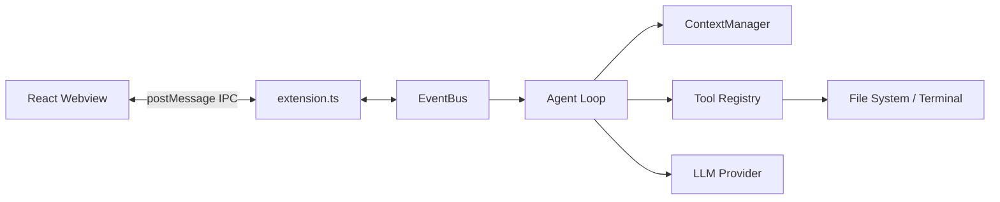
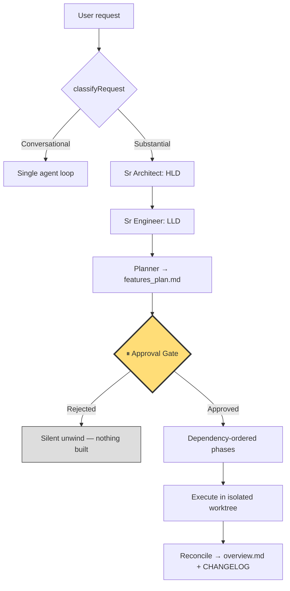

<div id="black-ide-logo" align="center">
    <br />
    
    <h1>Black IDE</h1>
    <h3>A custom, telemetry-free distribution of VS Code featuring a built-in AI coding assistant and agentic loop engine.</h3>
</div>

---

⚠️ **Project Status: Hobby & Experimental**
*Black IDE is a personal hobby project created for learning, experimentation, and custom developer workflows. It is not an official product, and is not actively maintained or supported for production use.*

---

## 💡 About Black IDE

Black IDE is built on top of the open-source codebases of **VS Code** and the build environment of **VSCodium**. The objective is to integrate a native, autonomous AI agent directly into a clean, telemetry-free IDE — not as a bolt-on extension, but as part of a full standalone Electron distribution.

The agent is a persistent loop that reads, writes, researches, and executes terminal commands until a request is resolved — with a human approval gate before anything substantial touches your code.

---

## 🏗️ Architecture

Black IDE separates the UI from the engine so heavy Node.js work can never freeze the interface:

- **React Webview (Frontend)** — a sandboxed UI layer rendering Chat, the Activity Timeline, and the Checkpoint Tracker. Holds no business logic.
- **Extension Host (Backend)** — a Node.js runtime executing the agent loop, connecting to the file system, managing token budgets, and coordinating LLM providers.

The two communicate over an internal `EventBus`. When a tool starts, the backend emits a semantic event that is piped over IPC; the React UI's reducer draws a loading card instantly rather than waiting for the tool to finish.



---

## ✨ Key Features

### 🤖 The Agent Loop

A bounded state machine rather than a single API call. Each request enters a loop of up to 25 iterations (configurable per mode):

- **Context budgeting** — the `ContextManager` computes token size before every LLM call. Oldest tool results are truncated first, so reading a large file cannot blow the context window.
- **Execution interlock** — when the model requests a tool, the loop pauses, executes locally, captures output, and feeds it back, forcing the model to analyse the real result.

### 📋 Two-Phase Planning with a Human Gate

Substantive requests are split into planning and execution, with you in between:

1. Any non-trivial prompt is forced into **plan mode**, where the agent has read-only tools and cannot mutate source files.
2. The planner must produce an `implementation_plan` and `task_list` artifact.
3. The loop **stops** and presents a Plan Review Card with collapsible previews.
4. On approval, the task re-runs in **agent mode** with the plan injected, tracking progress and writing a walkthrough on completion.

Pending approvals persist to VS Code's `Memento` storage, so a reload or crash mid-review restores the card rather than losing the run. Greetings, short questions (≤5 words), and slash commands bypass planning entirely to keep the UX snappy.

### 🎭 Specialized Agent Modes

Eight built-in modes, each with targeted system prompts, tool permissions, and iteration budgets:

| Role | Focus Area | Max Iterations | Constraints |
|---|---|---|---|
| **Ask** | Answering questions without modifying code | — | No edit/write/command tools |
| **Plan** | Research and architectural planning | 25 | Read-only + artifact creation |
| **Agent** | Full agent, absolute tool permissions | 25 | All tools enabled |
| **Frontend** | UI/UX, React, CSS, accessibility | 40 | All tools enabled |
| **Backend** | APIs, databases, auth, server performance | 40 | All tools enabled |
| **DevOps** | CI/CD, Docker, build scripts, Makefiles | 30 | Shell and deployment tools |
| **Manager** | Coordination and delegation | 15 | Cannot write code; `spawn_subagent` only |
| **Sr Architect** | System design, patterns, tech debt | 20 | Read-only; writes ADRs and refactor plans |

### ⏮️ Atomic Checkpoints & Rollback

A surgical undo system that keeps the agent from permanently breaking your code:

- **Reverse hunks** — rather than copying whole files, Black IDE computes the structural diff and stores only that. Restoring applies the reverse diff.
- **Durable** — checkpoints serialize to `globalStorage`, surviving window reloads and crashes.
- **Granular** — every file transaction is tracked as `pending`, `kept`, or `restored`. Accept or roll back individual files instead of all-or-nothing.
- **Per-message undo** — checkpoints link to a `messageId`, so you can revert a single agent response from the timeline.

### 🔍 Semantic Codebase Indexing

A local RAG pipeline backed by SQLite vector embeddings. Chunking is **AST-aware** — code is split on class and function boundaries rather than arbitrary character counts, so retrieved context contains whole functions with intact signatures.

### 🌲 Parallel Subagent Isolation (Git Worktrees)

Subagents run in isolated git worktrees at `~/.blackide/worktrees/<hash>/<branch>`, where `<hash>` is derived from the workspace path so multiple open workspaces never collide.

- **Serialized git mutex** — a process-global promise queue funnels every git operation, retrying `index.lock` with exponential backoff and bounding each operation with a timeout so one hung subprocess cannot deadlock the queue.
- **Reintegration is a delta, not a merge** — the worktree baseline mirrors your uncommitted state, so a whole-branch merge would refuse. `applyDelta` carries only what the pipeline actually changed and never touches your local edits.
- **Conflicts preserve the worktree** — agent work is never silently discarded. The error names the branch, path, baseline SHA, and the exact command to discard it manually.

### ⚡ Inline Chat (`Cmd+I`)

Editor-native refactoring on the current selection or line. Streamed edits are applied directly and decorated with a light-green highlight, with line-offset tracking so the decoration stays accurate as the model inserts or removes lines. A QuickPick offers **Accept**, **Edit Again** (reverts, then re-prompts on the original), or **Reject**.

### 🔌 Model Context Protocol (MCP)

A built-in MCP client discovers config at `.blackide/mcp.json` or `.vscode/mcp.json`, spawns each server over `stdio`, performs the JSON-RPC handshake, and registers discovered tools into the agent's `ToolRegistry` — making them transparently callable during the loop.

### 🧩 The Multi-Agent Pipeline

Large requests ("build a CRM") run through phased execution rather than one agent turn:



- **Dependency-driven phase selection** — `EXECUTION_PHASE_GRAPH` declares prerequisites rather than hardcoding a sequence. A plan with no `[backend]` tasks skips that executor entirely.
- **Per-phase model routing** — send cheap scaffolding to a fast model and execution to a stronger one.
- **Budget interlock** — tripping the token budget aborts through the same `AbortController` a user cancellation uses, but reports as a failure rather than a silent stop.
- Up to **4 concurrent runs**, each with its own `AbortController` and run-local `CheckpointManager`.

### 🧠 Long-Term Project Memory

A durable, human-readable `.blackIDE/knowledge/` directory that both you and the agents read and write — `architecture.md`, `decision_log.md` (auto-numbered ADRs), `feature_status.md`, `technical_debt.md`, `glossary.md`, `roadmap.md`. Plain markdown, so it stays inspectable, diffable, and correctable by hand.

On first activation the agent derives a starting `architecture.md` from your file tree and `package.json`. It runs once per workspace and **never overwrites your edits**. Context injection is budgeted per file, so an append-only ADR log cannot starve the other files.

### 📤 Output Modes

| Mode | Behaviour | Live working tree |
|---|---|---|
| `apply` *(default)* | `applyDelta` onto the live tree, then remove the worktree | Modified |
| `pr` | Keep the branch, `git push` + `gh pr create` | **Never touched** |

Anything unrecognised maps safely to `apply` — the failure mode of guessing wrong should be "your changes landed as usual", never "the run silently did not touch your workspace."

### 🧪 Parallel Wave Execution *(experimental — default OFF)*

Independent phases in the same dependency wave can run concurrently in separate worktrees, but **merges are strictly sequential** under the git mutex so conflicts stay reproducible. Defaults off because a defect here corrupts your working tree — the least recoverable failure this project has. It requires an explicit `true`, declines when no wave holds more than one phase, and refuses to combine with `pr` output mode.

### 🔒 Telemetry-Free & Hardened

- All built-in tracking, telemetry, and reporting endpoints are patched out of the codebase.
- The agent's own telemetry sink writes **local JSONL only**, and is privacy-safe by construction — events are projected down to metadata (mode, model, duration, error class), dropping content-bearing and streaming events entirely so a prompt can never reach the log.
- Command filter capabilities and extension security hardening.

---

## ⚙️ Configuration

### Custom Agent Modes

Register your own modes by dropping Markdown files with YAML frontmatter into:

| Scope | Location |
|---|---|
| Global | `~/.blackide/modes/` |
| Workspace | `.blackide/modes/` |
| Project | `.agents/modes/` |

```markdown
---
name: Security Auditor
description: Audits code changes for security vulnerabilities
tools: [read_file, grep_search, complete_task]
maxIterations: 15
icon: shield
---
You are a Senior Security Auditor. Evaluate the code changes in the active
selection for common vulnerabilities. Write a report and do not modify files.
```

Fields: `name` (required, cannot override built-ins), `description`, `model`, `tools` (allowlist; omit for all), `maxIterations` (1–500, default 25), `icon` (VS Code Codicon). The body becomes the system prompt extension.

The `ModeLoader` watches these directories and hot-reloads changes, surfacing config errors as inline VS Code diagnostics.

---

## 🛠️ Repository Structure

Black IDE is a **build harness**, not a fork with a vendored copy of VS Code. The
repository holds only the sources that are *ours* — patches, overlay code, branding,
and automation. Upstream VS Code is cloned at build time and patched in place, so
several directories below exist only after a build and are deliberately gitignored.

```
blackIDE/
├── src/                    # Overlay sources copied over upstream VS Code
│   ├── stable/
│   │   ├── extensions/     # Bundled first-party extensions
│   │   │   ├── black-ide-agent/    # The native AI agent
│   │   │   ├── black-ide-theme/
│   │   │   ├── andromeda/
│   │   │   └── material-icon-theme/
│   │   ├── resources/      # Per-platform icons & desktop entries
│   │   └── src/            # Direct workbench overrides (vs/workbench/...)
│   └── insider/            # Insider-channel overrides
│
├── config/                 # Everything that defines "what we build"
│   ├── patches/            # Patches applied to upstream VS Code
│   ├── icons/              # Branding icon sources (stable + insider)
│   ├── stores/             # Store packaging: snapcraft, winget
│   ├── upstream/           # Pinned upstream commits (stable.json, insider.json)
│   ├── product.json        # Extension allowlists (marketplace, badge providers)
│   └── announcements-*.json
│
├── scripts/                # Build & release automation
│   ├── lib/                # Shared shell helpers (utils.sh, version.sh)
│   ├── prepare/            # Clone upstream, apply patches, stage assets
│   ├── build/              # Per-platform builds
│   │   └── packages/       # linux, osx, windows, alpine packaging
│   ├── release/            # Versioning, changelogs, GitHub release upload
│   ├── ci/                 # CI helpers (tag checks, repo/PR setup)
│   ├── dev/                # Local dev entry points (build.sh, patch.sh, cli.sh)
│   ├── telemetry/          # Rewrites Microsoft telemetry endpoints to 0.0.0.0
│   └── tools/              # Misc tooling (font-size)
│
├── docs/                   # All documentation + build-input licence/notice
│   ├── wiki_docs/          # GitHub wiki source (published via push_wiki.sh)
│   ├── mindmap/            # Architecture notes (hld, lld, tech)
│   ├── notes/              # Roadmaps and phased implementation plans
│   ├── blackIDE.md         # Architecture & KT guide (+ .bn.md translation)
│   ├── push_wiki.sh        # Publishes docs/wiki_docs/ to the GitHub wiki
│   ├── LICENSE             # Bundled into the app build
│   ├── NOTICE              # Upstream attribution
│   └── release_notes.md    # Consumed by the release pipeline
├── .github/workflows/      # CI and publish pipelines
├── Makefile                # Primary entry point — see Building Locally
│
├── vscode/                 # ⚙️ generated — upstream VS Code clone
├── vscode-cli/             # ⚙️ generated — CLI / tunnel build sources
├── assets/                 # ⚙️ generated — packaged release artifacts
└── VSCode-darwin-arm64/    # ⚙️ generated — macOS app bundle output
```

### Key paths

| Path | Contents |
|---|---|
| [`src/stable/extensions/black-ide-agent/`](src/stable/extensions/black-ide-agent) | The agent loop, planner, and subagent orchestration |
| [`config/patches/`](config/patches) | Every modification to upstream VS Code, one patch per concern |
| [`config/upstream/`](config/upstream) | Pins the exact upstream commit each channel builds from |
| [`scripts/prepare/prepare_vscode.sh`](scripts/prepare/prepare_vscode.sh) | Applies patches and writes the final `product.json` |
| [`scripts/lib/utils.sh`](scripts/lib/utils.sh) | Defines `APP_NAME`, `BINARY_NAME`, and repo paths used across all builds |

> **Note:** the four `⚙️ generated` directories are gitignored and safe to delete —
> `make dev` recreates `vscode/`, and `make clean` clears build output. Never commit
> to them; changes there are overwritten on the next build. To modify upstream
> behaviour, add a patch in [`config/patches/`](config/patches) instead.

---

## 🚀 Building Locally

### Prerequisites

- [Node.js](https://nodejs.org/) — version pinned in [.nvmrc](.nvmrc)
- [npm](https://www.npmjs.com/)
- [Git](https://git-scm.com/)

### Make Targets

| Command | Purpose |
|---|---|
| `make dev` | Clone upstream vscode, apply patches, set up the dev environment |
| `make build` | Build for the current platform |
| `make build-mac` | Build the macOS binary |
| `make build-linux` | Build the Linux binary |
| `make build-windows` | Build the Windows binary |
| `make icons` | Regenerate branding icons |
| `make prepare-assets` | Stage assets for packaging |
| `make release` | Produce release artifacts |
| `make clean` | Remove build artifacts |
| `make help` | List all targets |

### What the Build Produces

The macOS pipeline packages Electron into `Black IDE.app` (bundling `Squirrel.framework`, `Mantle.framework`, and isolated GPU/Renderer helpers), extracts the `black-ide-tunnel` CLI, generates a mountable `.dmg` and `.zip`, computes `sha1`/`sha256` checksums for every asset, and publishes via `gh release upload`.

---

## 🧪 Testing

| Tier | Runner | Coverage |
|---|---|---|
| **Core harness** | Plain Node, no display — stubs the `vscode` module and drives the core against a mock LLM over HTTP | All pure logic; some suites drive **real git** in temp repos (worktree lifecycle, delta reconciliation, parallel merge semantics) |
| **Extension host** | `@vscode/test-electron` launches a real VS Code | Activation, command registration, first-run workspace scan, settings defaults |

Both are gated in CI via [`ci-agent-tests.yml`](.github/workflows/ci-agent-tests.yml) and [`ci-agent-integration.yml`](.github/workflows/ci-agent-integration.yml) (the latter under `xvfb-run` on Linux). Algorithmic logic deliberately lives in `vscode`-free modules so the fast tier can cover as much as possible.

---

## 🔌 Extensions & Marketplace

In compliance with the Visual Studio Marketplace Terms of Use, Black IDE uses the **[Open VSX Registry](https://open-vsx.org/)** as its default extension provider.

*Note: some proprietary Microsoft extensions (official C# debugger tools, Live Share) have license restrictions preventing them from running on non-Microsoft builds. See [Extensions Compatibility](https://github.com/ornate-source/blackIDE/wiki/Extensions-Compatibility).*

---

## 📚 Documentation

- [Architecture & Knowledge Transfer Guide](docs/blackIDE.md) — the deep technical reference this README summarizes
- [Getting Started](https://github.com/ornate-source/blackIDE/wiki/Getting-Started) · [Build Guide](https://github.com/ornate-source/blackIDE/wiki/How-to-Build) · [Usage](https://github.com/ornate-source/blackIDE/wiki/Usage) · [Troubleshooting](https://github.com/ornate-source/blackIDE/wiki/Troubleshooting)
- [Patches](https://github.com/ornate-source/blackIDE/wiki/Patches) · [Telemetry](https://github.com/ornate-source/blackIDE/wiki/Telemetry) · [Extension Compatibility](https://github.com/ornate-source/blackIDE/wiki/Extensions-Compatibility)

---

## ❤️ Special Thanks & Acknowledgements

This project would not be possible without the incredible work of the open-source community:

*   **[VSCodium](https://github.com/VSCodium/vscodium)**: A massive thank you to the VSCodium project and its contributors. Black IDE relies heavily on the excellent build scripts, telemetry-removal patches, and community configuration files maintained by the VSCodium team — principally Baptiste Augrain and Peter Squicciarini.
*   **[Microsoft VS Code](https://github.com/microsoft/vscode)**: For creating a powerful, extensible, and open-source editor framework.
*   **[Open VSX Registry](https://open-vsx.org/)**: For providing a community-driven, open-source alternative to the proprietary extension marketplace.

---

## 👥 Contributors

See [CONTRIBUTORS.md](CONTRIBUTORS.md) for people who have contributed to Black IDE, and for credit to the upstream projects it derives from.

---

## 📄 License

Black IDE's own changes are licensed under the **MIT License**. See [LICENSE](LICENSE) for details.

Black IDE is a **derivative work**. It is built on VS Code (MIT, © Microsoft Corporation) and VSCodium (MIT, © The VSCodium contributors / Peter Squicciarini). Their copyright notices are retained in [LICENSE](LICENSE), with full attribution in [NOTICE](docs/NOTICE).
