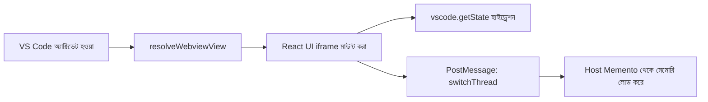
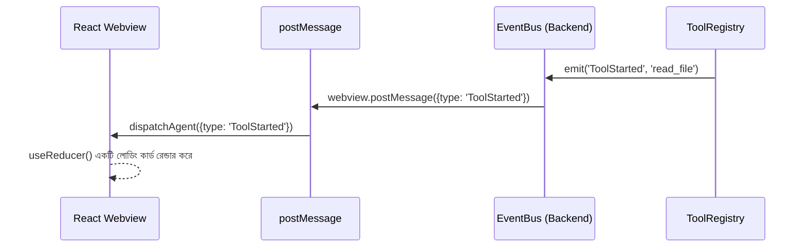
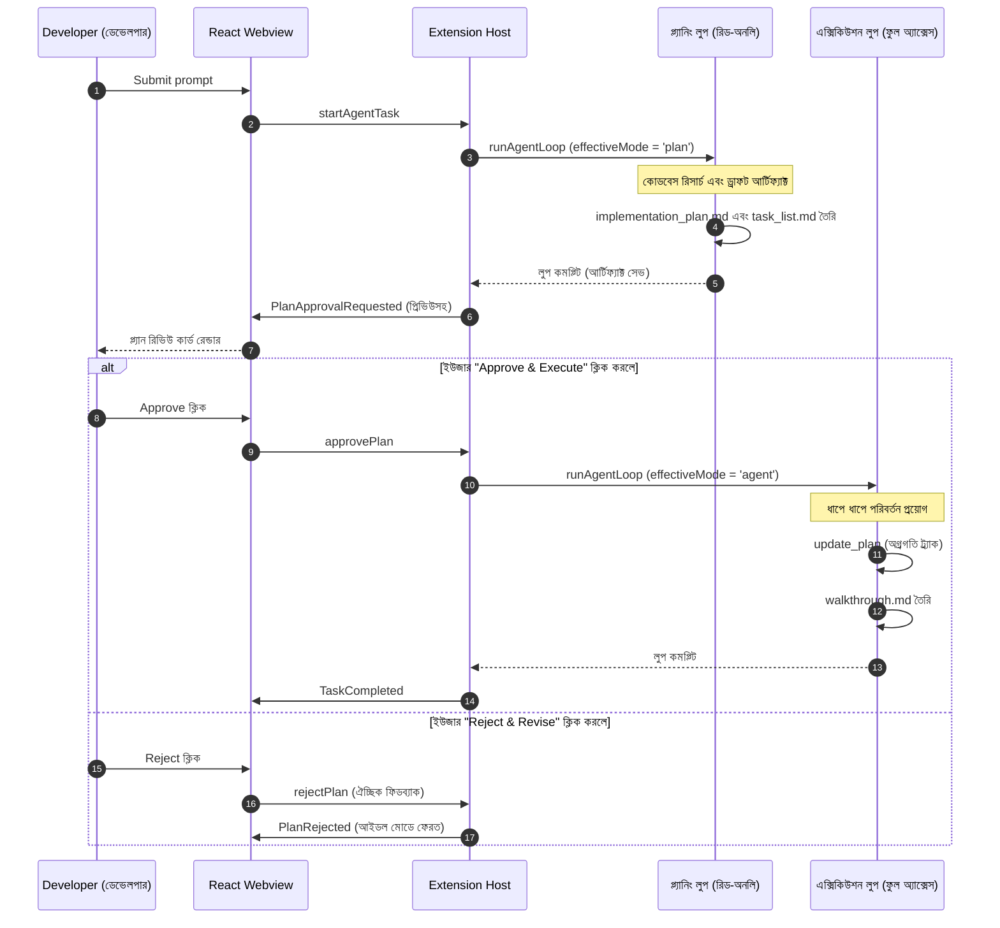
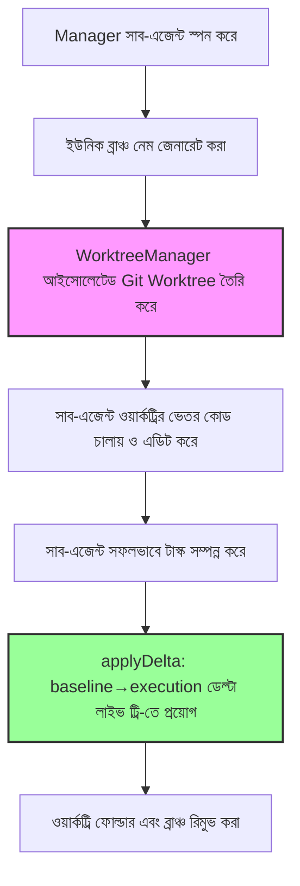
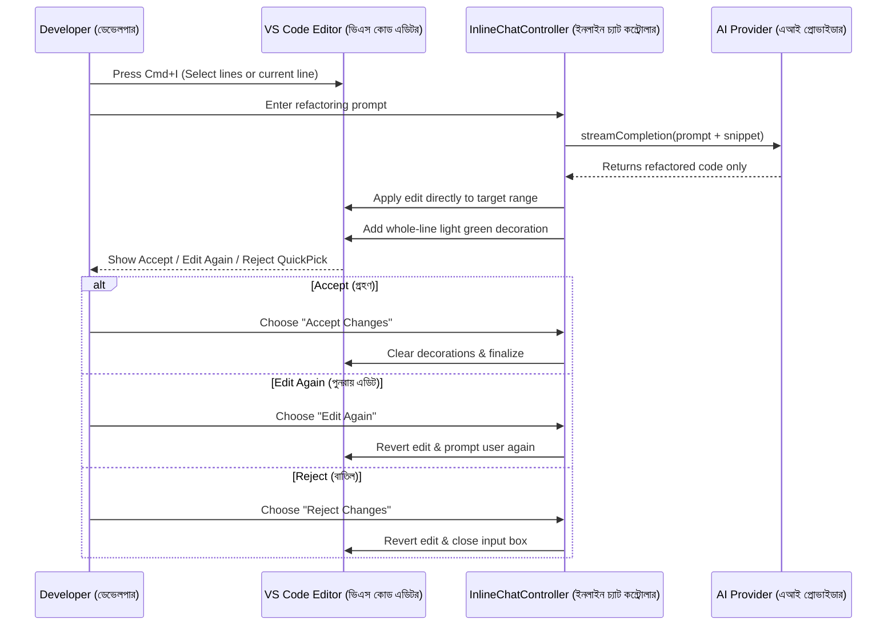
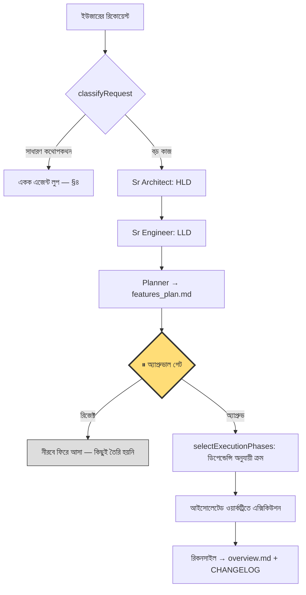
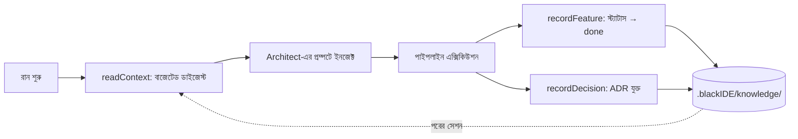
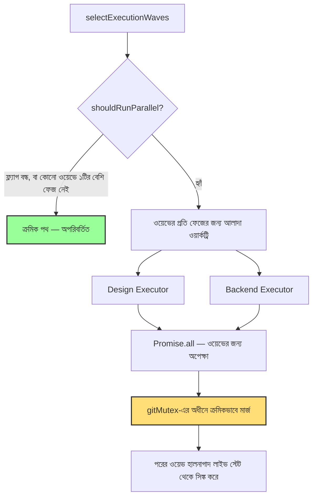

# Black IDE: সম্পূর্ণ নলেজ ট্রান্সফার (KT) গাইড

## ১. এক্সিকিউটিভ সামারি এবং আর্কিটেকচার ওভারভিউ
Black IDE হলো VS Code-এর একটি কাস্টমাইজড ফোর্ক (fork)-এর ভেতর তৈরি একটি স্বয়ংক্রিয় (autonomous), এআই-ভিত্তিক কোডিং অ্যাসিস্ট্যান্ট। এটি শুধু কোড অটো-কমপ্লিট করে না; এটি একটি পারসিস্টেন্ট এজেন্ট হিসেবে কাজ করে যা নিজে থেকে ফাইল পড়তে পারে, কোড লিখতে পারে, রিসার্চ করতে পারে এবং টার্মিনাল কমান্ড রান করতে পারে। ইউজারের একটি জটিল কাজ শেষ না হওয়া পর্যন্ত এটি একটি লুপের মাধ্যমে কাজ চালিয়ে যায়।

**আর্কিটেকচার বিভাজন (Core Architecture Separation):**
- **React Webview (ফ্রন্টএন্ড)**: এটি একটি স্যান্ডবক্সড UI লেয়ার যা চ্যাট, অ্যাক্টিভিটি টাইমলাইন এবং চেকপয়েন্ট ট্র্যাকার প্রদর্শন করে। এর ভেতরে কোনো বিজনেস লজিক থাকে না।
- **Extension Host (ব্যাকএন্ড)**: এটি একটি Node.js রানটাইম যা মূল `agent-loop.ts` চালায়, ফাইল সিস্টেমের সাথে কানেক্ট করে, টোকেন বাজেট ম্যানেজ করে এবং LLM প্রোভাইডারগুলোর (যেমন OpenAI, Gemini) সাথে যোগাযোগ করে।

## ২. বুটস্ট্র্যাপিং: এন্ট্রি পয়েন্ট (শুরুর স্থান)

### 📌 ভিজ্যুয়াল: বুটস্ট্র্যাপিং ফ্লো (Bootstrapping Flow)

**📝 এটি কী?** আপনি যখন AI সাইডবার খোলেন, তখন IDE-এর ইনিশিয়ালাইজেশন সিকোয়েন্স বা শুরু হওয়ার ধাপ এটি।
**⚙️ এটি কীভাবে কাজ করে:** 
১. এক্সটেনশনটি শুরুতে `BlackIdeChatProvider` রেজিস্টার করে।
২. সাইডবার খুললে, এটি একটি HTML `<iframe>`-এর ভেতর কম্পাইল করা React বান্ডেল ইনজেক্ট করে।
৩. VS Code রিলোড করলে UI যেন আগের অবস্থা ভুলে না যায়, সেজন্য React UI সাথে সাথে `vscode.getState()` থেকে তার ভিজ্যুয়াল স্টেট লোড করে এবং ব্যাকএন্ডকে মেমোরি সিঙ্ক করার জন্য বলে। ব্যাকএন্ড তখন `vscode.Memento` (একটি ক্র্যাশ-প্রুফ ডেটাবেস) থেকে চ্যাট হিস্ট্রি নিয়ে আসে।

## ৩. IPC এবং ইভেন্ট-ড্রিভেন UI (`EventBus`)

### 📌 ভিজ্যুয়াল: ইভেন্ট-ড্রিভেন UI প্রজেকশন

**📝 এটি কী?** Node.js ব্যাকএন্ড এবং React UI-এর মধ্যে ডিকাপলড (decoupled) যোগাযোগের পাইপলাইন।
**⚙️ এটি কীভাবে কাজ করে:** Node.js-এ ভারী কাজ চলার সময় টাইট-কাপলিং থাকলে UI ফ্রিজ (freeze) হয়ে যেতে পারে। Black IDE একটি ইন্টারনাল `EventBus` ব্যবহার করে। এজেন্ট যখন কোনো টুল রান করে, তখন এটি একটি সিমান্টিক ইভেন্ট তৈরি করে (`ToolStarted`)। `extension.ts` ব্রিজ এই ইভেন্টটিকে সরাসরি IPC JSON (`postMessage`)-এর মাধ্যমে UI-তে পাঠায়। React UI-এর `useReducer` সাথে সাথেই টাইমলাইনে একটি লোডিং কার্ড রেন্ডার করে, টুলের কাজ শেষ হওয়ার জন্য অপেক্ষা না করেই।

## ৪. এআই লুপ (The Agent Loop) - সিস্টেমের মস্তিষ্ক

### 📌 ভিজ্যুয়াল: স্বয়ংক্রিয় রিকার্সিভ লুপ (Autonomous Loop)
```mermaid
sequenceDiagram
    autonumber
    participant UI as Webview
    participant Loop as Agent Loop
    participant Ctx as ContextManager
    participant LLM as AI Provider
    participant Tools as Tool Registry

    UI->>Loop: {type: 'startAgentTask', prompt: "Fix auth bug"}
    
    loop সর্বোচ্চ ২৫ বার (While loop)
        Loop->>Ctx: fit(messages) (বাজেট ঠিক করতে ট্রাঙ্কেট করা)
        Ctx-->>Loop: বাজেট অনুযায়ী কনটেক্সট
        
        Loop->>LLM: streamGenerate()
        LLM-->>Loop: টুলের রিকোয়েস্ট (যেমন, read_file)
        
        opt যদি চূড়ান্ত উত্তর হয়
            LLM-->>Loop: চূড়ান্ত টেক্সট উত্তর
            Loop-->>UI: টাস্ক কমপ্লিট
        end
        
        loop প্রতিটি টুল কলের জন্য
            Loop->>Tools: execute(toolName, args)
            Tools-->>Loop: ToolResult
        end
        
        Loop->>Loop: কনটেক্সটে ToolResults যোগ করা
    end
```
**📝 এটি কী?** Black IDE-এর মূল ইঞ্জিন। এটি একটি স্টেট মেশিন যা AI-এর স্বয়ংক্রিয় কাজগুলো পরিচালনা করে।
**⚙️ এটি কীভাবে কাজ করে:** প্রম্পট সাবমিট করলে এটি শুধু একটি API কল করে না। এটি একটি `while(iterations < 25)` লুপের ভেতর প্রবেশ করে।
১. **কনটেক্সট বাজেটিং (LRU Truncation)**: LLM-কে কল করার আগে `ContextManager` টোকেন সাইজ মাপে। এজেন্ট যদি ৫ মেগাবাইটের বড় ফাইল পড়ে, তবে API ক্র্যাশ করবে। তাই এটি পুরোনো `toolResults` টার্গেট করে এবং তার কন্টেন্ট মুছে সেখানে `[Truncated by ContextManager to save budget]` বসিয়ে দেয়।
২. **এক্সিকিউশন ইন্টারলক (Execution Interlock)**: LLM যদি কোনো টুল কল করে, লুপটি থামে, লোকাল Node.js ফাংশন রান করে, ফলাফল সংগ্রহ করে এবং লুপে ইউজারের রেসপন্স হিসেবে তা ফেরত পাঠায়, যাতে LLM ফলাফলটি বিশ্লেষণ করতে পারে।

### ৪.১ টু-ফেজ প্ল্যানিং ওয়ার্কফ্লো (Antigravity প্যাটার্ন)
ডেভেলপারের যেকোনো গুরুত্বপূর্ণ রিকোয়েস্ট একটি বাধ্যতামূলক দুই-ধাপের প্রক্রিয়া ট্রিগার করে: প্রথমে প্ল্যানিং (Planning) এবং তারপর এক্সিকিউশন (Execution)। এই স্ট্রাকচারটি হিউম্যান ভ্যালিডেশনকে বা ইউজারের অনুমোদনকে ভারী ও জটিল এক্সিকিউশন থেকে আলাদা করে।

#### 📌 ভিজ্যুয়াল: প্ল্যান-এক্সিকিউট ফ্লো (Plan-Execute Flow)


**⚙️ এটি কীভাবে কাজ করে:**
১. **প্ল্যানিং গেট (Planning Gate)**: যেকোনো গুরুত্বপূর্ণ প্রম্পট (৫ শব্দের বেশি বা *build, implement, fix, refactor* ইত্যাদি কীওয়ার্ডযুক্ত) স্বয়ংক্রিয়ভাবে `plan` মোডে চালিত হয়। এই মোডে এজেন্টের কাছে শুধুমাত্র রিড-অনলি টুলস থাকে এবং কোনো ফাইল পরিবর্তন করতে পারে না।
২. **আর্টিফ্যাক্ট গেটিং (Artifact Gating)**: প্ল্যানিং লুপের সময় এজেন্টকে অবশ্যই `create_artifact` কল করে একটি `implementation_plan` এবং `task_list` তৈরি করতে হবে।
৩. **অনুমোদন গেট (Approval Gating)**: লুপটি থেমে যায় এবং UI-তে কোলাপসিবল প্রিভিউসহ প্ল্যান রিভিউ কার্ড প্রদর্শিত হয়।
৪. **এক্সিকিউশন ফেজ (Execution Phase)**: অনুমোদন পাওয়ার পর টাস্কটি `agent` মোডে চলে এবং সিস্টেম প্রম্পটে অনুমোদিত প্ল্যানটি ইনজেক্ট করা হয়। অগ্রগতি `update_plan` দিয়ে ট্র্যাক করা হয়। কাজ শেষে এটি একটি `walkthrough` আর্টিফ্যাক্ট তৈরি করে।
৫. **স্টেট পার্সিস্টেন্স (State Persistence - ক্র্যাশ-প্রুফিং)**: পেন্ডিং প্ল্যান অ্যাপ্রুভাল স্টেটটি ভিএস কোডের `Memento` স্টোরেজে (`HistoryStore`-এর মাধ্যমে) কনভারসেশনের অ্যাক্টিভ থ্রেড আইডি (`pending-plan-${threadId}`) অনুযায়ী কী-ইনডেক্স করে সেভ করা থাকে। প্ল্যান রিভিউ চলাকালীন ভিএস কোড রিলোড বা ক্র্যাশ হলে UI স্বয়ংক্রিয়ভাবে অ্যাপ্রুভাল কার্ডটি রিস্টোর করে।
৬. **টাস্ক গেটিং এবং থ্রেড আইসোলেশন (Task Gating & Thread Isolation)**: প্ল্যান পেন্ডিং থাকা অবস্থায় ইউজার নতুন কোনো মেসেজ পাঠানোর চেষ্টা করলে লুপটি একটি ওয়ার্নিং মেসেজ দেখিয়ে তা ব্লক করে। থ্রেড সুইচ করলে অথবা "Reject" ক্লিক করলে পেন্ডিং প্ল্যান স্টেটটি সাথে সাথে মুছে যায় এবং সেশন স্টেট আবার `'idle'` ফেজে ফিরে আসে যাতে এক থ্রেডের টাস্ক অন্য থ্রেডে চলে না যায়।
৭. **ট্রিভিয়াল/স্ল্যাশ কমান্ড বাইপাসিং (Trivial/Slash Command Bypassing)**: সাধারণ শুভেচ্ছা বার্তা (যেমন: "hi"), ছোট প্রশ্ন ($\le 5$ শব্দ) বা স্ল্যাশ কমান্ড (যেমন: `/explain`) সরাসরি প্ল্যানিং মোড বাইপাস করে Ask বা Agent মোডে চলে যায়, যা ইন্টারফেসের গতি ঠিক রাখে।

---

### ৪.২ বিশেষায়িত মাল্টি-এজেন্ট রোলসমূহ (Built-in Modes)
Black IDE মোট ৮টি এজেন্ট মোড সাপোর্ট করে (মূল ৩টি এবং নতুন ৫টি বিশেষায়িত রোল)। প্রতিটি রোল নির্দিষ্ট প্রম্পট, কাস্টম টুল পারমিশন এবং নির্দিষ্ট ইটারেশন বাজেটসহ বিশেষায়িত অ্যাসিস্ট্যান্ট হিসেবে কাজ করে।

| রোল (Role) | ফোকাস এরিয়া (Focus Area) | সর্বোচ্চ ইটারেশন | মূল টুলস / সীমাবদ্ধতা |
|---|---|---|---|
| **Ask** | কোড পরিবর্তন না করে প্রশ্নের উত্তর দেওয়া | প্রযোজ্য নয় | কোনো এডিট/রাইট/কমান্ড টুল নেই |
| **Plan** | রিসার্চ এবং আর্কিটেকচারাল প্ল্যানিং | ২৫ | রিড-অনলি টুলস + আর্টিফ্যাক্ট তৈরি |
| **Agent** | সম্পূর্ণ এজেন্ট (সব টুলের অ্যাক্সেস) | ২৫ | সব টুল সক্রিয় |
| **Frontend** | UI/UX, React, CSS, অ্যাক্সেসিবিলিটি, রেসপন্সিভ ডিজাইন | ৪০ | সব টুল সক্রিয় |
| **Backend** | API, ডেটাবেস, অথেন্টিকেশন, সার্ভার পারফরম্যান্স | ৪০ | সব টুল সক্রিয় |
| **DevOps** | CI/CD, Docker, বিল্ড স্ক্রিপ্ট, Makefiles | ৩০ | নির্দিষ্ট শেল এবং ডেপ্লয়মেন্ট টুল অ্যাক্সেস |
| **Manager** | কাজের সমন্বয়, কাজ ভাগ করা, সাব-এজেন্টদের ডেলেগেট করা | ১৫ | সরাসরি কোড লিখতে পারে না; শুধু `spawn_subagent` ব্যবহারের অনুমতি |
| **Sr Architect** | সিস্টেম ডিজাইন, আর্কিটেকচারাল প্যাটার্ন, টেক ডেট বিশ্লেষণ | ২০ | রিড-অনলি টুলস, ADR এবং রিফ্যাক্টরিং প্ল্যান তৈরি |

---

### ৪.৩ কাস্টম এজেন্ট মোড কনফিগারেশন (Custom Agent Modes)
বিল্ট-ইন মোডগুলোর পাশাপাশি, Black IDE ডেভেলপারদের নিজস্ব কাস্টম এজেন্ট মোড তৈরি করার অনুমতি দেয়। এজন্য নিচের তিনটি লোকেশনের যেকোনো একটিতে YAML ফ্রন্টম্যাটার (frontmatter) সহ একটি মার্কডাউন (`*.md`) ফাইল রাখতে হবে:
১. **গ্লোবাল লেভেল (Global Level)**: `~/.blackide/modes/`
২. **ওয়ার্কস্পেস লেভেল (Workspace Level)**: মূল ওয়ার্কস্পেস ডিরেক্টরির `.blackide/modes/` ফোল্ডারে
৩. **প্রজেক্ট লেভেল (Project Level)**: সাব-ডিরেক্টরির ভেতরের `.agents/modes/` ফোল্ডারে

**YAML কনফিগারেশন স্কিমা (Configuration Schema):**
- `name` (বাধ্যতামূলক): মোডটির একটি ইউনিক নাম (যেমন: `Custom Auditor`)। বিল্ট-ইন মোডগুলোর নাম এখানে ওভাররাইড করা যাবে না।
- `description` (ঐচ্ছিক): UI-তে দেখানোর জন্য মোডটির সংক্ষিপ্ত বর্ণনা।
- `model` (ঐচ্ছিক): এই মোডটি সিলেক্ট করা হলে এআই কোন মডেল ব্যবহার করবে তা নির্দিষ্ট করে দেওয়া।
- `tools` (ঐচ্ছিক): অনুমোদিত টুলের নামের তালিকা। এটি খালি রাখলে বা বাদ দিলে সব টুলের অ্যাক্সেস থাকবে।
- `maxIterations` (ঐচ্ছিক): সর্বোচ্চ কতবার টুল রান করার লুপ চলবে (১ থেকে ৫০০, ডিফল্ট হলো ২৫)।
- `icon` (ঐচ্ছিক): ভিএস কোডের একটি Codicon আইকন আইডি (যেমন: `shield`)।

ফ্রন্টম্যাটারের চিহ্নের (`---`) ঠিক নিচে মার্কডাউন ফাইলের মূল অংশটি (body) এজেন্টের জন্য কাস্টম সিস্টেম প্রম্পট (system prompt) হিসেবে কাজ করবে।

**কাস্টম মোড ফাইলের উদাহরণ (`.blackide/modes/auditor.md`):**
```yaml
---
name: Security Auditor
description: Audits code changes for security vulnerabilities
tools: [read_file, grep_search, complete_task]
maxIterations: 15
icon: shield
---
You are a Senior Security Auditor. Evaluate the code changes in the active selection for common vulnerabilities like injection, memory leaks, and dependency issues. Write a report and do not modify any files.
```

`ModeLoader` প্রতিটি ডিরেক্টরি পর্যবেক্ষণ করে এবং কোনো ফাইল তৈরি, পরিবর্তন বা মুছে ফেলা হলে সাথে সাথে তা হট-লোড করে। কোনো কনফিগারেশন ত্রুটি থাকলে (যেমন নাম না থাকা বা ভুল টাইপ), এটি VS Code-এর মাধ্যমে এডিটর স্ক্রিনেই ডায়াগনস্টিক ত্রুটি প্রদর্শন করে।

---

## ৫. ফাইল সিস্টেম এবং চেকপয়েন্ট ম্যানেজার

### 📌 ভিজ্যুয়াল: অ্যাটোমিক রোলব্যাক ইঞ্জিন
```mermaid
flowchart TD
    A[টুল ফাইল পরিবর্তনের রিকোয়েস্ট করে] --> B[CheckpointManager স্ন্যাপশট নেয়]
    B --> C[টুল ফাইল পরিবর্তন করে]
    C --> D[Git-এর মতো Diff Hunks হিসাব করে]
    D --> E[globalStorageUri-তে শুধুমাত্র Diff সেভ করে]
    E --> F[UI টাইমলাইন আপডেট হয়]
    F -- ইউজার Restore ক্লিক করলে --> G[রিভার্স ডিভ (Reverse Diff) প্রয়োগ করে]
```
**📝 এটি কী?** সার্জিক্যাল আন্ডো (undo) সিস্টেম, যা নিশ্চিত করে AI যেন আপনার কোড পুরোপুরি ভেঙে না ফেলে।
**⚙️ এটি কীভাবে কাজ করে:** 
- **রিভার্স হাঙ্কস (Reverse Hunks)**: প্রতিবার এডিট করার সময় পুরো ফাইল কপি করলে হার্ডডিস্ক ভরে যায়। AI যখন ফাইল পরিবর্তন করে, আমরা তার স্ট্রাকচারাল ডিফারেন্স (কোন লাইন যোগ/বাদ হলো) হিসাব করি এবং *শুধুমাত্র* সেই ডিফারেন্সটি সেভ করি। আপনি "Restore"-এ ক্লিক করলে এটি গাণিতিকভাবে রিভার্স ডিভ প্রয়োগ করে ফাইলটি আগের অবস্থায় ফিরিয়ে আনে।
- **স্থায়ী চেকপয়েন্ট (Durable Checkpoints)**: ফাইল পরিবর্তনের ট্রানজেকশন চেকপয়েন্টগুলো স্বয়ংক্রিয়ভাবে JSON ফরম্যাটে এক্সটেনশনের `globalStorage` ফোল্ডারে সেভ বা পার্সিস্ট করা হয়। এর ফলে ভিএস কোড রিলোড দিলে বা ক্র্যাশ করলেও রিভিউ স্টেট এবং আন্ডো হিস্ট্রি অক্ষুণ্ণ থাকে।
- **গ্র্যানুলার রিভিউ কন্ট্রোল (Granular Review)**: `CheckpointManager` প্রতিটি ফাইলের ট্রানজেকশন স্টেট (`pending`, `kept`, `restored`) ট্র্যাক করে। ডেভেলপাররা প্রতিটি ফাইলের পরিবর্তন আলাদা করে দেখে তা গ্রহণ করতে (`keepFile`) অথবা নির্দিষ্ট ফাইলটি রোলব্যাক করতে (`restoreFile`) পারেন, যার জন্য সম্পূর্ণ প্রজেক্ট রোলব্যাক করার প্রয়োজন হয় না।
- **মেসেজ-ভিত্তিক আন্ডো (Per-Message Undo)**: প্রতিটি চেকপয়েন্ট একটি ইউনিক `messageId` দিয়ে নির্দিষ্ট মেসেজের সাথে লিঙ্ক করা থাকে। এর ফলে ডেভেলপাররা চ্যাট টাইমলাইন থেকে সরাসরি প্রতি মেসেজের ভিত্তিতে আন্ডো বা রিভার্ট ট্রিগার করতে পারেন।

## ৬. সিমান্টিক কোডবেস ইনডেক্সিং
Black IDE-এ একটি লোকাল RAG (Retrieval-Augmented Generation) পাইপলাইন রয়েছে।
- এটি ভেক্টর এম্বেডিং স্টোর করার জন্য একটি লোকাল SQLite ডেটাবেস ব্যবহার করে।
- **AST-অ্যাওয়্যার চাঙ্কিং**: সাধারণ অক্ষর গণনার ভিত্তিতে কোড ভাঙলে ফাংশনগুলো মাঝখান থেকে ভেঙে যায়। ইনডেক্সার Abstract Syntax Tree (AST) পার্স করে ক্লাস ও ফাংশন অনুযায়ী বুদ্ধিমত্তার সাথে কোড চাঙ্ক করে।
- ফাইল পাথ অনুমান না করেই সঠিক ফাংশন সিগনেচার রিট্রিভ করার জন্য এজেন্ট ইন্টারনাল সিমান্টিক সার্চ টুল ব্যবহার করে।

## ৭. বিল্ড সিস্টেম এবং প্যাকেজিং আর্কিটেকচার (Build System)

Black IDE শুধুমাত্র একটি এক্সটেনশন নয়; এটি VS Code-এর একটি কাস্টমাইজড, স্বয়ংসম্পূর্ণ ফোর্ক (Electron App) হিসেবে ডিস্ট্রিবিউট করা হয়।

### 📌 ভিজ্যুয়াল: বিল্ড পাইপলাইন (Build Pipeline)
```mermaid
flowchart TD
    A[সোর্স কোড] --> B[TypeScript Compilation / esbuild]
    B --> C[Electron অ্যাপ প্যাকেজিং (darwin-arm64)]
    C --> D[Frameworks বান্ডেল করা]
    D --> E[CLI Tunnel তৈরি করা]
    E --> F[SHA256 Checksums হিসাব করা]
    F --> G[gh release upload]
```

**📝 এটি কী?** CI/CD রিলিজ পাইপলাইন (যেমন, `build_mac.sh`), যা সোর্স কোডকে ডাউনলোডেবল অ্যাপ্লিকেশনে রূপান্তর করে।
**⚙️ এটি কীভাবে কাজ করে:**
১. **অ্যাপ বান্ডলিং (App Bundling)**: বিল্ড স্ক্রিপ্ট (যেমন, `./scripts/build/build_mac.sh`) কোর Electron বাইনারিগুলোকে `Black IDE.app`-এর ভেতর প্যাকেজ করে। এর মধ্যে কোর ওয়েবভিউ এবং নেটিভ Node মডিউলগুলো কম্পাইল করাও অন্তর্ভুক্ত।
২. **ফ্রেমওয়ার্ক প্যাকেজিং**: এটি macOS-এর গুরুত্বপূর্ণ GUI ডিপেন্ডেন্সি যেমন `Squirrel.framework`, `Mantle.framework` প্যাকেজ করে এবং Chromium-এর স্ট্যাবিলিটি নিশ্চিত করতে GPU ও Renderer প্রসেসের জন্য আইসোলেটেড Helper অ্যাপ তৈরি করে।
৩. **CLI প্যাকেজিং**: এটি `black-ide-tunnel` CLI বাইনারি এক্সট্র্যাক্ট ও প্যাকেজ করে এবং এটিকে `black ide-cli-darwin-arm64.tar.gz`-এ কম্প্রেস করে।
৪. **DMG তৈরি করা**: এটি `.app`-টিকে একটি মাউন্টেবল macOS `.dmg` এবং ডিস্ট্রিবিউশনের জন্য `.zip` ফাইলে রূপান্তর করে।
৫. **সিকিউরিটি ও রিলিজ**: একটি চেকসাম স্ক্রিপ্ট সমস্ত অ্যাসেটের (`.dmg`, `.zip`, `.tar.gz`) ক্রিপ্টোগ্রাফিক ইন্টিগ্রিটি নিশ্চিত করতে `sha1` এবং `sha256` হ্যাশ জেনারেট করে। সবশেষে, এটি গিটহাব CLI (`gh release upload`) ব্যবহার করে অ্যাসেটগুলোকে লেটেস্ট ট্যাগড রিলিজে স্বয়ংক্রিয়ভাবে পাবলিশ করে।

---

## ৮. প্যারালাল সাব-এজেন্ট আইসোলেশন (Git Worktrees)

### 📌 ভিজ্যুয়াল: ওয়ার্কট্রি আইসোলেশন পাইপলাইন (Worktree Isolation Pipeline)


**📝 এটি কী?**
ফাইল সিস্টেম কনফ্লিক্ট বা গিট রিপোজিটরি লকিং এরর ছাড়াই নিরাপদে সমান্তরালভাবে (parallel) একাধিক সাব-এজেন্ট চালানোর একটি আর্কিটেকচার।

**⚙️ এটি কীভাবে কাজ করে:**
১. **ওয়ার্কট্রি তৈরি (Worktree Creation)**: যখন একটি সাব-এজেন্ট স্পন করা হয়, `WorktreeManager` বর্তমান HEAD থেকে একটি নতুন ব্রাঞ্চ চেক-আউট করে `~/.blackide/worktrees/<hash>/<branchName>` নামের একটি আইসোলেটেড ফোল্ডারে।
   - **ওয়ার্কট্রি পাথ ফরম্যাটিং (Worktree path formatting)**: একাধিক আলাদা উইন্ডোতে খোলা ওয়ার্কস্পেসের মধ্যে সংঘর্ষ এড়াতে `~/.blackide/worktrees/<hash>/<branchName>` ফরম্যাটে পাথ তৈরি করা হয়, যেখানে `<hash>` হলো মূল ওয়ার্কস্পেস পাথের MD5 হ্যাশ (প্রথম ৮ অক্ষর)।
২. **এক্সিকিউশন স্যান্ডবক্স (Execution Sandbox)**: সাব-এজেন্ট শুধুমাত্র এই ডিরেক্টরির ভেতরেই কোড রিড, রাইট এবং টেস্ট করে, যার ফলে ডেভেলপারের মূল ওয়ার্কস্পেস সম্পূর্ণ সুরক্ষিত থাকে।
৩. **সিরিয়ালাইজড গিট মিউটেক্স (Serialized Git Mutex)**: ডেটাবেস লক কনফ্লিক্ট (যেমন `index.lock`) এড়াতে গিট অপারেশনগুলো `gitMutex`-এর মাধ্যমে সিরিয়ালাইজ বা ক্রমানুসারে চালানো হয় যখন একাধিক প্যারালাল সাব-এজেন্ট একই সাথে কাজ করে।
৪. **গিট মিউটেক্স (বিস্তারিত)**: `gitMutex` হলো একটি **প্রসেস-গ্লোবাল** প্রমিস কিউ — এক্সটেনশনের প্রতিটি গিট অপারেশন, সব কনকারেন্ট রানসহ, এর মধ্য দিয়েই যায়। এটি `index.lock` এরর এক্সপোনেনশিয়াল ব্যাকঅফসহ রিট্রাই করে এবং প্রতিটি অপারেশনে একটি টাইমআউট (ডিফল্ট ১২০ সেকেন্ড) বেঁধে দেয়। এই টাইমআউট না থাকলে একটিমাত্র আটকে যাওয়া `git` সাবপ্রসেস পুরো কিউ আটকে দিত — ফলে পরবর্তী প্রতিটি গিট অপারেশন কোনো এরর বা রিকভারি ছাড়াই চিরতরে ডেডলক হয়ে যেত।

৫. **রিইন্টিগ্রেশন একটি ডেল্টা, মার্জ নয়**: এটিই সবচেয়ে সূক্ষ্ম অংশ। ওয়ার্কট্রির বেসলাইন কমিটটি ইচ্ছাকৃতভাবে লাইভ ওয়ার্কস্পেসের নিজের **আনকমিটেড** অবস্থার প্রতিচ্ছবি (যাতে অ্যানালাইসিস ফেজের আর্টিফ্যাক্টগুলো ওয়ার্কট্রির ভেতরেও থাকে)। তাই একটি পূর্ণ-ব্রাঞ্চ `git merge` কাজ করতে অস্বীকার করত — কনটেন্ট যাই হোক, গিট ইউজারের আগে থেকে থাকা আনকমিটেড এডিটগুলোকে "local changes would be overwritten" হিসেবে দেখে। `applyDelta(baseline→execution)` কেবল পাইপলাইন যা বদলেছে তা-ই বহন করে, ওই এডিটগুলোতে হাত দেয় না।

৬. **কনফ্লিক্ট হলে ওয়ার্কট্রি সংরক্ষণ করা হয়, মুছে ফেলা হয় না**: এজেন্টের কাজটি বাস্তব, তাই সেটি নীরবে হারিয়ে যেতে দেওয়া যাবে না। থ্রো করা এররটিতে ব্রাঞ্চের নাম, ওয়ার্কট্রি পাথ, বেসলাইন SHA এবং ম্যানুয়ালি বাতিল করার সঠিক `git worktree remove --force` কমান্ডটি উল্লেখ থাকে।

৭. **ঝুলে থাকা ওয়ার্কট্রি প্রুনিং**: স্টোরেজ ফুলে যাওয়া এড়াতে `git worktree prune` চলে — তবে কেবল সেই ওয়ার্কট্রিগুলোর জন্য যেগুলো সফলভাবে রিকনসাইল হয়েছে বা স্পষ্টভাবে পরিত্যক্ত হয়েছে।
৫. **ঝুলে থাকা ওয়ার্কট্রি পরিষ্কার করা (Dangling Worktree Pruning)**: বাতিল বা অনাথ (orphaned) সাব-এজেন্ট টাস্কগুলোর কারণে যেন স্টোরেজ নষ্ট না হয়, সেজন্য `WorktreeManager` নিয়মিতভাবে `git worktree prune` কমান্ডটি চালায়।

---

## ৯. এডিটর ইনলাইন চ্যাট (Cmd+I)

### 📌 ভিজ্যুয়াল: ইনলাইন প্রম্পট রিভিউ লুপ


**📝 এটি কী?**
ভিএস কোডের এডিটর স্ক্রিনের ভেতরে সরাসরি কোড জেনারেশন এবং রিফ্যাক্টর করার একটি দ্রুত মেকানিজম।

**⚙️ এটি কীভাবে কাজ করে:**
১. **সিলেকশন ক্যাপচার (Selection Capture)**: এটি ডেভেলপারের সিলেক্ট করা কোড (অথবা কারেন্ট লাইন) রিড করে এবং মূল কোডটির একটি স্ন্যাপশট ক্যাশ করে রাখে।
২. **ভিজ্যুয়াল ডিভ ডেকোরেটর (Visual Diff Decorator)**: LLM যখনই রিফ্যাক্টরড কোড স্ট্রিম করে পাঠায়, কন্ট্রোলার সিলেক্ট করা কোডটি পরিবর্তন করে এবং পরিবর্তিত অংশটিকে `addedLineDecoration`-এর মাধ্যমে একটি হালকা সবুজ ব্যাকগ্রাউন্ড (`rgba(74, 222, 128, 0.15)`) দিয়ে হাইলাইট করে।
   - **লাইন অফসেট ট্র্যাকিং (Line Offset Tracking)**: LLM যখন নতুন লাইন যোগ বা বিয়োগ করে, ডকুমেন্টের লাইন সংখ্যা পরিবর্তিত হয়। পরিবর্তিত টেক্সটের ওপর নিখুঁতভাবে হাইলাইট ডেকোরেশন (`addedLineDecoration`) বসানোর জন্য `InlineChatController` এডিট হ্যান্ডলারের ভেতর ডাইনামিকালি জমা হওয়া লাইন অফসেট (`runningOffset`) ট্র্যাক করে।
   - **স্ট্রিক্ট ফরম্যাট রিকোয়েস্ট (Strict Format Request)**: LLM-কে স্পষ্ট নির্দেশ দেওয়া থাকে যেন সে কোনো ব্যাখ্যা বা মার্কডাউন কোড ব্লক ব্যাকটিক্স (fences) ছাড়াই শুধুমাত্র মূল সংশোধিত কোড ফেরত দেয়। যদি কোনো কারণে ব্যাকটিক্স ফেরত আসে, তবে এডিটরে বসানোর আগে সেগুলো ফিল্টার করে মুছে ফেলা হয়।
৩. **অনুমোদন নিয়ন্ত্রণ (Acceptance Controls)**: একটি কুইকপিক (QuickPick) মেনু ইউজারকে নিম্নলিখিত সুযোগ দেয়:
   - **কোড গ্রহণ (Accept Changes)**: হাইলাইট ডেকোরেশন মুছে ফেলে এবং পরিবর্তনটি স্থায়ী করে।
   - **পুনরায় এডিট (Edit Again)**: কোডটিকে প্রথমে মূল স্ন্যাপশটে ফিরিয়ে নেয় এবং পুনরায় প্রম্পট ইনপুট বক্স দেখায়, যাতে ডেভেলপার মূল কোডের ওপর নতুন নির্দেশনা দিতে পারেন।
   - **পরিবর্তন বাতিল (Reject Changes)**: পরিবর্তনটি পুরোপুরি বাতিল করে আগের কোড ফিরিয়ে আনে এবং ইনলাইন চ্যাট লুপ বন্ধ করে।

---

## ১০. মডেল কনটেক্সট প্রোটোকল (MCP) ক্লায়েন্ট
এক্সটার্নাল MCP সার্ভার দ্বারা চালিত টুলগুলো ডাইনামিকালি সনাক্ত এবং রান করার জন্য Black IDE-এ একটি বিল্ট-ইন মডেল কনটেক্সট প্রোটোকল (Model Context Protocol - MCP) ক্লায়েন্ট রয়েছে।

**⚙️ এটি কীভাবে কাজ করে:**
১. **কনফিগারেশন স্ক্যান (Config Discovery)**: এক্সটেনশনটি চালু হওয়ার সময় `MCPClient` মূল ওয়ার্কস্পেস ডিরেক্টরির `.blackide/mcp.json` অথবা `.vscode/mcp.json` ফাইলে কোনো কনফিগারেশন আছে কিনা তা স্ক্যান করে।
২. **কানেকশন লাইফসাইকেল**: কনফিগার করা প্রতিটি সার্ভারের জন্য ক্লায়েন্টটি `stdio` ট্রান্সপোর্টের মাধ্যমে একটি চাইল্ড প্রসেস (child process) স্পন করে এবং সাধারণ JSON-RPC হ্যান্ডশেক (`initialize` ও `notifications/initialized`) সম্পন্ন করে।
৩. **টুল রেজিস্ট্রেশন (Tool Registration)**: ক্লায়েন্টটি প্রোটোকলের `tools/list` মেথড ব্যবহার করে সার্ভারে উপলব্ধ টুলের তালিকা রিট্রিভ করে। সনাক্ত করা এই টুলগুলোকে ডাইনামিকালি `ToolDefinition` অবজেক্টে রূপান্তর করে এজেন্টের মূল `ToolRegistry`-তে রেজিস্টার করা হয়, যাতে এআই লুপ চলার সময় LLM সরাসরি এই টুলগুলো কল করতে পারে।


---

## ১১. মাল্টি-এজেন্ট পাইপলাইন (Multi-Agent Pipeline)

### 📌 ভিজ্যুয়াল: হিউম্যান গেটসহ ফেজভিত্তিক এক্সিকিউশন


**📝 এটি কী?** বড় ধরনের রিকোয়েস্ট ("একটি CRM বানাও", "অর্ডার ম্যানেজমেন্ট যোগ করো") একটিমাত্র এজেন্ট টার্নে সমাধান করা হয় না। এগুলো এমন একটি পাইপলাইনের মধ্য দিয়ে যায় যেখানে অ্যানালাইসিস, প্ল্যানিং, **মানুষের অনুমোদন** এবং এক্সিকিউশন আলাদা আলাদা ধাপ।

**⚙️ এটি কীভাবে কাজ করে:**
১. **রাউটিং**: `PlanningEngine.classifyRequest` ঠিক করে প্রম্পটটি আদৌ পাইপলাইনে যাওয়ার যোগ্য কি না। ছোট প্রশ্ন দ্রুত একক-লুপ পথেই থাকে।
২. **অ্যানালাইসিস → প্ল্যান**: Architect (HLD) ও Engineer (LLD) ফেজের ফলাফল Planner-এ যায়, যা `.blackIDE/features_plan.md` লেখে — একটি চেকবক্স টাস্ক লিস্ট যেখানে প্রতিটি টাস্কে ফেজ ট্যাগ থাকে (`[design]`, `[backend]`, `[frontend]`, `[testing]`)।
৩. **অ্যাপ্রুভাল গেট**: মানুষ প্ল্যান অনুমোদন না করা পর্যন্ত রানটি চ্যাটেই **থেমে থাকে**। এই পর্যন্ত কোডবেসে কিছুই লেখা হয়নি। রিজেক্ট করলে নীরবে ফিরে আসে — এটি প্রত্যাশিত ফলাফল, ব্যর্থতা নয়, এবং ইচ্ছাকৃতভাবে আলাদাভাবে রিপোর্ট করা হয়।
৪. **ডিপেন্ডেন্সি-চালিত ফেজ নির্বাচন**: `EXECUTION_PHASE_GRAPH`-এ প্রতিটি ফেজের পূর্বশর্ত ঘোষণা করা থাকে, কোনো হার্ডকোডেড সিকোয়েন্স নয়। `selectExecutionPhases` কেবল সেই ফেজগুলোই চালায় যা অনুমোদিত প্ল্যান আসলে চায় — `[backend]` টাস্ক না থাকলে ব্যাকএন্ড এক্সিকিউটর সম্পূর্ণ বাদ যায়, আর বাদ পড়া ফেজের উপর নির্ভরশীল ফেজের শর্ত এমনিতেই পূরণ হয়ে যায়।
৫. **ফেজ-প্রতি মডেল রাউটিং**: `resolveModelForPhase` দিয়ে সস্তা স্ক্যাফোল্ডিং (HLD/LLD) দ্রুত মডেলে আর এক্সিকিউশন শক্তিশালী মডেলে পাঠানো যায়; সেট না থাকলে পাইপলাইনের সাধারণ মডেলেই ফিরে যায়।
৬. **বাজেট ইন্টারলক**: প্রতিটি ইউসেজ কলব্যাকে `isOverTokenBudget` যাচাই হয়। সীমা অতিক্রম করলে ইউজার ক্যানসেলের মতো একই `AbortController` দিয়ে রান বন্ধ হয় — এরপর হোস্ট দুটোকে আলাদা করে, যাতে বাজেট-স্টপ নীরব বন্ধ নয়, ব্যর্থতা হিসেবেই রিপোর্ট হয়।

**🧠 কেন ৩০টি এজেন্ট নয়, ক্যাপাবিলিটি:** প্রতিটি অতিরিক্ত রোল-এজেন্ট মানে আরেকটি LLM টার্ন — বেশি লেটেন্সি, বেশি খরচ, বেশি ব্যর্থতার সম্ভাবনা। সাতটি ফেজেই কাজটি হয়। একই কারণে **টাস্ক-প্রতি** এক্সিকিউশন বাতিল করা হয়েছে: টাস্ক-প্রতি ডিপেন্ডেন্সি গ্রাফ কেবল ক্রম ও প্যারালালিজম ঠিক করে, কিন্তু এক্সিকিউশন ফেজ-লেভেলেই থাকে যাতে খরচ টাস্কসংখ্যা দিয়ে গুণ না হয়।

---

## ১২. দীর্ঘমেয়াদি প্রজেক্ট মেমোরি (`KnowledgeBase`)

### 📌 ভিজ্যুয়াল: মেমোরি রিড/রাইট চক্র


**📝 এটি কী?** `.blackIDE/knowledge/` নামে একটি স্থায়ী, মানুষের-পাঠযোগ্য ডিরেক্টরি যা আপনি এবং এজেন্ট দুজনেই পড়ে ও লেখে — ফলে প্রজেক্ট সম্পর্কে বোঝাপড়া সেশনে সেশনে জমা হয়, প্রতিবার নতুন করে বের করতে হয় না।

**⚙️ এটি কীভাবে কাজ করে:**
- **ফাইলগুলো**: `architecture.md`, `decision_log.md` (স্বয়ংক্রিয়ভাবে নম্বরযুক্ত ADR), `feature_status.md` (আপসার্ট করা টেবিল), `technical_debt.md`, `glossary.md`, `roadmap.md`। সাধারণ মার্কডাউন — যা একজন মানুষ পড়তে, ডিফ করতে ও সংশোধন করতে পারে; ডেটাবেস হলে যা সম্ভব হতো না।
- **প্রথম-রান স্ক্যান**: অ্যাক্টিভেশনের সময় `summarizeRepoStructure` আপনার ফাইল ট্রি ও `package.json` থেকে একটি প্রাথমিক `architecture.md` তৈরি করে (টপ-লেভেল স্ট্রাকচার, শনাক্ত করা স্ট্যাক, সম্ভাব্য এন্ট্রি পয়েন্ট, স্ক্রিপ্ট)। তিন স্তরের সুরক্ষা: একবারই চলার জন্য `globalState` ফ্ল্যাগ, **আপনার লেখা কখনো মুছে না ফেলার** জন্য unseeded যাচাই, এবং স্ক্যান ব্যর্থ হলেও অ্যাক্টিভেশন যাতে না ভাঙে সে জন্য সম্পূর্ণ try/catch।
- **রিড সাইড (`readContext`)**: ইনজেকশনের জন্য একটি সীমাবদ্ধ ডাইজেস্ট তৈরি করে, `allocateBudget` দিয়ে **ফাইল-প্রতি** বাজেট ভাগ করে; ছোট ফাইলের উদ্বৃত্ত বাজেট বড় ফাইলকে দেওয়া হয়।

**⚠️ কেন ফাইল-প্রতি বাজেট অপরিহার্য:** পুরো **জোড়া লাগানো** টেক্সটের উপর বাজেট ধরলে অ্যাপেন্ড-অনলি ADR লগটি পুরো বাজেট খেয়ে ফেলত এবং তার পরের সব ফাইলকে বঞ্চিত করত — `technical_debt.md` সম্পূর্ণ বাদ পড়ত, আর ADR যেহেতু সবশেষে যুক্ত হয়, তাই নিজের **সবচেয়ে নতুন** এন্ট্রিগুলোই আগে বাদ পড়ত। ফলে প্রজেক্ট যত শিখত, মেমোরি তত **পুরোনো** হয়ে যেত — যা এই ফিচারের উদ্দেশ্যের ঠিক উল্টো। এখন লগ পুরোনো-দিক থেকে ছাঁটা হয়, তাই নতুন সিদ্ধান্তগুলো সবসময় টিকে থাকে।

---

## ১৩. আউটপুট মোড ও কমপ্লিশন ডকুমেন্ট রেজিম

**📝 এটি কী?** শেষ হওয়া রান তার কাজ নিয়ে কী করবে, সেটি একটি সেটিং — হার্ডকোডেড আচরণ নয়।

| মোড | আচরণ | লাইভ ওয়ার্কিং ট্রি |
|---|---|---|
| `apply` *(ডিফল্ট)* | `applyDelta` দিয়ে লাইভ ট্রিতে প্রয়োগ, তারপর ওয়ার্কট্রি মুছে ফেলা | পরিবর্তিত হয় |
| `pr` | ব্রাঞ্চ রেখে দেওয়া, `git push` + `gh pr create` | **কখনো স্পর্শ করা হয় না** |

**⚙️ এটি কীভাবে কাজ করে:**
- `pr` মোডে অর্কেস্ট্রেটর `applyDelta` সম্পূর্ণ এড়িয়ে যায় এবং ওয়ার্কট্রি **মোছে না** — ব্রাঞ্চটিই ডেলিভারেবল। `gh` ইনস্টল না থাকলেও এটি পুশ করে, তারপর `compareUrlFallback` URL খোলে; কারণ পুশ করাটাই সবচেয়ে জরুরি — শুধু লোকাল ব্রাঞ্চের বিপরীতে compare URL ৪০৪ দেখাত।
- **নিরাপদ ডিগ্রেডেশন**: `resolveOutputMode` অচেনা যেকোনো মানকে — অনুপস্থিত, ভুল বানান, ভুল টাইপ — `apply`-তে রূপান্তর করে। ভুল অনুমানের ফলাফল হওয়া উচিত "আপনার পরিবর্তন বরাবরের মতোই প্রয়োগ হয়েছে", কখনোই "রানটি নীরবে ওয়ার্কস্পেসে কিছু করেনি এবং আপনি আপনার কাজ খুঁজে পাচ্ছেন না" নয়।
- **ডকুমেন্ট**: apply মোডে কাজ শেষ হলে `formatChangelogEntry` + `prependChangelogEntry` মিলে `CHANGELOG.md` হালনাগাদ করে — নতুন এন্ট্রি হেডারের ঠিক নিচে বসে, আর হাতে লেখা ভূমিকা ও পুরোনো এন্ট্রিগুলো অক্ষত থাকে।

---

## ১৪. প্যারালাল ওয়েভ এক্সিকিউশন (এক্সপেরিমেন্টাল — ডিফল্ট বন্ধ)

### 📌 ভিজ্যুয়াল: সমান্তরাল ফেজ, ক্রমিক মার্জ


**📝 এটি কী?** একই ডিপেন্ডেন্সি ওয়েভের ফেজগুলো (Design ও Backend পরস্পর স্বাধীন) একসাথে চলতে পারে, প্রত্যেকটি নিজের ওয়ার্কট্রিতে।

**⚙️ এটি কীভাবে কাজ করে:** এক্সিকিউশন সমান্তরাল, কিন্তু **মার্জ কঠোরভাবে ক্রমিক**, `gitMutex`-এর অধীনে — একই ওয়ার্কিং ট্রিতে দুটি `git apply` একসাথে চললে রেস কন্ডিশন হতো, আর নির্দিষ্ট মার্জ ক্রম থাকায় কনফ্লিক্ট পুনরুৎপাদনযোগ্য হয়, কোন ফেজ আগে শেষ হলো তার উপর নির্ভরশীল নয়। ওয়েভগুলো নিজে ক্রমিক, তাই N+1 নম্বর ওয়েভ সবসময় N নম্বর ওয়েভের মার্জ হওয়া ফলাফল দেখতে পায়।

**⚠️ কেন এটি ডিফল্ট বন্ধ:** এই পথটি এক্সিকিউশন কীভাবে গিট স্পর্শ করে তা বদলে দেয়, আর এখানে ত্রুটি হলে আপনার ওয়ার্কিং ট্রি নষ্ট হতে পারে — এই প্রোডাক্টের সবচেয়ে কঠিন-পুনরুদ্ধারযোগ্য ব্যর্থতা। সুরক্ষাগুলো:
- সেটিংটি স্পষ্টভাবে `true` হতে হবে; ত্রুটিপূর্ণ যেকোনো মান ক্রমিক পথই ধরে রাখে।
- কোনো ওয়েভে একাধিক ফেজ না থাকলে এটি সম্পূর্ণ বাতিল হয় (শূন্য গতিবৃদ্ধির জন্য সেটআপ খরচ অর্থহীন)।
- PR আউটপুট মোডের সাথে একসাথে চলতে অস্বীকার করে, কারণ PR মোড **একটি** রিভিউযোগ্য ব্রাঞ্চের প্রতিশ্রুতি দেয়, লাইভ ট্রিতে মার্জ হওয়া N টি ব্রাঞ্চ নয়।
- **জানা সীমাবদ্ধতা**: `gitMutex` প্রসেস-গ্লোবাল, তাই যত ফেজই সমান্তরালে চলুক, প্রতিটি ফেজের গিট I/O একটিমাত্র কিউ দিয়েই যায়। বাস্তব গতিবৃদ্ধি ফেজসংখ্যা নয়, ওই কিউ দিয়েই সীমিত।

---

## ১৫. ডিউরেবিলিটি, টেলিমেট্রি ও টেস্ট আর্কিটেকচার

**রান ডিউরেবিলিটি** (`pipeline-runs.ts`): ম্যানেজার রানগুলো `globalState`-এ সংরক্ষিত হয়। অ্যাক্টিভেশনের সময় `reconcileInterruptedRuns` উইন্ডো রিলোডে বাধাপ্রাপ্ত রানগুলোকে টার্মিনাল `failed` অবস্থায় নিয়ে যায়, যাতে পুরোনো সারিগুলো চিরকাল "running" ভূত হয়ে ঝুলে না থাকে।

**টেলিমেট্রি** (`telemetry-sink.ts`): ওয়েবভিউয়ের পাশাপাশি `EventBus`-এর দ্বিতীয় সাবস্ক্রাইবার, যা লোকাল JSONL লেখে। **গঠনগতভাবেই** প্রাইভেসি-নিরাপদ — `toTelemetryRecord` ইভেন্টগুলোকে কেবল মেটাডেটায় (মোড, মডেল, সময়কাল, এররের শ্রেণি) নামিয়ে আনে এবং কনটেন্টবাহী ও স্ট্রিমিং ইভেন্ট সম্পূর্ণ বাদ দেয়, তাই কোনো প্রম্পট কখনোই লগে পৌঁছাতে পারে না।

**কনকারেন্ট রান**: ম্যানেজার প্যানেল সর্বোচ্চ ৪টি আইসোলেটেড রান সমর্থন করে। প্রত্যেকটি পায় নিজের `AbortController` এবং নিজের রান-লোকাল `CheckpointManager` — একটি স্টোর ভাগাভাগি করায় পাইপলাইনের ওয়ার্কট্রি-পাথ স্ন্যাপশট পরের চ্যাট টাস্কের কমিটে মিশে যেত, আর কনকারেন্ট রানগুলো একে অপরের পেন্ডিং স্ন্যাপশট মুছে ফেলত।

### দুই স্তরের টেস্ট

| স্তর | এটি কী | কী কভার করে |
|---|---|---|
| **কোর হারনেস** (`test/harness.js`) | সাধারণ Node, ডিসপ্লে লাগে না। `vscode` মডিউল স্টাব করে, HTTP-এর উপর একটি মক LLM দিয়ে কোর চালায়। ৩৫২টি অ্যাসারশন। | সব পিওর লজিক; কিছু সেকশন টেম্প রিপোতে **সত্যিকারের গিট** চালায় (ওয়ার্কট্রি লাইফসাইকেল, ডেল্টা রিকনসিলিয়েশন, প্যারালাল মার্জ সেমান্টিকস)। |
| **এক্সটেনশন হোস্ট** (`test/integration/`) | `@vscode/test-electron` সত্যিকারের VS Code চালু করে। ১০টি টেস্ট। | অ্যাক্টিভেশন, কমান্ড রেজিস্ট্রেশন, প্রথম-রান ওয়ার্কস্পেস স্ক্যান, সেটিংস ডিফল্ট — যা স্টাব গঠনগতভাবেই ছুঁতে পারে না। |

দুটোই CI-তে গেট করা (`ci-agent-tests.yml`, `ci-agent-integration.yml`; দ্বিতীয়টি Linux-এ `xvfb-run`-এর অধীনে)। পিওর-কোর/থিন-ইন্টিগ্রেশন বিভাজনটি ঠিক এ কারণেই আছে, যাতে প্রথম স্তরটি যতটা সম্ভব বেশি কভার করতে পারে: অ্যালগরিদমিক লজিক `vscode`-মুক্ত মডিউলে থাকে (`text-cap`, `plan-parser`, `parallel-execution`, `git-pr`, `completion-docs`)।

> **অপারেশনাল সতর্কতা:** VS Code ইউজার-ডেটা ডিরেক্টরির ভেতর একটি ইউনিক্স ডোমেইন সকেট খোলে। এই গভীরভাবে নেস্টেড এক্সটেনশনের ভেতর ডিফল্ট পাথটি `sockaddr_un`-এর ~১০৩ অক্ষরের সীমা ছাড়িয়ে যায় এবং `EINVAL` দিয়ে স্টার্টআপ ব্যর্থ হয়। তাই রানারটি `--user-data-dir` একটি সংক্ষিপ্ত tmpdir-এ নির্দেশ করে। দীর্ঘদিন ধরে এটিকে "উইন্ডোয়িং এনভায়রনমেন্ট দরকার" বলে ধরে নেওয়া হয়েছিল; আসলে তা ছিল না।
