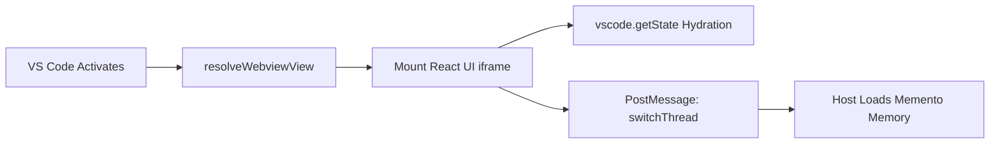
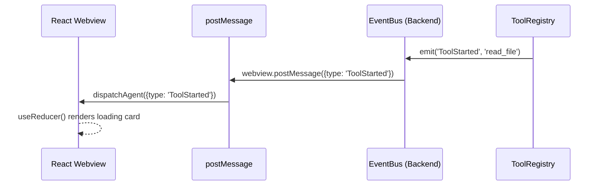
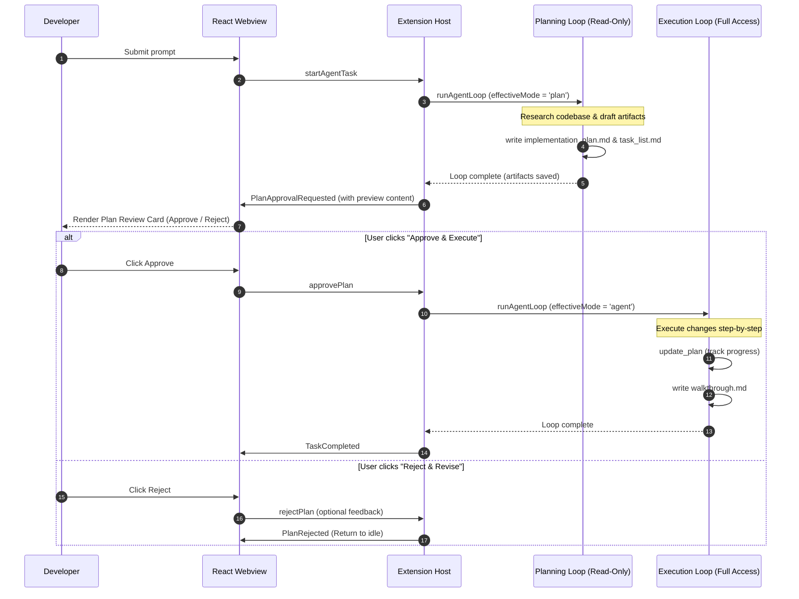
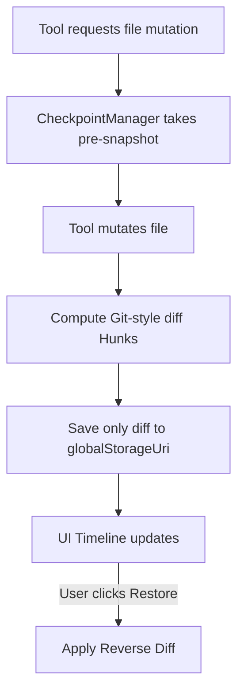
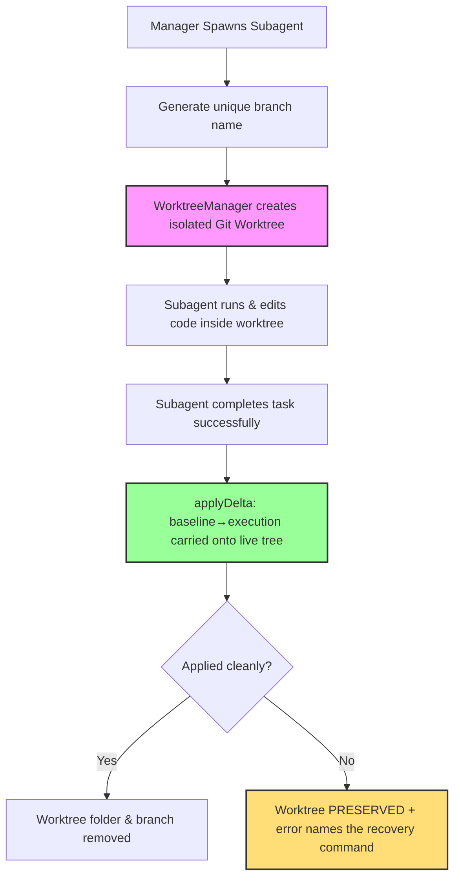
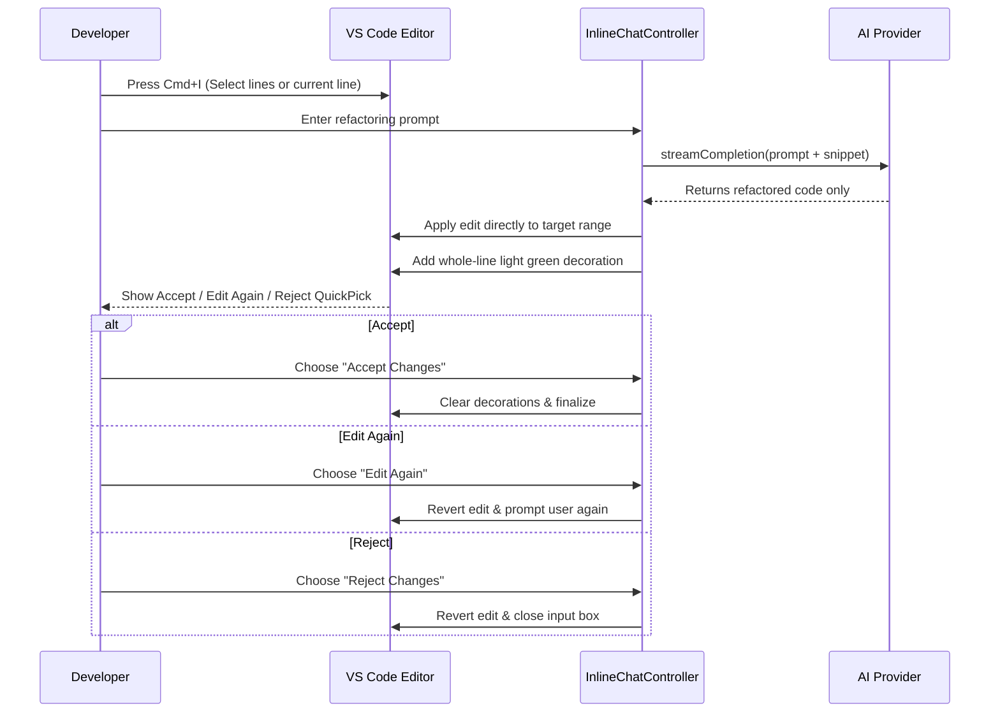
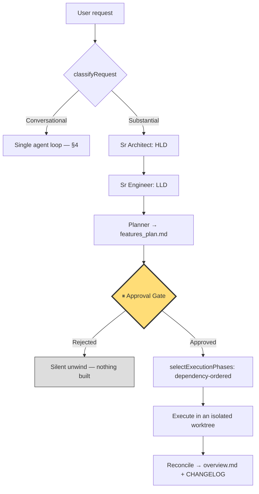
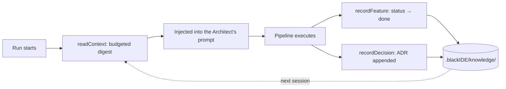
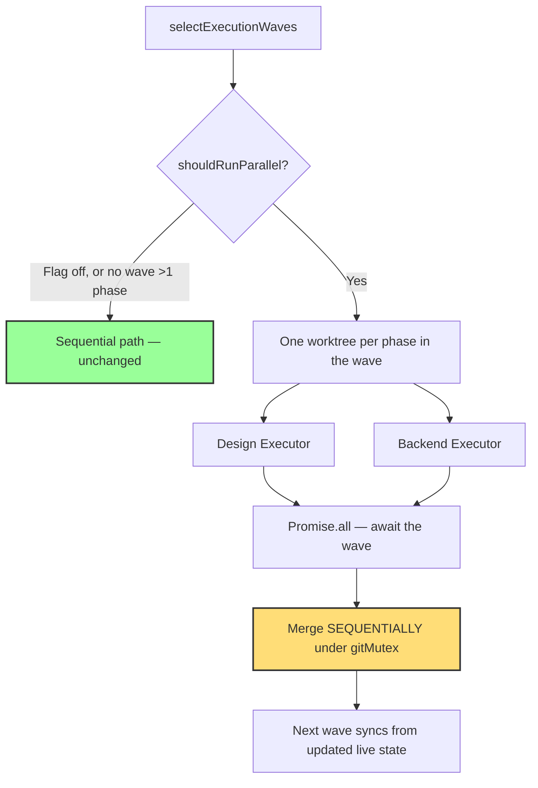

# Black IDE: Comprehensive Knowledge Transfer (KT) Guide

## 1. Executive Summary & Architecture Overview
Black IDE is an autonomous, AI-native coding assistant built directly into a customized fork of VS Code. It acts as a persistent, autonomous agent that can read, write, research, and execute terminal commands in a continuous loop until a developer's request is resolved.

**Core Architecture Separation:**
- **React Webview (Frontend)**: A sandboxed UI layer rendering the Chat, Activity Timeline, and Checkpoint Tracker. It holds no business logic.
- **Extension Host (Backend)**: A Node.js runtime executing the core `agent-loop.ts`, connecting to the file system, managing token budgets, and coordinating with LLM Providers.

## 2. Bootstrapping: The Entry Point

### 📌 Visual: Bootstrapping Flow

**📝 What is this?** This is the initialization sequence of the IDE when you open the AI sidebar.
**⚙️ How it works:** 
1. The extension registers `BlackIdeChatProvider`.
2. When the sidebar opens, it injects a compiled React bundle into an HTML `<iframe>`.
3. To prevent UI amnesia across reloads, the React UI immediately loads its visual state from `vscode.getState()` and tells the Backend to sync up by loading the matching conversation memory from `vscode.Memento` (a crash-proof VS Code database).

## 3. IPC & Event-Driven UI (`EventBus`)

### 📌 Visual: Event-Driven UI Projection

**📝 What is this?** The decoupled communication pipeline between the Node.js backend and the React UI.
**⚙️ How it works:** Heavy Node.js operations can freeze the UI if tightly coupled. Black IDE uses an internal `EventBus`. When the agent runs a tool, it emits a semantic event (`ToolStarted`). The `extension.ts` bridge blindly pipes this event over IPC JSON (`postMessage`), and the React UI's `useReducer` reacts instantly by drawing a loading card on the timeline without waiting for the tool to finish.

## 4. The Agent Loop (The Brain)

### 📌 Visual: The Autonomous Recursive Loop
```mermaid
sequenceDiagram
    autonumber
    participant UI as Webview
    participant Loop as Agent Loop
    participant Ctx as ContextManager
    participant LLM as AI Provider
    participant Tools as Tool Registry

    UI->>Loop: {type: 'startAgentTask', prompt: "Fix auth bug"}
    
    loop Max 25 Iterations (While loop)
        Loop->>Ctx: fit(messages) (Truncate to fit Budget)
        Ctx-->>Loop: Budgeted Context
        
        Loop->>LLM: streamGenerate()
        LLM-->>Loop: Tool Call Requests (e.g., read_file)
        
        opt If Final Answer
            LLM-->>Loop: Final Text Answer
            Loop-->>UI: Task Completed
        end
        
        loop For Each Tool Call
            Loop->>Tools: execute(toolName, args)
            Tools-->>Loop: ToolResult
        end
        
        Loop->>Loop: Append ToolResults to Context
    end
```
**📝 What is this?** The beating heart of Black IDE. It is a state machine that drives the AI's autonomy.
**⚙️ How it works:** When you submit a prompt, it doesn't do a single API call. It enters a `while(iterations < 25)` loop. 
1. **Context Budgeting (LRU Truncation)**: Before hitting the LLM, the `ContextManager` computes the token size. If the agent read a massive 5MB file, the API would crash. It targets the oldest `toolResults` and replaces their text with `[Truncated by ContextManager to save budget]`.
2. **Execution Interlock**: If the LLM requests a tool, the loop pauses, executes the local Node.js function, captures the output, and feeds it back into the loop as the user's response, forcing the LLM to analyze the result.

### 4.1 Two-Phase Planning Workflow (The Antigravity Pattern)
Every substantive developer request triggers a mandatory two-phase flow: Planning followed by Execution. This structure separates human validation from heavy multi-step execution.

#### 📌 Visual: Plan-Execute Flow


**⚙️ How it works:**
1. **Planning Gate**: Any non-trivial prompt (more than 5 words or containing planning keywords like *build, implement, fix, refactor*) is forced into `plan` mode. In this mode, the agent has read-only tools and cannot mutate source code files.
2. **Artifact Gating**: The planning agent must call `create_artifact` to produce an `implementation_plan` and `task_list`.
3. **Approval Gating**: The Loop stops and UI presents the Plan Review Card containing collapsible previews.
4. **Execution Phase**: On approval, the task runs in `agent` mode with the plan injected in the system prompt. Progress is tracked via `update_plan`. When done, it writes a `walkthrough` artifact.
5. **State Persistence (Crash-Proofing)**: The pending plan approval state is persisted inside VS Code's `Memento` storage (via `HistoryStore`) key-indexed by the conversation's active thread ID (`pending-plan-${threadId}`). If VS Code is reloaded or crashes during plan review, the UI automatically restores the approval card.
6. **Task Gating & Thread Isolation**: If the user tries to send a new message while a plan is pending, the loop displays a warning blocker. Switching threads or clicking "Reject" immediately discards the pending plan state and transitions the session state back to `'idle'` to avoid cross-thread task pollution.
7. **Trivial/Slash Command Bypassing**: Greets (e.g. "hi"), short questions ($\le 5$ words), or slash commands (like `/explain`) bypass the planning mode, running directly in Ask or Agent mode to keep the UX snappy.

---

### 4.2 Specialized Multi-Agent Roles (Built-in Modes)
Black IDE supports 8 agent modes (the original 3 plus 5 specialized roles). Each role acts as a specialized assistant with targeted system prompts, custom tool permissions, and adjusted iteration budgets.

| Role | Focus Area | Max Iterations | Key Tools / Constraints |
|---|---|---|---|
| **Ask** | Answering questions without modifying code | N/A | No edit/write/command tools |
| **Plan** | Research and architectural planning | 25 | Read-only tools + artifact creation |
| **Agent** | Full agent with absolute tool permissions | 25 | All tools enabled |
| **Frontend** | UI/UX, React, CSS, accessibility, responsive design | 40 | All tools enabled |
| **Backend** | APIs, databases, authentication, server performance | 40 | All tools enabled |
| **DevOps** | CI/CD, Docker, build scripts, Makefiles | 30 | Tailored shell and deployment tool permissions |
| **Manager** | Coordination, breaking down tasks, delegating to sub-agents | 15 | Cannot write code directly; restricted to `spawn_subagent` |
| **Sr Architect** | System design, architectural patterns, tech debt analysis | 20 | Read-only tools, writes ADRs and refactoring plans |

---

### 4.3 Custom Agent Modes Configuration
In addition to built-in modes, Black IDE allows developers to register custom agent modes by placing Markdown files (`*.md`) with YAML frontmatter in any of three locations:
1. **Global Level**: `~/.blackide/modes/`
2. **Workspace Level**: `.blackide/modes/` in the workspace root
3. **Project Level**: `.agents/modes/` in nested project directories

**YAML Configuration Schema:**
- `name` (Required): Unique string identifier for the mode (e.g. `Security Auditor`). Built-in mode names cannot be overridden.
- `description` (Optional): Brief explanation shown in the UI.
- `model` (Optional): Explicit model identifier to use when this mode is selected.
- `tools` (Optional): Allowlist of tool names. If omitted or empty, all tools are permitted.
- `maxIterations` (Optional): Maximum sequential tool loop cycles (1 to 500, default is 25).
- `icon` (Optional): A VS Code Codicon identifier (e.g. `shield`).

The Markdown body below the frontmatter serves as the custom system prompt extension appended when the mode is active.

**Example Mode File (`.blackide/modes/auditor.md`):**
```yaml
---
name: Security Auditor
description: Audits code changes for security vulnerabilities
tools: [read_file, grep_search, complete_task]
maxIterations: 15
icon: shield
---
You are a Senior Security Auditor. Evaluate the code changes in the active selection for common vulnerabilities like injection, memory leaks, and dependency issues. Write a report and do not modify any files.
```

The `ModeLoader` monitors these directories and hot-reloads them dynamically. If configuration errors are found (e.g. missing `name` or invalid types), inline diagnostics are generated using the VS Code diagnostic collection.

---

## 5. File System & Checkpoint Manager

### 📌 Visual: Atomic Rollback Engine

**📝 What is this?** The surgical undo system that prevents the AI from permanently breaking your code.
**⚙️ How it works:** 
- **Reverse Hunks**: Copying entire files on every edit causes massive disk bloat. When the AI mutates a file, we compute the exact structural diff (added/removed lines) and save *only* that diff. If you click "Restore", it mathematically applies the reverse diff to the file on disk.
- **Durable Checkpoints (Crash-Proofing)**: File transaction checkpoints are automatically serialized to JSON and persisted to disk inside the extension's `globalStorage` folder. This ensures that undo history and review state survive VS Code window reloads and crashes.
- **Granular Review Controls**: The `CheckpointManager` tracks each file transaction state (`pending`, `kept`, `restored`). Developers can review individual file edits, accepting them (`keepFile`) or rolling back single files (`restoreFile`) instead of performing an all-or-nothing rollback.
- **Per-Message Undo**: Checkpoints are linked to specific messages via a unique `messageId`, enabling the developer to trigger reverts on a per-response basis directly from the UI timeline.

## 6. Semantic Codebase Indexing
Black IDE features a local RAG (Retrieval-Augmented Generation) pipeline.
- It uses a local SQLite database to store vector embeddings.
- **AST-Aware Chunking**: Instead of chunking code arbitrarily by character count (which breaks functions in half), the indexer parses the Abstract Syntax Tree (AST) to chunk code intelligently by class and function boundaries.
- The agent uses internal semantic search tools to retrieve exact function signatures without guessing file paths.

## 7. Build System & Packaging Architecture

Black IDE is not just an extension; it is distributed as a deeply customized, full standalone fork of VS Code (Electron App).

### 📌 Visual: The Build Pipeline
```mermaid
flowchart TD
    A[Source Code] --> B[TypeScript Compilation / esbuild]
    B --> C[Electron App Packaging (darwin-arm64)]
    C --> D[Bundle Frameworks]
    D --> E[Build CLI Tunnel]
    E --> F[Compute SHA256 Checksums]
    F --> G[gh release upload]
```

**📝 What is this?** The CI/CD release pipeline (e.g., `build_mac.sh`) that turns the source code into a downloadable application.
**⚙️ How it works:**
1. **App Bundling**: The build scripts (e.g., `./scripts/build/build_mac.sh`) package the core Electron binaries into `Black IDE.app`. This includes compiling all core webviews and native Node modules.
2. **Framework Packaging**: It packages crucial macOS GUI dependencies like `Squirrel.framework`, `Mantle.framework`, and creates isolated Helper apps for GPU and Renderer processes to ensure Chromium stability.
3. **CLI Packaging**: It extracts and packages the `black-ide-tunnel` CLI binary and compresses it into `black ide-cli-darwin-arm64.tar.gz`.
4. **DMG Generation**: It bundles the `.app` into a mountable macOS `.dmg` and `.zip` file for distribution.
5. **Security & Release**: A checksum script generates `sha1` and `sha256` hashes for all assets (`.dmg`, `.zip`, `.tar.gz`) to guarantee cryptographic integrity. Finally, it uses the GitHub CLI (`gh release upload`) to automatically publish the assets to the latest tagged release.

---

## 8. Parallel Subagent Isolation (Git Worktrees)

### 📌 Visual: Worktree Isolation Pipeline


**📝 What is this?** 
An architecture that runs multiple subagents in parallel safely without causing file system conflicts or Git repository locking errors.

**⚙️ How it works:**
1. **Worktree Creation**: When a subagent is spawned, `WorktreeManager` checks out a new branch from current HEAD into an isolated folder at `~/.blackide/worktrees/<hash>/<branchName>`.
   - **Worktree path formatting**: The `<hash>` is an MD5 hash of the workspace root path (sliced to 8 characters) to guarantee isolation between multiple open VS Code workspaces.
2. **Execution Sandbox**: The subagent reads, writes, and tests code only within this directory, keeping the developer's main workspace completely untouched.
3. **Serialized Git Mutex**: Git operations are serialized via `gitMutex` to prevent database lock conflicts (like `index.lock`) when multiple parallel subagents execute git operations.
4. **Serialized Git Mutex (details)**: `gitMutex` is a *process-global* promise queue — every git operation in the extension, across every concurrent run, passes through it. It retries `index.lock` errors with exponential backoff, and bounds each operation with a timeout (default 120s). Without that timeout, a single hung `git` subprocess would stall the queue and therefore deadlock *every* later git operation with no error and no recovery.
5. **Reintegration is a delta, NOT a merge**: this is the subtle part. The worktree's baseline commit deliberately mirrors the live workspace's own *uncommitted* state (so the analysis phases' artifacts are present inside the worktree). A whole-branch `git merge` would therefore refuse — git sees the user's pre-existing uncommitted edits as "local changes would be overwritten", regardless of content. `applyDelta(baseline→execution)` carries only what the pipeline actually changed and never touches those edits.
6. **On conflict the worktree is PRESERVED, not pruned**: the agent's work is real and must never be silently discarded. The thrown error names the branch, the worktree path, the baseline SHA, and the exact `git worktree remove --force` command to discard it manually.
7. **Dangling Worktree Pruning**: `git worktree prune` runs to avoid storage bloat from orphaned tasks — but only for worktrees that were successfully reconciled or explicitly abandoned.

---

## 9. Editor Inline Chat (Cmd+I)

### 📌 Visual: Inline Prompt Review Loop


**📝 What is this?**
A fast, editor-native inline code generation and refactoring mechanism.

**⚙️ How it works:**
1. **Selection Capture**: It reads the developer's active selection (or current line) and caches the original text as a snapshot.
2. **Visual Diff Decorator**: As soon as the LLM streams the refactored code back, the controller replaces the selected text and decorates the modified region with a transparent light-green background (`rgba(74, 222, 128, 0.15)`) using `addedLineDecoration`.
   - **Line Offset Tracking**: As the LLM inserts or removes lines, the lines of the document shift. The `InlineChatController` dynamically tracks the cumulative line offset (`runningOffset`) inside the edit handler to position the highlight decoration precisely over the new lines.
   - **Strict Format Request**: The controller instructs the LLM to return ONLY the raw corrected code block without any explanations or Markdown code block backticks (fences). Any fences returned are stripped before applying to the text editor.
3. **Acceptance Controls**: A QuickPick menu allows the user to:
   - **Accept Changes**: Clears the visual decorations and finalizes the edit.
   - **Edit Again**: Reverts the code to its original text snapshot first, then displays the input prompt box again, enabling the developer to refine their instructions on top of the original code.
   - **Reject Changes**: Reverts the edit back to the original code snapshot and closes the inline chat prompt loop.

---

## 10. Model Context Protocol (MCP) Client
Black IDE integrates a built-in Model Context Protocol (MCP) client to dynamically discover and execute tools hosted by external MCP servers.

**⚙️ How it works:**
1. **Config Discovery**: At startup, `MCPClient` scans the workspace for configuration files located at `.blackide/mcp.json` or `.vscode/mcp.json`.
2. **Connection Lifecycle**: For each configured server, the client spawns a child process via `stdio` transport and performs a standard JSON-RPC handshake (`initialize` and `notifications/initialized`).
3. **Tool Registration**: The client requests the available tool schema list using the protocol's `tools/list` method. Discovered tools are dynamically converted into `ToolDefinition` objects and registered with the main Agent's `ToolRegistry`, making them transparently callable by the LLM during the agent loop.


---

## 11. The Multi-Agent Pipeline

### 📌 Visual: Phased Execution with a Human Gate


**📝 What is this?** Substantial requests ("build a CRM", "add order management") are not answered by one agent turn. They run through a pipeline where analysis, planning, **human approval**, and execution are distinct stages.

**⚙️ How it works:**
1. **Routing**: `PlanningEngine.classifyRequest` decides whether a prompt deserves the pipeline at all. A quick question stays on the fast single-loop path.
2. **Analysis → Plan**: Architect (HLD) and Engineer (LLD) phases feed a Planner that writes `.blackIDE/features_plan.md` — a checkbox task list where every task carries a phase tag (`[design]`, `[backend]`, `[frontend]`, `[testing]`).
3. **The approval gate**: the run *blocks* in-chat until the human approves the plan. Nothing has been written to the codebase yet. Rejection unwinds silently — it is an expected outcome, not a failure, and is deliberately reported differently.
4. **Dependency-driven phase selection**: `EXECUTION_PHASE_GRAPH` declares each phase's prerequisites rather than hardcoding a sequence. `selectExecutionPhases` runs only the phases the approved plan actually calls for — a plan with no `[backend]` tasks skips that executor, and a phase depending on a skipped phase is simply satisfied.
5. **Per-phase model routing**: `resolveModelForPhase` lets you send cheap scaffolding (HLD/LLD) to a fast model and execution to a stronger one, falling back to the pipeline-wide model when unset.
6. **Budget interlock**: `isOverTokenBudget` is checked on every usage callback. Tripping it aborts the run through the same `AbortController` a user cancellation uses — the host then distinguishes the two so a budget stop reports as a failure, not a silent stop.

**🧠 Why capabilities, not 30 agents:** every additional role-agent is another LLM turn — more latency, more cost, more failure surface. Seven phases deliver the capability. For the same reason, per-*task* execution was rejected: the per-task dependency graph informs ordering and parallelism, but execution stays at phase granularity so cost does not multiply by task count.

---

## 12. Long-Term Project Memory (`KnowledgeBase`)

### 📌 Visual: Memory Read/Write Cycle


**📝 What is this?** A durable, human-readable `.blackIDE/knowledge/` directory that both you and the agents read and write, so project understanding accrues across sessions instead of being re-derived every run.

**⚙️ How it works:**
- **The files**: `architecture.md`, `decision_log.md` (auto-numbered ADRs), `feature_status.md` (an upserted table), `technical_debt.md`, `glossary.md`, `roadmap.md`. Plain markdown — inspectable, diffable, and correctable by a human in a way a database would not be.
- **First-run discovery**: on activation, `summarizeRepoStructure` derives a starting `architecture.md` from your file tree and `package.json` (top-level structure, detected stack, likely entry points, scripts). Guarded three ways: a `globalState` flag so it runs once per workspace, an unseeded check so it **can never overwrite your edits**, and a total try/catch so a scan failure cannot break activation.
- **The read side (`readContext`)**: builds a bounded digest for injection, budgeted **per file** via `allocateBudget`, with slack from small files handed to large ones.

**⚠️ Why per-file budgeting is load-bearing:** budgeting across the *concatenated* text meant the append-only ADR log consumed the whole allowance and starved every file after it — dropping `technical_debt.md` entirely and, because ADRs append newest-last, dropping its own **newest** entries first. Memory therefore grew *staler* as the project learned more, which is the exact inverse of the feature's purpose. The log is now pruned oldest-first, so the newest decisions always survive.

---

## 13. Output Modes & The Completion Doc Regime

**📝 What is this?** What a finished run does with its work is a setting, not a hardcoded behaviour.

| Mode | Behaviour | Live working tree |
|---|---|---|
| `apply` *(default)* | `applyDelta` onto the live tree, then remove the worktree | Modified |
| `pr` | Keep the branch, `git push` + `gh pr create` | **Never touched** |

**⚙️ How it works:**
- In `pr` mode the orchestrator skips `applyDelta` entirely and does **not** remove the worktree — the branch *is* the deliverable. Without `gh` installed it still pushes and then opens a `compareUrlFallback` URL, because pushing matters most: a compare URL against a local-only branch would 404.
- **Safe degradation**: `resolveOutputMode` maps anything unrecognised — absent, misspelled, wrong type — to `apply`. The failure mode of guessing wrong must be "your changes landed as usual", never "the run silently did not touch your workspace and you cannot find your work".
- **Docs**: on completion in apply mode, `formatChangelogEntry` + `prependChangelogEntry` maintain `CHANGELOG.md`, inserting the newest entry beneath the header while preserving any hand-written preamble and older entries.

---

## 14. Parallel Wave Execution (experimental — default OFF)

### 📌 Visual: Concurrent Phases, Sequential Merges


**📝 What is this?** Phases in the same dependency wave (Design and Backend are independent) can run at the same time, each in its own worktree.

**⚙️ How it works:** execution is concurrent, but **merges are strictly sequential** under `gitMutex` — two `git apply` runs against one working tree would race, and a deterministic merge order makes a conflict reproducible instead of dependent on which phase happened to finish first. Waves themselves stay sequential, so wave N+1 always sees wave N's merged output.

**⚠️ Why it defaults to off:** this path changes how execution touches git, and a defect can corrupt your working tree — the least recoverable failure this product has. Guard rails:
- The setting must be an explicit `true`; any malformed value keeps the sequential path.
- It declines entirely when no wave holds more than one phase (setup cost for zero speedup).
- It refuses to combine with PR output mode, which promises *one* reviewable branch rather than N merged into the live tree.
- **Known limit**: `gitMutex` is process-global, so every phase's git I/O serializes through one queue regardless of concurrency. Realized speedup is bounded by that queue, not by phase count.

---

## 15. Durability, Telemetry & Test Architecture

**Run durability** (`pipeline-runs.ts`): Manager runs persist to `globalState`. On activation, `reconcileInterruptedRuns` flips anything a window reload interrupted into a terminal `failed` state, so stale rows don't linger as ghost "running" entries forever.

**Telemetry** (`telemetry-sink.ts`): a second `EventBus` subscriber alongside the webview, writing local JSONL. Privacy-safe **by construction** — `toTelemetryRecord` projects events down to metadata (mode, model, duration, error class) and drops content-bearing and streaming events entirely, so a prompt can never reach the log.

**Concurrent runs**: the Manager panel supports up to 4 isolated runs. Each gets its own `AbortController` and its own run-local `CheckpointManager` — sharing one store meant a pipeline's worktree-path snapshots bled into the next chat task's commit, and concurrent runs swept each other's pending snapshots.

### Two test tiers

| Tier | What it is | What it covers |
|---|---|---|
| **Core harness** (`test/harness.js`) | Plain Node, no display. Stubs the `vscode` module, drives the core against a mock LLM over HTTP. 352 assertions. | All pure logic; some sections drive **real git** in temp repos (worktree lifecycle, delta reconciliation, parallel merge semantics). |
| **Extension host** (`test/integration/`) | `@vscode/test-electron` launches a real VS Code. 10 tests. | Activation, command registration, the first-run workspace scan, settings defaults — what the stub structurally cannot reach. |

Both are gated in CI (`ci-agent-tests.yml`, `ci-agent-integration.yml`; the latter under `xvfb-run` on Linux). The pure-core/thin-integration split exists precisely so the first tier can cover as much as possible: algorithmic logic lives in `vscode`-free modules (`text-cap`, `plan-parser`, `parallel-execution`, `git-pr`, `completion-docs`).

> **Operational gotcha:** VS Code opens a unix domain socket under the user-data dir. The default path inside this deeply-nested extension exceeds the ~103-char `sockaddr_un` limit and fails startup with `EINVAL`. The runner points `--user-data-dir` at a short tmpdir. This was long assumed to be a "needs a windowing environment" blocker; it was not.
