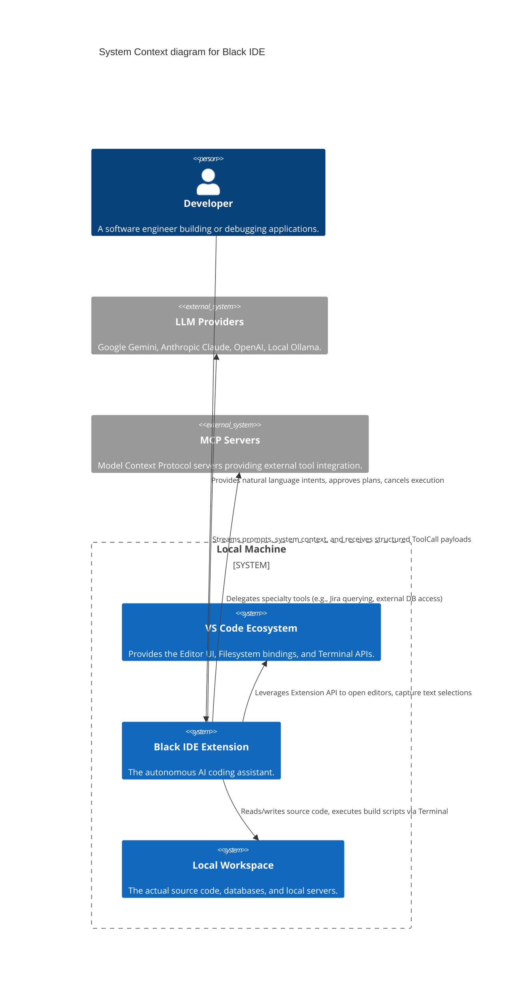
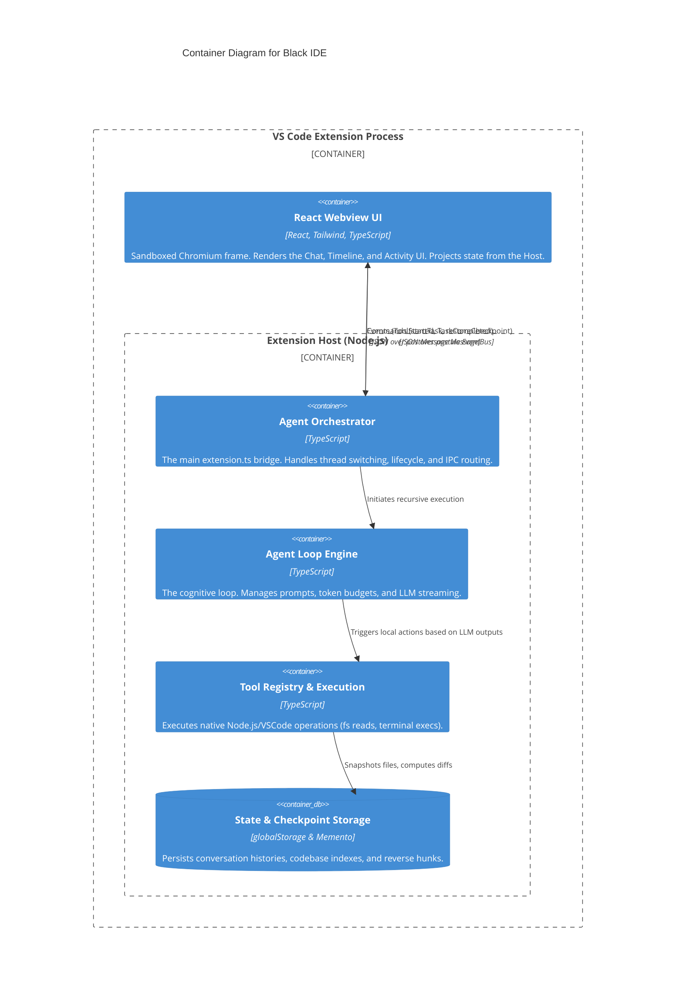

# High Level Design (HLD): Black IDE Architecture

## 1. Introduction & Core Philosophy
Black IDE is an AI-native autonomous coding assistant built as a VS Code extension. Unlike standard copilot tools that act as simple autocompleters or stateless chat interfaces, Black IDE implements a persistent, autonomous agentic loop. 

**Core Philosophies**:
- **Autonomy**: The agent must be able to recursively query the workspace, read files, run tests, and modify code without user intervention until a task is completed.
- **Safety**: Every file modification must be atomically tracked and instantly reversible via a visual timeline.
- **Transparency**: The user must have a real-time, X-Ray view into the agent's thought process and the exact commands it is executing.

## 2. System Context Diagram
The system context illustrates how Black IDE sits between the human developer, their local machine environment, and the cloud intelligence providing the reasoning.

## 3. Container Diagram
The architecture splits cleanly along the VS Code IPC boundary. The frontend is purely reactive; the backend is heavily stateful.

## 4. Component Diagram: Extension Host
Zooming into the Extension Host container to view the internal subsystem layout.

```mermaid
C4Component
    title Component Diagram: Extension Host

    Component(ext, "Extension Bridge", "extension.ts", "Monolithic router managing WebviewViewProvider")
    Component(bus, "EventBus", "EventEmitter", "Decouples the Agent Loop from UI constraints")
    Component(session, "SessionManager", "Task Tracker", "Tracks active tasks, handles AbortControllers for cancellation")
    
    Component(loop, "Agent Loop", "agent-loop.ts", "while() loop mapping LLM outputs to native execution")
    Component(ctx, "ContextManager", "Token Budgeter", "Implements LRU truncation for massive tool outputs")
    
    Component(ckpt, "CheckpointManager", "File Tracker", "Computes diffs, stores reverse hunks, applies rollbacks")
    Component(hist, "HistoryStore", "Memento Persistence", "Caches multi-turn conversations across window reloads")
    Component(idx, "CodebaseIndex", "Semantic Search", "AST-aware chunker and local vector embedding DB")
    
    Component(planning, "Planning Engine", "planning-engine.ts", "Two-phase planning; classifyRequest routes substantial work to the pipeline")
    Component(worktree, "Worktree Manager", "worktree-manager.ts", "Isolated git worktrees; delta-based reconciliation via applyDelta")
    Component(modes, "Mode Loader", "mode-loader.ts", "Loads custom and built-in agent roles and rules")
    Component(inline, "Inline Chat Controller", "inline-chat-controller.ts", "Manages Cmd+I inline refactoring and visual diffs")

    Component(orch, "Pipeline Orchestrator", "pipeline-orchestrator.ts", "HLD to LLD to Planner to approval to phased execution")
    Component(mutex, "Git Mutex", "git-mutex.ts", "Process-global git serialization with retry and timeout")
    Component(kb, "Knowledge Base", "knowledge-base.ts", "Durable .blackIDE/knowledge markdown brain across sessions")
    Component(runs, "Pipeline Runs", "pipeline-runs.ts", "Run durability across window reloads")
    Component(tel, "Telemetry Sink", "telemetry-sink.ts", "Local-first, privacy-safe event projection")
    Component(pr, "Output Router", "git-pr.ts + completion-docs.ts", "Apply-to-tree or open-a-PR, plus the completion doc regime")

    Rel(ext, bus, "Subscribes to all events, pipes to Webview")
    Rel(ext, session, "Registers/Aborts tasks")
    Rel(ext, inline, "Delegates inline chat loops")
    Rel(ext, modes, "Loads agent modes on start/refresh")
    Rel(ext, planning, "Checks prompts and handles approval gates")
    Rel(session, loop, "Passes AbortSignal down to LLM API")
    Rel(loop, bus, "Publishes lifecycle events")
    Rel(loop, ctx, "Requests prompt fitting before LLM call")
    Rel(loop, ckpt, "Triggers snapshots during file mutations")
    Rel(loop, worktree, "Spawns subagents in clean isolated git sandboxes")
    Rel(ext, hist, "Hydrates and persists conversation state")

    Rel(ext, orch, "Starts pipeline runs; supplies settings and executor factory")
    Rel(orch, loop, "Runs each phase as its own agent turn")
    Rel(orch, worktree, "Creates, syncs, commits and reconciles per-run worktrees")
    Rel(worktree, mutex, "Serializes every git operation")
    Rel(orch, kb, "Reads prior knowledge in; records decisions and status out")
    Rel(ext, runs, "Reconciles interrupted runs on activation")
    Rel(bus, tel, "Second subscriber alongside the Webview")
    Rel(orch, pr, "Routes finished work to the live tree or a pull request")
```

## 5. Architectural Decision Records (ADRs)

### ADR 001: Event-Driven UI Projection
- **Context**: In complex multi-step LLM loops, state mutates rapidly (e.g. 5 tools running in parallel). Keeping a React state object synced synchronously with a Node.js backend over an IPC bridge causes race conditions and UI freezing.
- **Decision**: The Extension Host holds no UI state. It blindly publishes domain events (`ToolStarted`, `CheckpointCreated`, `TokenUsageUpdated`) to an internal `EventBus`. The webview acts as a pure projection layer, reducing these events into a local state tree via `useReducer`.
- **Consequence**: Guaranteed UI responsiveness. The backend can run headlessly.

### ADR 002: Reverse Hunk Checkpointing
- **Context**: Autonomous agents make mistakes. Rolling back changes is critical for user trust. Copying the entire workspace (or even whole files) for every LLM step causes massive I/O bloat and sluggish performance.
- **Decision**: Implement a surgical, diff-based rollback system. When a tool modifies `foo.ts`, we take a pre-modification snapshot in memory. Post-modification, we calculate the exact structural diff (`Hunks`), store ONLY the diff in `globalStorage`, and discard the file copies.
- **Consequence**: Near-zero storage footprint. Rollbacks can revert a single file from a single LLM step without touching unrelated changes made by the user in the meantime (assuming no line-drift conflicts).

### ADR 003: Memento for Conversation Persistence
- **Context**: LLM conversational histories can become massive. Saving them to local flat JSON files introduces severe risks of file corruption if the IDE crashes or forcefully quits during a write cycle.
- **Decision**: Persist multi-turn conversation memory using VS Code's native `vscode.Memento` key-value API (`workspaceState`), capped at a hard limit of 40 turns. Furthermore, actively strip out Base64 image data and truncate text outputs >500 chars *before* serialization.
- **Consequence**: Atomic, safe writes. The backend seamlessly remembers what the user was talking about even after a full system reboot, without ballooning the VS Code internal SQLite DB.

### ADR 004: Unified Execution Interlock (AbortController)
- **Context**: Users frequently change their minds mid-generation or switch chat threads. If an LLM call or a headless browser automation is running in the background, thread switching could cause the background task to inject its results into the *new* thread, creating corrupted conversational state.
- **Decision**: Pass a singular standard JavaScript `AbortController.signal` from the top route handler in `extension.ts` down through every layer: the Agent Loop, the LLM Provider, and the Tool Registry.
- **Consequence**: Immediate, clean termination of network requests, sub-processes, and file writes the millisecond a user clicks "Cancel" or switches threads. Guaranteed isolation.

### ADR 005: Worktree Isolation with Delta Reconciliation (not `git merge`)
- **Context**: A multi-phase pipeline writes many files across many minutes. Running that against the user's live working tree means a failed, cancelled, or rejected run leaves half-built code behind. But the analysis phases also write real artifacts (`features_plan.md`) to the live tree *before* execution starts, and the user may have their own uncommitted edits in flight.
- **Decision**: Execute inside a dedicated `git worktree`. Sync the live tree's uncommitted state into it and commit that as a **baseline** — so the baseline introduces nothing new relative to live. On success, carry only the `baseline→execution` delta back with `applyDelta`.
- **Consequence**: A whole-branch `git merge` would spuriously conflict on every file the user already had modified, because those edits are in the baseline too. The delta touches only what the pipeline actually changed. On reconciliation failure the worktree is **preserved, not discarded** — the agent's work is real — and the error names the branch, path, and exact `git worktree remove` command.

### ADR 006: Capabilities, Not an Org Chart of Agents
- **Context**: The product vision describes an "AI software agency" with ~30 role-agents. Each additional agent is another LLM turn: more latency, more cost, and more failure surface.
- **Decision**: Deliver the *capability* with the fewest agents that produce it. Seven pipeline phases, not thirty roles. Dependency-aware ordering, persistent memory, and a quality loop are implemented as machinery — not as personas that must be prompted into existence each run.
- **Consequence**: Runs stay affordable and debuggable. Roles are added only where a distinct persona measurably improves output. Per-task *execution* was explicitly rejected for the same reason: the per-task dependency graph informs ordering and parallelism, but execution stays at phase granularity so cost does not multiply by task count.

### ADR 007: Long-Term Memory as Human-Readable Markdown
- **Context**: Project understanding was re-derived from scratch every run — expensive, and it meant the agent could not learn from its own prior decisions.
- **Decision**: A durable `.blackIDE/knowledge/` directory of plain markdown (`architecture.md`, `decision_log.md` as ADRs, `feature_status.md`, `technical_debt.md`, …) that both the user and the agents read and write. Injection is **budgeted per file**, not across the concatenation.
- **Consequence**: Memory is inspectable, diffable, and correctable by a human — a database would not be. The per-file budget is load-bearing: budgeting across the joined text meant an append-only ADR log would crowd out every file after it and drop its own newest entries first, so memory grew *staler* as the project learned more.

### ADR 008: Unsafe Paths Are Default-Off Until Integration-Tested
- **Context**: Parallel wave execution and PR output mode both change how a run touches git. A defect in either can corrupt the user's working tree — the least recoverable failure this product has.
- **Decision**: Both ship behind explicit opt-in settings that default off, and unrecognised setting values degrade to the *safe* behaviour (`apply`, sequential) rather than the new one. Parallel execution additionally declines when no wave holds more than one phase, and refuses to combine with PR mode.
- **Consequence**: The proven sequential path stays the default until extension-host integration tests can exercise concurrent cancellation and budget trips. The failure mode of a malformed settings blob is "behaves as it always did", never "silently did something new to your repo".

### ADR 009: Two Test Tiers — Stubbed Core, Real Host
- **Context**: The core harness stubs the `vscode` module so the algorithmic core can be tested as plain Node. That is fast and reliable, but it means the ~2000-line `extension.ts` glue, activation, and command registration are structurally unreachable by it.
- **Decision**: Keep the fast stubbed harness as the primary gate, and add a separate `@vscode/test-electron` suite that launches a real VS Code for the wiring layer only. Two CI workflows, so a unit regression still fails in under a minute.
- **Consequence**: Each tier tests what it can actually reach. Pure logic lives in vscode-free modules (`text-cap`, `plan-parser`, `parallel-execution`, `git-pr`) with harness tests; integration stays thin and is covered by the host suite.
