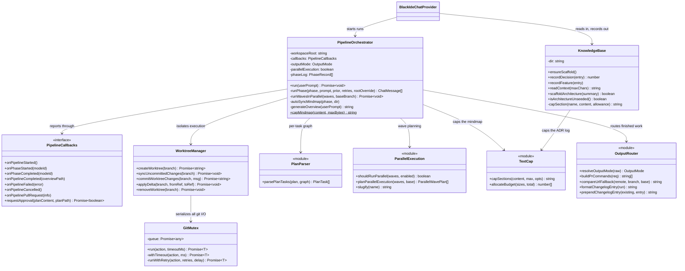
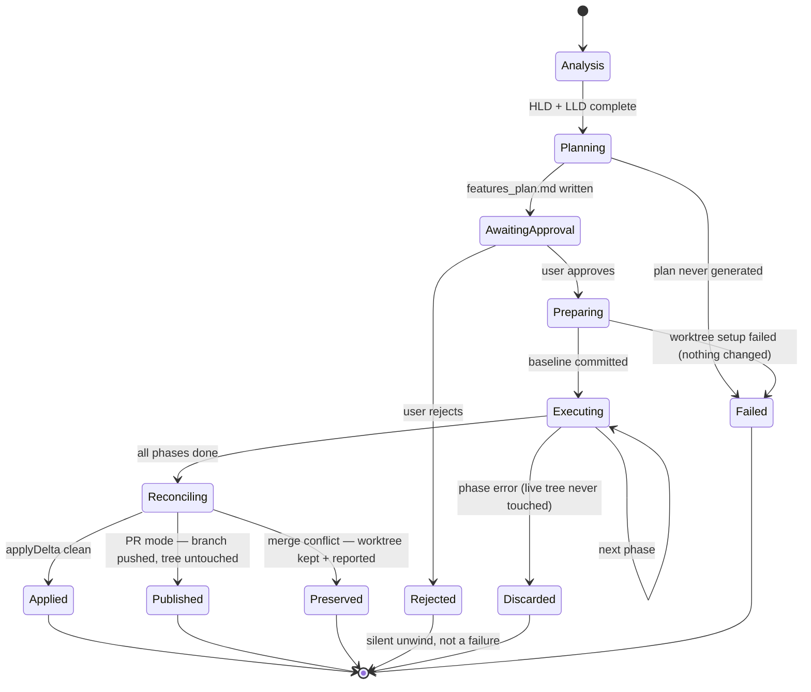

# Low Level Design (LLD): Black IDE Internal Mechanics

This document breaks down the algorithmic and state-machine mechanics of the system's core subsystems.

## 1. Class Relationships & Domain Model

The domain model is strictly partitioned between UI State and Backend Orchestration.

```mermaid
classDiagram
    %% Core Orchestration
    class BlackIdeChatProvider {
        -SessionManager _sessions
        -CheckpointManager _checkpoints
        -HistoryStore _historyStore
        -EventBus _bus
        -CodebaseIndex _index
        -ModeLoader _modeLoader
        -ChatMessage[] _conversation
        +resolveWebviewView()
        -_runAgentTask(prompt, mode)
        -_pruneForPersistence(messages)
    }
    
    %% Engine
    class AgentLoop {
        +runAgentLoop(prompt, priorMessages, options) Promise~Result~
    }

    class ContextManager {
        -maxTokens: number
        +fit(messages: ChatMessage[], systemPrompt: string) ChatMessage[]
        -approximateTokens(text) number
        -truncateToolResults(results) ToolResult[]
    }
    
    class PlanningEngine {
        -PLAN_KEYWORDS: string[]
        +shouldPlan(prompt: string) boolean
        +getPlanningPromptExtension() string
        +getExecutionPromptExtension(plan, tasks) string
    }
    
    class ModeLoader {
        -modes: Map~string, CustomMode~
        +loadAll(rootPath, globalConfigPath) CustomMode[]
        +watchForChanges(rootPath, onReload)
    }

    %% Persistence
    class CheckpointManager {
        -storagePath: string
        -Map~string, Checkpoint~ index
        +snapshot(filePath: string)
        +commit(taskId, label) Checkpoint
        +undo(checkpointId) Result
        +getInlineDiffPreview(checkpointId, filePath) string[]
    }

    class HistoryStore {
        -Memento state
        +setConversationState(threadId, messages)
        +getConversationState(threadId) ChatMessage[]
    }
    
    class WorktreeManager {
        -static instance: WorktreeManager
        +getInstance() WorktreeManager
        +createWorktree(branchName) string
        +mergeWorktree(branchName)
        +removeWorktree(branchName)
        +pruneOrphans()
    }
    
    %% Semantic Engine
    class CodebaseIndex {
        -SQLiteDB db
        +indexWorkspace()
        +search(query, k) SearchResult[]
        -chunkFileAst(content) string[]
    }
    
    %% Interactive UI
    class InlineChatController {
        -addedLineDecoration: TextEditorDecorationType
        +start(context, secretManager)
    }

    BlackIdeChatProvider --> AgentLoop : Bootstraps execution
    BlackIdeChatProvider --> CheckpointManager : File tracking
    BlackIdeChatProvider --> HistoryStore : Multi-turn memory
    BlackIdeChatProvider --> CodebaseIndex : Semantic search prep
    BlackIdeChatProvider --> ModeLoader : Loads custom roles
    BlackIdeChatProvider --> InlineChatController : Handles Cmd+I keybinding
    BlackIdeChatProvider --> PlanningEngine : Checks if plan is required
    AgentLoop --> ContextManager : Token budgeting
    AgentLoop --> WorktreeManager : Spawns isolated sandbox worktrees
```



## 2. Agentic Loop State Machine

The beating heart of Black IDE is the recursive `runAgentLoop` in `agent-loop.ts`. It is NOT a simple request/response. It is a `while` loop that yields to tool execution.

### Pseudo-Code Implementation
```typescript
async function runAgentLoop(userPrompt, priorMessages, abortSignal, provider) {
    let loopCount = 0;
    const MAX_ITERATIONS = 25;
    
    // 1. Initialize conversational state
    const messages = [...priorMessages, { role: 'user', content: userPrompt }];
    
    while (loopCount < MAX_ITERATIONS) {
        if (abortSignal.aborted) throw new Error('Task cancelled');

        // 2. Token Budgeting (LRU Truncation)
        // Ensures the prompt never exceeds the LLM's context window.
        const budgetedMessages = ContextManager.fit(messages, SYSTEM_PROMPT);
        
        // 3. LLM Generation
        // Sends prompt and the JSON schema of available tools.
        const response = await provider.streamGenerate(budgetedMessages, availableTools, abortSignal);
        
        // 4. Exit Condition
        // If the LLM did not request a tool, it is providing the final answer.
        if (response.isFinalAnswer || response.toolCalls.length === 0) {
            messages.push({ role: 'assistant', content: response.text });
            return { messages, finalText: response.text, aborted: false };
        }
        
        // 5. Tool Execution Interlock
        // Record the LLM's tool request in the conversation history
        messages.push({ role: 'assistant', content: response.text, toolCalls: response.toolCalls });
        
        const toolResults = [];
        for (const call of response.toolCalls) {
            EventBus.emit('ToolStarted', call);
            
            // 5a. Pre-mutation Snapshotting
            if (isMutatingTool(call.name)) {
                CheckpointManager.snapshot(call.args.path);
            }
            
            // 5b. Native Execution
            const result = await ToolRegistry.execute(call.name, call.args);
            toolResults.push(result);
            
            EventBus.emit('ToolFinished', result);
        }
        
        // 6. Append Results for next iteration
        // The LLM will read these results in the next loop pass.
        messages.push({ role: 'user', content: '', toolResults });
        loopCount++;
    }
    
    throw new Error('Agent exceeded maximum allowed iterations (Loop Limit reached).');
}
```

## 3. Data Structures: Normalizing LLM Schemas

Different LLMs (Anthropic, Google, OpenAI) use entirely different JSON schemas for tool calling. Black IDE normalizes them into a unified internal AST.

### ChatMessage (Unified Schema)
```typescript
interface ChatMessage {
    role: 'user' | 'assistant' | 'system';
    content: string; // The text content
    
    // Only present if the assistant is requesting to run tools
    toolCalls?: { 
        id: string; // e.g., 'call_abc123'
        name: string; // e.g., 'replace_file_content'
        arguments: any; // JSON object parsed from LLM output
    }[];
    
    // Only present if the user is providing the outcome of a tool execution
    toolResults?: { 
        id: string; // Must match the toolCalls id
        name: string; 
        content: string; // The stdout/stderr or file content
        isError?: boolean;
        images?: { mediaType: string, dataBase64: string }[]; // For Browser Subagents
    }[];
}
```

## 4. UI State Reducer: Projecting the Event Stream

The Webview UI does not poll the backend. It uses a pure reducer function to transition UI states based on the sequential event stream emitted by the `EventBus`.

```typescript
function agentReducer(state: AgentState, event: AgentEvent): AgentState {
    switch(event.type) {
        case 'TaskStarted':
            // Wipes the previous timeline and sets UI to loading mode
            return { ...state, phase: 'generating', activity: [], plan: null };
            
        case 'ToolStarted':
            // Appends a pulsing/loading tool card to the Activity Timeline
            return { 
                ...state, 
                activity: [...state.activity, { 
                    id: event.toolCallId,
                    name: event.name,
                    summary: event.summary,
                    status: 'running' 
                }] 
            };
            
        case 'ToolFinished':
            // Locates the running tool and marks it done, injecting the output snippet
            return { 
                ...state, 
                activity: state.activity.map(a => 
                    a.id === event.toolCallId 
                        ? { ...a, status: event.ok ? 'done' : 'error', output: event.summary } 
                        : a
                ) 
            };
            
        case 'CheckpointCreated':
            // Prepends the new file modification to the visual Checkpoint Timeline
            return { 
                ...state, 
                checkpoints: [event.checkpoint, ...state.checkpoints] 
            };
            
        case 'TaskCompleted':
            // Halts loading animations
            return { ...state, phase: 'idle' };
            
        default:
            return state;
    }
}
```

## 5. Token Management: The LRU Pruner

The `ContextManager` uses a heuristic token estimation (`chars / 4`) to ensure prompts never crash the LLM API. 

**The Pruning Algorithm**:
1. Reserve tokens for the `System Prompt` (highest priority).
2. Reserve tokens for the `userPrompt` and the current iteration's tool results (second priority).
3. Calculate remaining budget.
4. Iterate backward through historical `ChatMessage` arrays.
5. If budget is tight, target `toolResults[].content`.
6. Replace large block outputs (e.g., `cat package-lock.json`) with `[Truncated by ContextManager to save budget]`.
7. Preserve the `toolCalls` themselves so the LLM remembers *that* it executed a command, even if the exact stdout is forgotten.

## 6. Pipeline Domain Model

The orchestration layer added on top of the single-agent loop. The algorithmic core is
deliberately split into `vscode`-free modules so it is unit-testable without an extension host;
`PipelineOrchestrator` is the thin integration that owns the git side effects.



## 7. Pipeline Execution State Machine

Note the two terminal states that are **not** failures — plan rejection and user cancellation
are expected outcomes and unwind silently. Distinguishing them from genuine failure matters:
conflating them left the caller's UI stuck showing "in progress" forever.



**Budget interlock:** `isOverTokenBudget` is checked on every usage callback. Tripping it aborts
the run through the same `AbortController` as a user cancellation — so the orchestrator reaches
the cancelled path, and the host distinguishes the two by a `budgetExceeded` flag to report it
as a failure rather than a silent stop.
