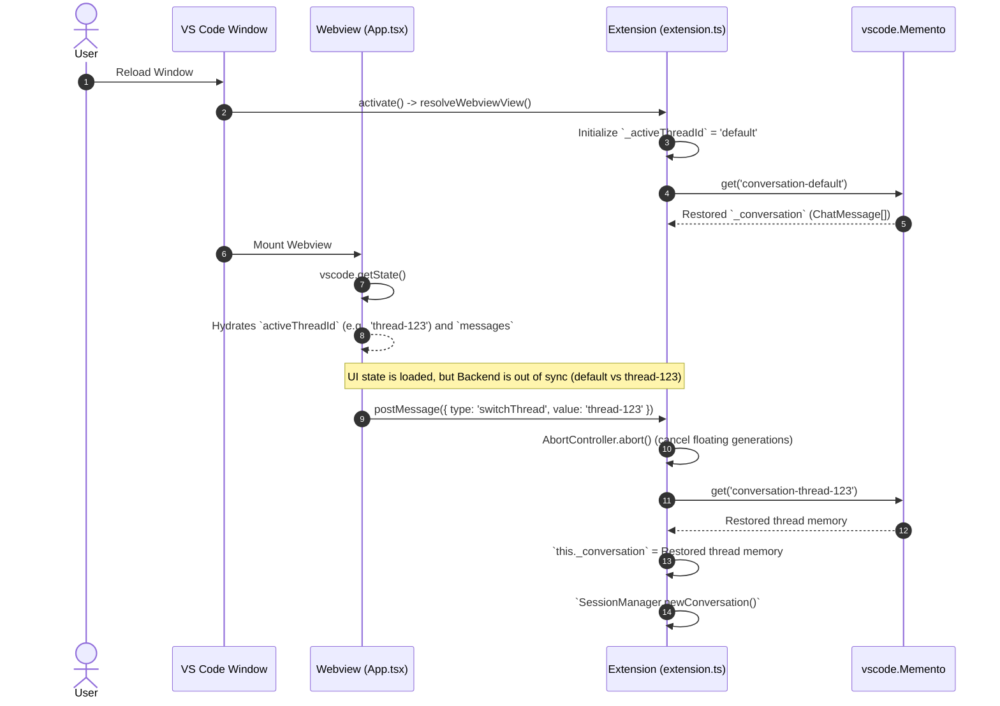
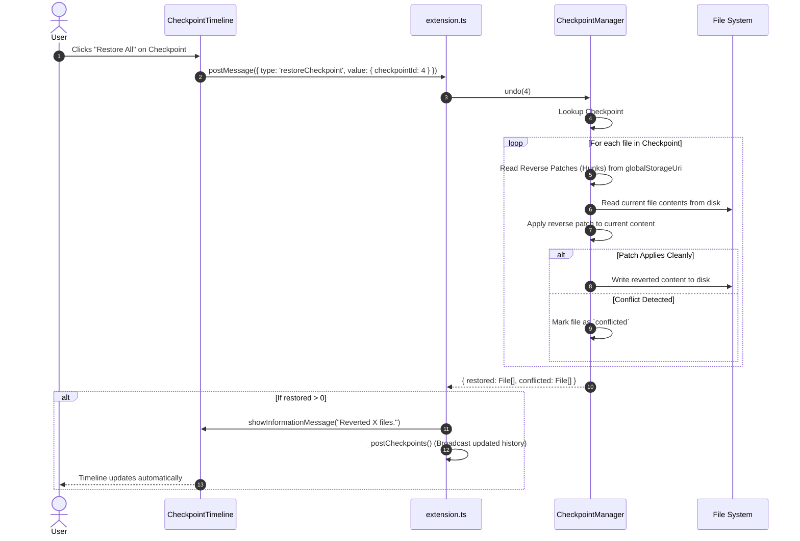
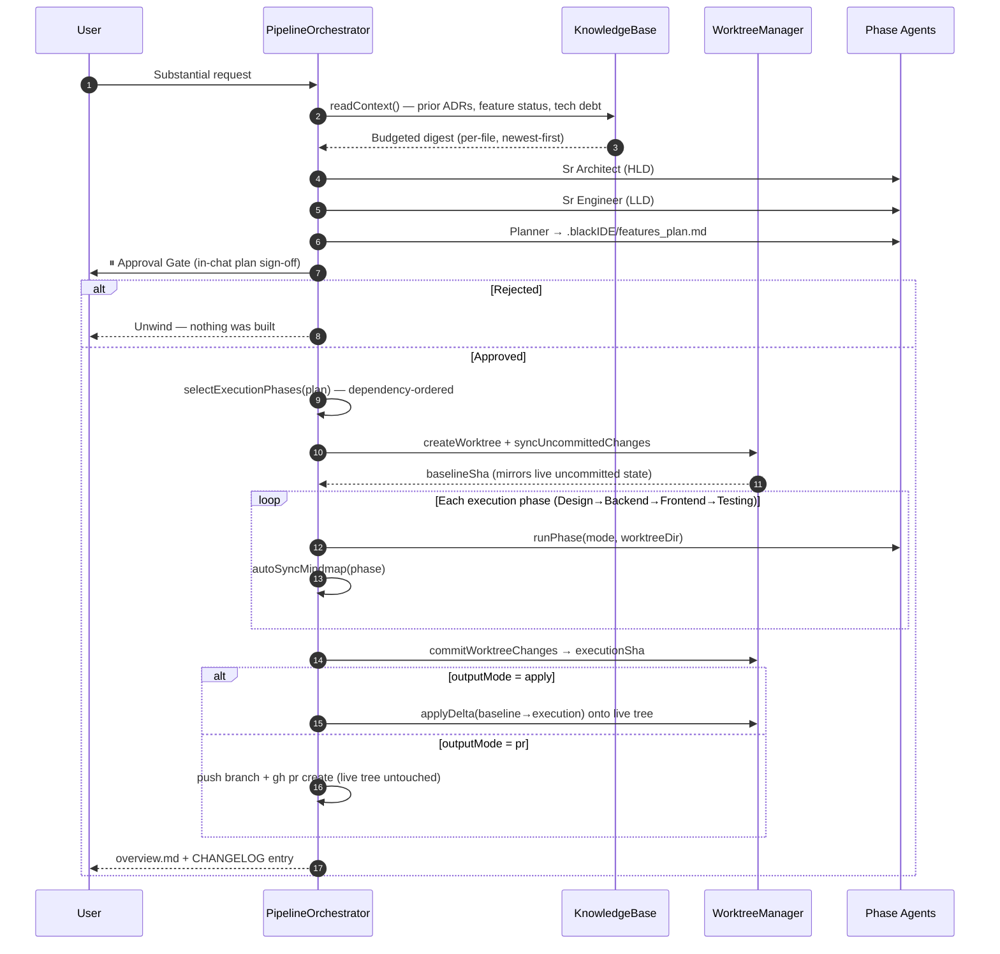
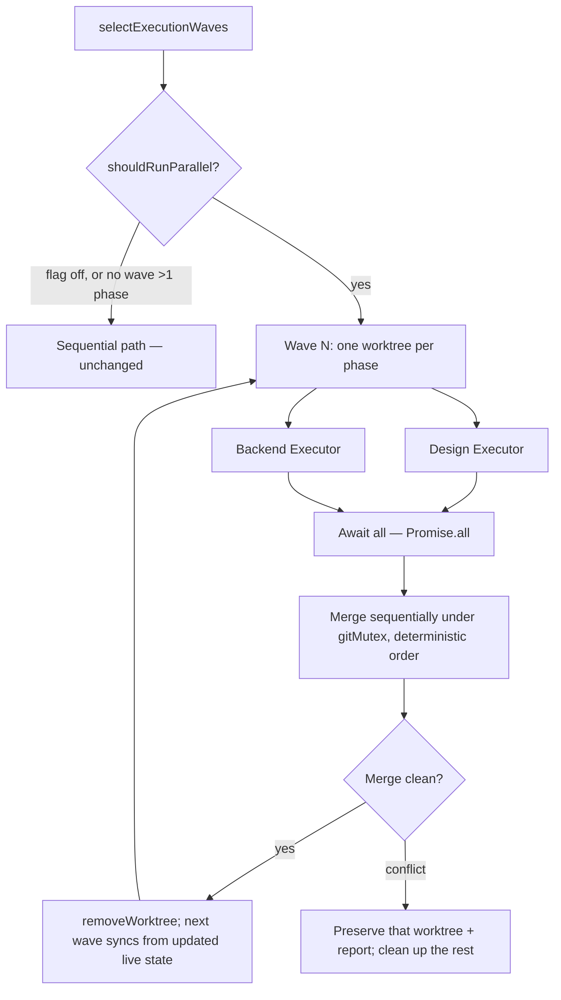

# Black IDE: Deep Architectural Mind Map & Flows

## 1. Comprehensive System Mind Map

This mind map breaks down the absolute full feature set and internal modules of the Black IDE extension.

```mermaid
mindmap
  root((Black IDE Architecture))
    Webview UI (React)
      Components
        App (State Orchestrator)
        ActivityPanel (Live feed)
        TerminalPanel (Terminal outputs)
        ReviewPanel (Diff viewer)
        CheckpointTimelinePanel (History & Revert)
      State Container (agent-store)
        agentReducer
        AgentState (Phase, Checkpoints, Activity)
        Messages (Chat History)
      VS Code Bridge
        postMessage API
        State Hydration (vscode.getState)
    Extension Host (Node.js)
      Core Orchestrator
        BlackIdeChatProvider (extension.ts)
        WebviewViewProvider implementation
        InlineChatController (Cmd+I Editor Chat)
      Event System
        EventBus (PubSub for decoupling)
        Event Emitters (TaskStarted, ToolFinished, PlanApprovalRequested)
      Agent Engine
        agent-loop.ts (Recursive execution)
        ContextManager (Token Budgeting, Truncation)
        PromptBuilder (System prompts, context injection)
        planning-engine.ts (Two-phase pattern, classifyRequest, detectMissingRequirements)
        mode-loader.ts (Custom modes & roles, 15 builtin)
      Multi-Agent Pipeline
        pipeline-orchestrator.ts (HLD to LLD to Planner to Execution)
        Approval Gate (in-chat plan sign-off before any code)
        selectExecutionPhases (dependency-ordered phase selection)
        selectExecutionWaves (parallelizable waves)
        plan-parser.ts (per-task graph from features_plan.md)
        parallel-execution.ts (concurrent waves, DEFAULT OFF)
        Per-phase model routing (resolveModelForPhase)
        Token budget guard (isOverTokenBudget)
        Manager Panel (up to 4 concurrent isolated runs)
      Long-Term Memory
        knowledge-base.ts (.blackIDE/knowledge/ markdown brain)
        architecture.md, decision_log.md (ADRs), feature_status.md
        technical_debt.md, glossary.md, roadmap.md
        readContext (per-file budgeted digest injection)
        summarizeRepoStructure (first-run discovery scan)
        text-cap.ts (bounded append-only files, shared with mindmap)
        KnowledgeStore (embeddings, save/search/getRelevantContext)
        OpenSpec mindmap (.blackIDE/mindmap/project_mindmap.md)
      Persistence & State
        HistoryStore (vscode.Memento, Multi-turn tracking)
        SessionManager (Active task cancellation via AbortController)
        CodebaseIndex (Semantic search, SQLite/Vector embeddings)
        CheckpointManager (Reverse hunks, atomic rollbacks)
        worktree-manager.ts (Parallel worktree isolation, applyDelta)
        git-mutex.ts (Process-global git serialization + timeout)
        pipeline-runs.ts (Durability across reload, reconcileInterruptedRuns)
        telemetry-sink.ts (Local-first, privacy-safe projection)
      Output & Delivery
        Apply mode (applyDelta onto the live working tree)
        PR mode (git-pr.ts: push + gh pr create, compare-URL fallback)
        completion-docs.ts (CHANGELOG, release notes)
        dependency_graph.md, features_plan.md, overview.md
      Tool Integrations
        FileSystem (Read, Write, List, Search)
        Terminal (Run local bash/zsh commands)
        Browser Subagent (Puppeteer/Playwright headless control)
        MCP Client (Model Context Protocol for external servers)
      LLM Providers
        OpenAI, Google Gemini, Anthropic Claude, OpenRouter, Ollama
```

## 2. Granular Data Flow: Autonomous Agent Loop

How a user's natural language command triggers a multi-step autonomous loop.

```mermaid
sequenceDiagram
    autonumber
    actor User
    participant App as Webview (App.tsx)
    participant Ext as Extension (extension.ts)
    participant Loop as Agent Loop (agent-loop.ts)
    participant Context as ContextManager
    participant LLM as LLM Provider
    participant Tools as Tool Registry
    participant Ckpt as CheckpointManager
    participant Bus as EventBus

    User->>App: "Refactor auth.ts to use JWT"
    App->>Ext: postMessage({ type: 'startAgentTask', prompt: ... })
    
    Ext->>Ext: Abort any active SessionManager tasks
    Ext->>HistoryStore: Load Conversation State (if multi-turn)
    Ext->>Loop: _runAgentTask(userPrompt, priorMessages)
    
    loop Autonomous Loop (max 25 iterations)
        Loop->>Context: fit(messages, systemPrompt)
        Context-->>Loop: Truncated Messages (budgeted for LLM context window)
        
        Loop->>LLM: streamGenerate(messages, tools)
        LLM-->>Loop: Returns ToolCall[] (e.g. read_file 'auth.ts')
        
        loop Execute each ToolCall
            Loop->>Bus: emit('ToolStarted', name, args)
            Bus->>App: postMessage (UI shows loading indicator)
            
            opt If tool is mutating (write_to_file / replace_content)
                Tools->>Ckpt: snapshot(filePath) (Record pre-mutation state)
            end
            
            Tools->>Tools: Execute Native Code
            
            opt If mutated
                Tools->>Ckpt: commit(taskId) (Calculate Hunks, save to globalStorage)
                Ckpt->>Bus: emit('CheckpointCreated', checkpointId)
                Bus->>App: Update CheckpointTimeline UI
            end
            
            Tools-->>Loop: ToolResult (Output / Error)
            Loop->>Bus: emit('ToolFinished', result)
            Bus->>App: postMessage (UI renders tool result output)
        end
        
        Loop->>Loop: Append ToolResults to internal `messages` array
    end
    
    Loop-->>Ext: Return final response text
    Ext->>Ext: _pruneForPersistence() (Strip giant outputs/images)
    Ext->>HistoryStore: setConversationState(activeThreadId, prunedMessages)
    Ext->>App: postMessage({ type: 'taskComplete', text })
    App-->>User: Renders final response
```

## 3. Data Flow: Thread Switching & Memory Hydration

How Black IDE ensures context doesn't bleed across threads and survives VS Code reloads.



## 4. Data Flow: Checkpoint Rollback

How the atomic rollback mechanism surgically reverts files without overwriting unrelated changes.



## 5. Data Flow: The Multi-Agent Pipeline

Substantial requests are not answered by a single agent turn. `PlanningEngine.classifyRequest`
routes them into a phased pipeline where analysis, planning, human approval, and execution are
distinct stages — and execution happens inside a **git worktree**, so a failed or rejected run
can never touch the user's working tree.



**Why `applyDelta` and not `git merge`:** the worktree's baseline commit deliberately mirrors
the live workspace's own *uncommitted* state. A whole-branch merge would therefore conflict on
every file the user already had modified before the pipeline even started. Carrying only the
`baseline→execution` delta touches nothing else.

**On failure to reconcile:** the worktree is *preserved*, not cleaned up — the agent's work is
real, and the error names the branch, the path, and the exact `git worktree remove` command to
discard it.

## 6. Data Flow: Parallel Wave Execution (experimental, default OFF)

Phases in the same dependency wave (e.g. Design and Backend) are independent and can run
concurrently, each in its own worktree. Execution is parallel; **merges are strictly
sequential** under `gitMutex`, because two `git apply` runs against one working tree would
race.



**Guard rails:** the flag must be an explicit `true`; the path declines entirely when no wave
holds more than one phase (setup cost for zero speedup); and it refuses to combine with PR
output mode, which promises one reviewable branch rather than N merged into the live tree.

**Known limit:** `gitMutex` is *process-global*, so every phase's git I/O serializes through one
queue regardless of how many run concurrently. Realized speedup is bounded by that queue, not
by phase count.
