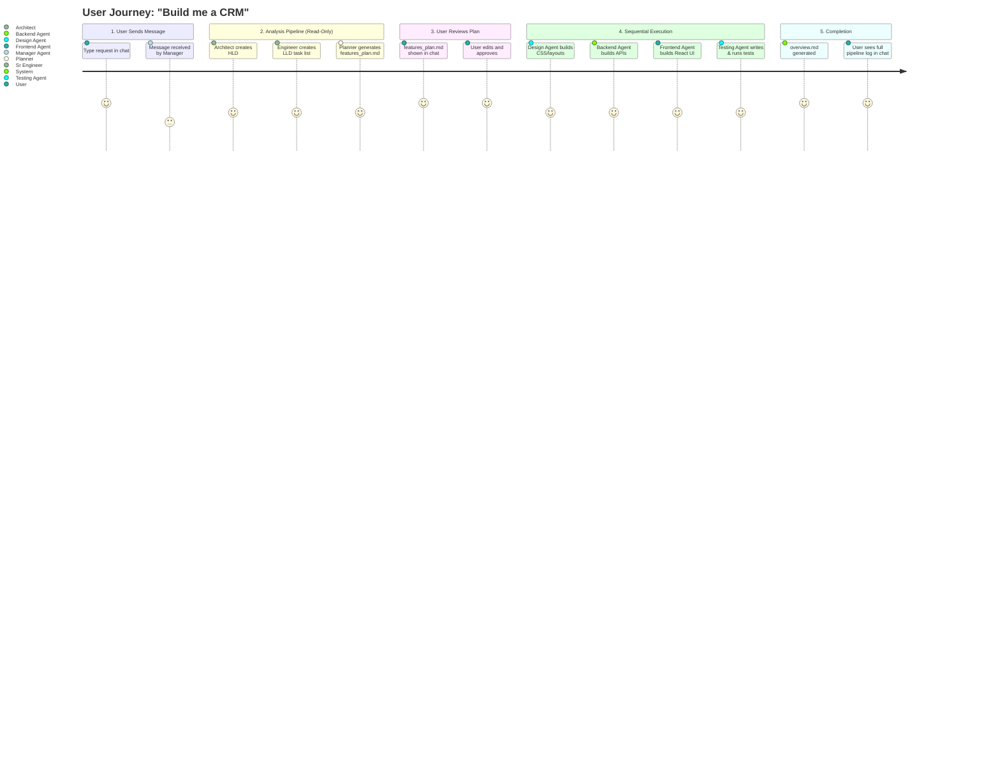
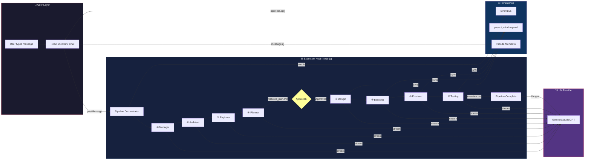
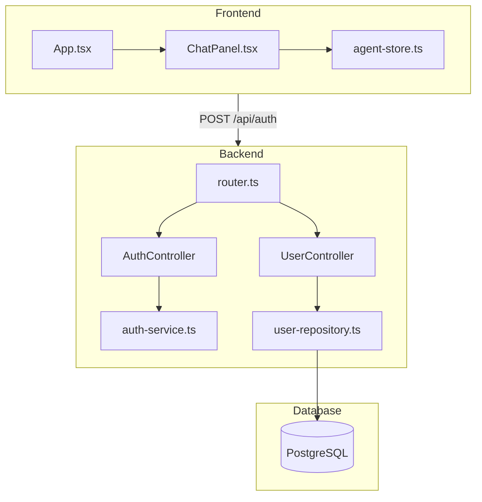
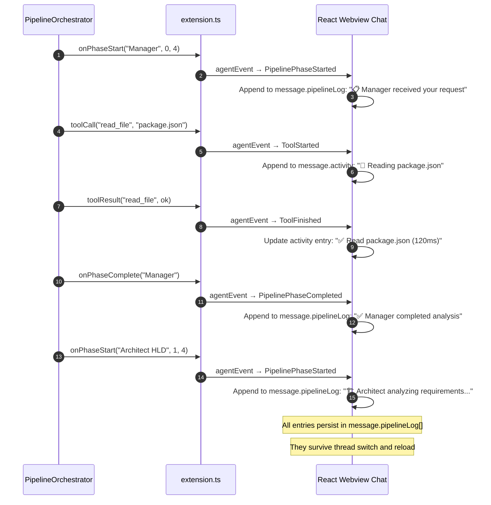
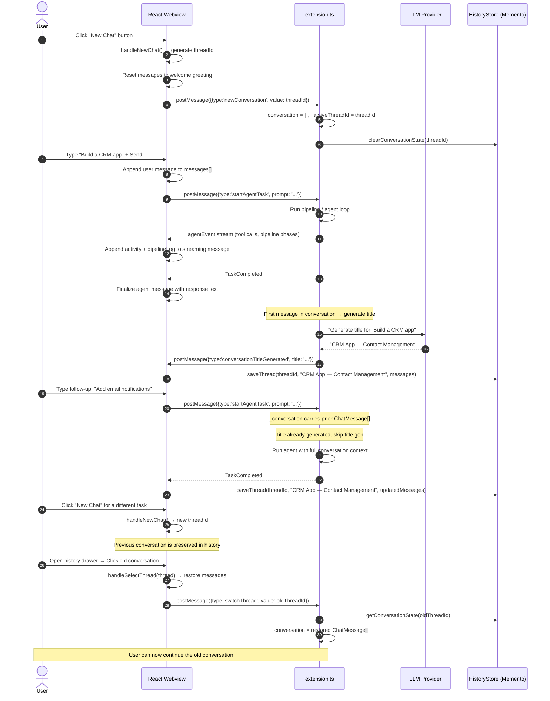

# Multi-Agent Orchestration Engine: Complete Architectural Specification

**Author:** Senior Systems Architect  
**Date:** July 18, 2026  
**Status:** IMPLEMENTED (with deviations) — see changelog below  
**Codebase Commit Base:** Current HEAD of `blackIDE`

---

## Changelog addendum (2026-07-20): pending-work execution pass

Executed against `notes/execution-plan-v2.md`, which re-audited
`notes/pending-work-plan.md` against the code before sequencing. Test suite **230 → 352**
harness assertions, plus a **new 10-test extension-host suite**. Both `tsc` projects clean;
webview builds.

**Correctness fixes to shipped code**
- `KnowledgeBase.readContext` budgeted **per file** instead of tail-slicing the joined
  string. The old behaviour dropped the *newest* ADRs first and could drop
  `technical_debt.md` entirely, so long-term memory grew staler as the project learned more.
- `GitMutex.run` gained a timeout (default 120s, wrapping the whole retry sequence). One
  hung `git` subprocess previously deadlocked every git operation in the extension with no
  error and no recovery. First tests for the primitive: serialization, poison-resistance,
  lock retry, and liveness.

**New capability modules** (pure core + thin integration, per the standing convention)
- `core/text-cap.ts` — shared bounded-append-only strategy; `capMindmap` and the ADR log
  are now both callers.
- `core/plan-parser.ts` — per-task dependency graphs from `features_plan.md`; tasks inherit
  an enclosing phase heading, since real Planner output often tags only the heading.
- `core/git-pr.ts` `resolveOutputMode` + `core/completion-docs.ts` — PR output mode and the
  CHANGELOG/release-notes regime. Unrecognised settings degrade to `apply`.
- `core/parallel-execution.ts` — P5 wave planning. **Default-off**; also declines when no
  wave has >1 phase, and refuses to combine with PR mode (which promises one branch, not N
  merged into the live tree).
- `KnowledgeBase.summarizeRepoStructure` / `scaffoldArchitecture` — first-run repo scan,
  guarded so it can never overwrite human or agent edits.

**Infrastructure**
- `.github/workflows/ci-agent-tests.yml` — the 230-test harness had been gated by **nothing**;
  it ran only on developer laptops. Gate verified by injecting a canary failure.
- `.github/workflows/ci-agent-integration.yml` + `test/integration/` — extension-host suite.
  Previously believed blocked on a windowing environment; the actual failure was a
  unix-socket path-length limit, fixed with a short `--user-data-dir`.
- Build artifacts untracked and gitignored (**~3900 files**): `dist/`, `tsconfig.tsbuildinfo`,
  `test/tmp/`, `node_modules/`, `webview/node_modules/`. All are regenerated by
  `scripts/prepare/prepare_vscode.sh`, which already does `rm -rf node_modules && npm install`
  then `npm run compile`.

**Known gap:** `pipelineParallelExecution` stays default-off. Its merge semantics are tested
against real git, but concurrent cancellation and budget-trip behaviour across parallel
phases still have no coverage — that is the gate on promoting it.


## Changelog: Spec vs. Shipped Implementation (2026-07-19)

This document was written as a proposal on 2026-07-18. The core of it shipped the very
next commit (`4a63475`, "implement multi-agent pipeline orchestration with mindmap
updating capabilities"), and a follow-up hardening pass closed the remaining gaps. It is
kept here as the design record, with this section noting where the shipped system
differs from what's described below — treat the sections after this one as historical
intent, not a live description of the code.

**Shipped as specified:** the `PipelineOrchestrator` (HLD → LLD → Planner → conditional
Design/Backend/Frontend/Testing execution), the 7 new modes, the `update_mindmap` tool,
the pipeline `AgentEvent` types, and the in-chat `PipelineLogPanel`.

**Deliberately built differently:**
- **No Manager phase.** The spec's Manager agent existed to classify "is this request
  substantial enough to orchestrate." That classification is a pure heuristic
  (`PlanningEngine.shouldOrchestrate`), not an LLM call — spending an agent turn on it
  would add latency for no behavioral gain. The pipeline is **7 agents, not 8**.
- **`shouldOrchestrate` triggers automatically** on substantial multi-domain requests
  (keyword + word-count heuristic, mirroring `PlanningEngine.shouldPlan`'s proven
  pattern), not only via manual mode selection or `/orchestrate` — the original shipped
  version required one of those explicitly, which made the flagship feature invisible
  by default. `/orchestrate` and selecting the "orchestrator" mode remain as forces-on
  overrides.
- **Approval gate reuses the existing in-chat card**, not a native VS Code dialog. The
  single-agent plan-first flow already had a polished `_pendingApproval` /
  `PlanApprovalRequested` / Approve-Reject card; the pipeline now populates the same
  state instead of a separate `showInformationMessage` popup.
- **`overview.md` is generated deterministically** by `PipelineOrchestrator` itself
  (phase timing + files touched, sourced from the existing `onFileChanged` stream), not
  left to an LLM call.
- **Mindmap sync is belt-and-suspenders**: the `update_mindmap` tool remains available
  for agent-authored structured updates, and the orchestrator *additionally* appends a
  deterministic "Auto-Sync" entry after every execution phase so the mindmap can't go
  silently stale if an executor forgets to call the tool.
- **F9 (auto-open every modified file)** was intentionally scoped down to auto-opening
  only `features_plan.md` / `project_mindmap.md` / `overview.md` by default, to avoid
  flooding the tab bar during a multi-file pipeline run. A `pipelineAutoOpenAllFiles`
  toggle (in the extension's own general settings, not a native VS Code setting — see
  §Phase 1 below) turns the full spec behavior back on.

### Phase 1 hardening (2026-07-19, same day)

- **Retry-error UX fixed.** `PipelinePhaseError` set the chat message's status to
  `failed` with no reset path — a successful "Retry Phase" after a transient error left
  the UI showing a red "Failed" badge, a frozen elapsed timer, and a stale error banner
  for the rest of a run that actually went on to succeed. Fixed in the webview reducers
  (`App.tsx`/`agent-store.ts`): status and error clear on the next `PipelinePhaseStarted`.
  Also removed a duplicate `onPhaseStarted` call that double-announced every retry.
- **`pipelineAutoOpenAllFiles` setting added**, in the same `general-settings` JSON blob
  every other extension setting already lives in (this extension has zero native
  `contributes.configuration` entries — everything routes through its own settings
  webview). Off by default.
- **`selectExecutionPhases()` extracted as a pure, exported function** so the
  conditional-backend-phase logic is unit-tested directly instead of only implicitly via
  the full LLM-driven pipeline.

### Phase 2: worktree isolation, browser self-verification, per-phase models (2026-07-19)

- **Execution phases (Design/Backend/Frontend/Testing) now run inside an isolated git
  worktree**, not the live workspace — a failed or still-running pipeline never touches
  the user's actual files. This uncovered two real, pre-existing correctness bugs that
  had to be fixed for isolation to work at all, not just compile:
  - `worktreeManager.mergeWorktree()` (also used by the existing ad-hoc `spawn_subagent`
    worktree isolation) merges branch *commits* — but nothing in either code path ever
    committed inside the worktree first, so the merge was a **silent no-op**: every file
    an isolated agent wrote was discarded when the worktree got removed. Added
    `commitWorktreeChanges()`.
  - Committing and then plain-`git merge`-ing still failed in practice (caught by a real
    temp-git-repo integration test, not just reasoning about it): the live workspace
    still has the exact same uncommitted state that was synced into the worktree (e.g.
    `features_plan.md`, written moments earlier), and `git merge` refuses to touch a
    file with local uncommitted changes regardless of content — meaning **every**
    pipeline run's reconciliation step would have failed, 100% of the time. Fixed by
    replacing `git merge` with a two-commit diff: a "sync baseline" commit right after
    `syncUncommittedChanges`, an "execution" commit after the phases finish, and
    `git diff baseline execution | git apply` onto the live tree — which only touches
    what the execution phases actually changed, never re-touching the pre-existing dirty
    files. See `WorktreeManager.applyDelta()`'s doc comment for the full reasoning.
  - `git worktree add` only clones from committed HEAD, so a worktree created right
    after the Planner phase wrote `.blackIDE/features_plan.md` wouldn't contain that
    file at all without an explicit sync step. Added
    `syncUncommittedChanges()` — tracked-file diff+apply, untracked files copied by path.
  - The deterministic mindmap auto-sync (added in Phase 0) now writes into the worktree
    during execution instead of the live workspace directly, since writing both sides of
    the same file outside git tracking would itself create a reconciliation conflict.
  - **Note:** the ad-hoc `spawn_subagent` worktree path (`extension.ts`, unrelated to the
    pipeline) has this same latent "merge is a no-op without a commit" bug and was *not*
    fixed here — it's a separate code path with its own blast radius, flagged but out of
    this scope.
- **Browser self-verification**: Testing Executor's tool list now includes
  `browser_open/screenshot/click/type/read/close`. Its system prompt instructs it to
  start the dev server, background it *with output redirected to a file* (a bare
  trailing `&` alone leaves `run_command` hanging until timeout, since the backgrounded
  process still holds the shell's stdout pipe open), then navigate/click through the
  actual built UI and screenshot it — only when the plan has a `[frontend]` phase to
  verify.
- **Per-phase model selection**: `PipelineOrchestrator` now resolves a model per phase
  via a pure `resolveModelForPhase()` function, configured through a new "Pipeline Phase
  Models" settings section (one dropdown per phase, defaulting to "use pipeline
  default"). Lets HLD/LLD scaffolding run on a cheap/fast model while execution phases
  use a stronger one, matching both Cursor's and Antigravity's per-agent model
  assignment.

### Phase 2.3: Pipeline Manager panel (parallel runs)

- A dedicated webview panel (command `black-ide.openPipelineManager`) running up to 4
  isolated pipeline instances concurrently, each its own worktree/model/AbortController,
  with per-run status, cancel, and in-panel approve/reject. `_runPipeline` was refactored
  into a shared `_runPipelineCore` so chat- and Manager-initiated runs share one
  implementation without touching each other's state. Also added
  `onPipelineFailed`/`onPipelineCancelled` callbacks so a failed/cancelled run signals a
  terminal state instead of leaving the UI stuck "in progress".

### Phase 1: Correctness & security hardening (see `notes/plans/phase-1-*.md`)

- **B1 — command policy now enforced in pipelines.** The pipeline previously ran with
  `approve: () => true`, ignoring the user's allow/deny command policy entirely. A single
  `_buildApprovalGate({interactive})` now backs both flows: chat is interactive (modals);
  pipeline runs are unattended (allow-list runs, deny-list + would-prompt refused-and-
  logged, MCP refused, worktree file writes allowed).
- **B2 — resource leak fixed.** `_runPipelineCore` now closes its `BrowserTool` /
  `MCPClient` in a `finally`, mirroring the chat flow. Testing-Executor browser runs no
  longer leak headless Chromium.
- **B5 — checkpoint bleed fixed.** Every pipeline run and every subagent now gets its own
  in-memory `CheckpointManager` instead of sharing `this._checkpoints`; concurrent runs
  and chat no longer sweep each other's snapshots. Pipeline execution changes are
  git-undoable (they land via `applyDelta`).
- **B6 — `spawn_subagent` no longer silently drops work.** The subagent path had the same
  merge-is-a-no-op bug the pipeline path was fixed for earlier: it now syncs uncommitted
  state, commits a baseline, and reconciles via `commitWorktreeChanges` + `applyDelta`
  (preserving the worktree on reconcile failure). `maxLoops` raised 6 → 15.
- **B4 — F14 actually implemented.** After a successful chat-initiated pipeline run, a
  compact `overview.md`-based summary is spliced into the conversation so follow-up chat
  turns have context. (Previously F14 was marked shipped but was not implemented.)

### Phase A: Observability & safety cluster (see `notes/implementation-plan.md` Phase A)

The first slice of the unified plan's "trust the foundation" phase — making the pipeline's
existing behavior visible, right-sized, and bounded:

- **B3 — per-pipeline token/cost visibility + budget cap.** `loopCallbacks` are now provided
  to every phase's agent loop (they were plumbed but never wired), so tool activity and
  cumulative token cost surface in both chat and the Manager panel. A new
  `pipelineTokenBudget` setting (0 = unlimited) aborts a run that exceeds the ceiling and
  reports it as a clear failure, not a silent stop. Token accounting is shared with the chat
  flow via one `_trackAndEmitUsage` helper (DRY).
- **B7 — trigger right-sized.** `shouldOrchestrate` now requires an action verb AND a scope
  noun AND the absence of modification intent (optimize/refactor/fix/faster/…), so
  "make this function faster in the user service" no longer launches a 7-agent run. Added a
  `/single` opt-out to force a request onto the single-agent path.
- **B8 minors.** `overview.md` shows real created/modified/deleted actions (file-kind threaded
  through the phase-file tracker); mindmap auto-sync is size-capped (`capMindmap`, drops oldest
  regenerable entries) so it can't bloat away its own token savings; per-phase retry budget
  raised to 2 with attempt-numbered dialog copy.

### Phase A: Durability + telemetry (completes Phase A's code)

- **Durability.** Manager-panel pipeline runs now persist a serializable summary to
  `globalState` on every status transition. On activation, `reconcileInterruptedRuns`
  (pure, in the new vscode-free `core/pipeline-runs.ts`) flips any run a window reload
  left non-terminal to `failed — Interrupted by a window reload`, so the Manager panel
  shows accurate history instead of ghost "running" rows. The live-vs-history views merge
  with live winning on id collision (`mergeRunViews`), bounded by `capRunHistory`.
- **Telemetry.** A second `EventBus.onAny` subscriber (`core/telemetry-sink.ts`) writes a
  privacy-safe, rotating local JSONL: counts, durations, coarse error classes, model type
  and event type only — never prompts, paths, file contents, or tool output (enforced by
  an allow-list projection `toTelemetryRecord`, unit-tested). Setting-gated by the existing
  `allowAnonymousTelemetry` toggle; a `black-ide.exportDiagnostics` command opens the log
  for self-diagnosis.

**Still open:** extension-host integration tests (`@vscode/test-electron` — designed but
needs a real CI/windowing environment) and the `dist/`-tracking repo-hygiene decision
(needs packaging-pipeline confirmation, not a blind removal). Both are infrastructure/owner
decisions, not feature code — **Phase A's implementation is otherwise complete.**

### Vision phases B/C/D: core capabilities shipped

The load-bearing, testable cores of the three most tractable vision phases (see
`notes/implementation-plan.md`) are now built and integrated — not the full phases, but
their algorithmic hearts, each a pure vscode-free module with harness coverage:

- **Phase B (long-term memory):** `core/knowledge-base.ts` — the durable `.blackIDE/knowledge/`
  file set (ADR decision log, feature status, architecture, tech-debt, glossary, roadmap) with
  pure `nextAdrId`/`formatAdr`/`upsertFeatureStatus` and a `KnowledgeBase` class. A completed
  pipeline scaffolds the folder and records what it built. *Remaining: the read side (agents
  consulting knowledge/ each run) + compaction.*
- **Phase C (smart intake):** `PlanningEngine.classifyRequest()` — a tested classifier over the
  plan.md intent taxonomy, wired into dispatch (pure questions now skip plan-first). *Remaining:
  requirement discovery + repo-discovery scan.*
- **Phase D (deeper planning):** `core/task-scheduler.ts` — a pure dependency-aware scheduler
  (topological order + priority + cycle reporting; parallel waves). The pipeline dogfoods it:
  execution-phase order is now resolved from an explicit dependency graph. *Remaining: richer
  planning artifacts + per-task graphs.*

### Vision phases B/C/D/F: extensions shipped

A follow-up pass extended the vision cores with more tested, integrated capability:

- **Phase B read-side:** `KnowledgeBase.readContext()` — a bounded knowledge digest now
  injected into every pipeline run, so agents start aware of prior decisions/feature status/
  tech debt instead of re-deriving them.
- **Phase C requirement discovery:** `PlanningEngine.detectMissingRequirements()` — flags the
  unspecified dimensions of a bare build (users, stack, auth, scope) as open questions fed to
  the Architect, rather than silent assumptions.
- **Phase D artifact:** the pipeline emits `dependency_graph.md` (`formatDependencyGraph`,
  showing the parallel execution waves) on approval.
- **Phase F:** ADR capability (in the knowledge base) + PR-output command builders
  (`core/git-pr.ts` — push + `gh pr create`, with a compare-URL fallback), all pure and tested.

**Still open — the one large feature + tail work:**
- **Phase E — parallel within-feature execution.** Deliberately not built: concurrent-worktree
  execution is the highest-risk item (a bug corrupts user work) and needs extension-host
  integration tests this environment can't run. All seams exist (`selectExecutionWaves`,
  per-phase worktrees, `applyDelta`, `gitMutex`); it warrants a dedicated, tested effort.
- Phase B compaction; Phase C repo-discovery scan; Phase D per-task graphs + more artifacts;
  Phase F PR-output *mode* wiring + full doc regime; and the two Phase A infra items
  (integration tests, `dist/` decision).

---

## 0. Visual Overview & Feature Catalog

### 0.1 What This System Does (At a Glance)



### 0.2 Complete Feature Catalog

| # | Feature | Category | Status | Details |
|:-:|---------|----------|:------:|---------|
| F1 | **7-Agent Sequential Pipeline** *(shipped without Manager — see changelog)* | Core | ✅ SHIPPED | Architect → Engineer → Planner → Design → Backend → Frontend → Testing |
| F2 | **Automatic Pipeline Trigger** | Core | 🆕 NEW | `shouldOrchestrate()` detects substantial requests (>10 words + build keywords); trivial requests use single-agent |
| F3 | **User Approval Gate** | Core | 🆕 NEW | Pipeline pauses after Planner, shows `features_plan.md` in chat with Approve/Reject buttons; user can edit before approving |
| F4 | **OpenSpec Mindmap** | Persistence | 🆕 NEW | `.blackIDE/mindmap/project_mindmap.md` — shared knowledge graph updated after each execution phase; ~90% token savings |
| F5 | **features_plan.md** | Artifacts | 🆕 NEW | Auto-generated, user-editable feature specification with tagged phases `[design]`, `[backend]`, `[frontend]`, `[testing]` |
| F6 | **overview.md** | Artifacts | 🆕 NEW | Auto-generated completion report with phase timing, file changes, and test results |
| F7 | **Real-Time Pipeline Log in Chat** | UI/UX | 🆕 NEW | Every agent action (phase start, tool call, file change) shown as timestamped entries in the chat message |
| F8 | **Persistent Activity Log** | UI/UX | 🆕 NEW | Pipeline log entries embedded in `message.pipelineLog[]`, persisted to Memento — never cleared on reload |
| F9 | **Auto-Open Modified Files in Editor** | UI/UX | 🆕 NEW | Every file write/edit triggers `vscode.window.showTextDocument()` with preview + preserveFocus |
| F10 | **Clickable File Links in Chat** | UI/UX | 🆕 NEW | Each file entry in the pipeline log has an "Open →" button to open the file in the editor |
| F11 | **LLM-Powered Conversation Titles** | Conversations | 🆕 NEW | After first task, LLM generates a concise title (e.g., "CRM — Contact Management") instead of naive truncation |
| F12 | **Multi-Message Conversations** | Conversations | ✅ EXISTS | Users can send follow-up messages in the same thread; `_conversation` carries full context |
| F13 | **New / Open / Delete Conversations** | Conversations | ✅ EXISTS | Full CRUD via history drawer; "New Chat" button, thread click to switch, 🗑️ to delete |
| F14 | **Pipeline-Scoped Conversation Context** | Conversations | 🆕 NEW | Pipeline orchestrator reuses `_conversation` so follow-up messages after a pipeline run maintain full context |
| F15 | **Conditional Backend Phase** | Core | 🆕 NEW | Backend Agent skipped if Planner produces no `[backend]` tasks (e.g., UI-only changes) |
| F16 | **Phase-Specific Tool Scoping** | Security | 🆕 NEW | Analysis agents are read-only (no `write_file`, `run_command`); execution agents get full tool access |
| F17 | **Error Handling & Phase Retry** | Resilience | 🆕 NEW | If an execution agent fails, pipeline emits `PipelinePhaseError`, logs the error in chat, and halts (no silent swallowing) |
| F18 | **Mid-Pipeline Cancellation** | Resilience | 🆕 NEW | User can cancel at any point; `AbortController.abort()` propagates through all active phases |
| F19 | **`update_mindmap` Tool** | Tools | 🆕 NEW | New tool for agents to programmatically update the OpenSpec mindmap with structured module/API/component data |
| F20 | **Pipeline Progress Events** | EventBus | 🆕 NEW | 5 new `AgentEvent` types: `PipelineStarted`, `PipelinePhaseStarted`, `PipelinePhaseCompleted`, `PipelineCompleted`, `MindmapUpdated` |

### 0.3 UI Layout: What the User Sees

```
┌─────────────────────────────────────────────────────────────────────┐
│  BLACK IDE AGENT                                     [⚙ Settings]  │
├────────────────┬────────────────────────────────────────────────────┤
│                │                                                    │
│  CONVERSATIONS │  💬 CHAT AREA                                      │
│  ─────────────│                                                    │
│                │  ┌──────────────────────────────────────────────┐  │
│  🔍 Search...  │  │ 👤 Build a CRM with contact management      │  │
│                │  └──────────────────────────────────────────────┘  │
│  ┌───────────┐│                                                    │
│  │ + New Chat ││  ┌──────────────────────────────────────────────┐  │
│  └───────────┘│  │ 🤖 Agent                                      │  │
│                │  │                                                │  │
│  Today         │  │ ┌──── ✦ Pipeline Execution Log ───────────┐  │  │
│  ┌───────────┐│  │ │                                          │  │  │
│  │ CRM —     ││  │ │ 19:30:01 📋 Manager started (1/4)      │  │  │
│  │ Contacts &││  │ │ 19:30:03   📂 Reading package.json      │  │  │
│  │ Pipeline 🗑││  │ │ 19:30:03   ✅ Read package.json (45ms) │  │  │
│  └───────────┘│  │ │ 19:30:08 ✅ Manager completed           │  │  │
│  ┌───────────┐│  │ │ 19:30:08 🏗️ Architect started (2/4)    │  │  │
│  │ Auth Bug  ││  │ │ 19:30:15 ✅ Architect completed          │  │  │
│  │ Fix      🗑││  │ │ 19:30:15 📐 Sr Engineer started (3/4)  │  │  │
│  └───────────┘│  │ │ 19:30:25 ✅ Sr Engineer completed        │  │  │
│  ┌───────────┐│  │ │ 19:30:25 📝 Planner started (4/4)       │  │  │
│  │ API Docs  ││  │ │ 19:30:28 📄 features_plan.md  [Open →]  │  │  │
│  │ Generator🗑││  │ │ 19:30:30 ✅ Planner completed            │  │  │
│  └───────────┘│  │ └──────────────────────────────────────────┘  │  │
│                │  │                                                │  │
│  Yesterday     │  │ ┌── Plan Approval ────────────────────────┐  │  │
│  ┌───────────┐│  │ │ features_plan.md ready for review        │  │  │
│  │ Sidebar   ││  │ │ 22 tasks across 4 phases                 │  │  │
│  │ Color    🗑││  │ │                                          │  │  │
│  └───────────┘│  │ │ [✓ Approve & Execute]   [✗ Reject]      │  │  │
│                │  │ └─────────────────────────────────────────┘  │  │
│                │  │                                                │  │
│                │  │ (After user approves...)                       │  │
│                │  │                                                │  │
│                │  │ ┌──── ✦ Pipeline Log (continued) ──────────┐  │  │
│                │  │ │ 19:31:00 🎨 Design Agent started (1/4)  │  │  │
│                │  │ │ 19:31:10 📄 tailwind.config.js [Open →]  │  │  │
│                │  │ │ 19:31:15 ✏️ index.css  [Open →]          │  │  │
│                │  │ │ 19:31:20 ✅ Design Agent completed       │  │  │
│                │  │ │ 19:31:20 ⚙️ Backend Agent started (2/4) │  │  │
│                │  │ │ 19:31:35 📄 src/app.ts  [Open →]         │  │  │
│                │  │ │ 19:31:40 📄 src/models/contact.ts [Open] │  │  │
│                │  │ │ 19:31:50 ✅ Backend Agent completed      │  │  │
│                │  │ │ 19:31:50 🖥️ Frontend started (3/4)      │  │  │
│                │  │ │ 19:32:05 📄 Dashboard.tsx  [Open →]      │  │  │
│                │  │ │ 19:32:15 ✅ Frontend Agent completed     │  │  │
│                │  │ │ 19:32:15 🧪 Testing started (4/4)       │  │  │
│                │  │ │ 19:32:25 📄 auth.test.ts  [Open →]       │  │  │
│                │  │ │ 19:32:30 ✅ Testing Agent completed      │  │  │
│                │  │ │ 19:32:31 📄 overview.md  [Open →]        │  │  │
│                │  │ └──────────────────────────────────────────┘  │  │
│                │  │                                                │  │
│                │  │ ✅ Pipeline complete. 8 agents, 22 tasks,     │  │
│                │  │ 28 tests passing. See overview.md              │  │
│                │  └──────────────────────────────────────────────┘  │
│                │                                                    │
│                │  ┌──────────────────────────────────────────────┐  │
│                │  │ 👤 Also add email notifications for deals    │  │
│                │  └──────────────────────────────────────────────┘  │
│                │  (User sends follow-up in same conversation...)   │
│                │                                                    │
├────────────────┴────────────────────────────────────────────────────┤
│  [📎 Attach] [Type a message...]                    [▶ Send]       │
│  Model: Gemini 2.5 Pro                          Mode: Agent        │
└─────────────────────────────────────────────────────────────────────┘
```

### 0.4 Key Visual Behaviors

| Behavior | Description | Where Implemented |
|----------|-------------|-------------------|
| **Pipeline log auto-scrolls** | As each entry is appended, chat scrolls to bottom | `App.tsx` existing auto-scroll on message update |
| **Phase entries are color-coded** | Phase start = blue, complete = green, file = yellow, error = red | `PipelineLogPanel` CSS classes |
| **File entries are clickable** | "Open →" button calls `openArtifact` → `showTextDocument()` | Reuses existing `openArtifact` handler in `extension.ts` L559 |
| **Files auto-open in preview tab** | Preview tab (not pinned), focus stays on chat | `showTextDocument({ preview: true, preserveFocus: true })` |
| **Pipeline log persists forever** | Embedded in `message.pipelineLog[]`, saved to `Memento` | `HistoryStore.saveThread()` serializes full `messages[]` |
| **Activity panel shows per-agent tools** | Existing `ActivityPanel` shows each tool call within current phase | Already works via `message.activity[]` |
| **Conversation title appears immediately** | LLM generates title async after first task, updates sidebar | `conversationTitleGenerated` event → `saveHistoryThread()` |
| **Conversation sidebar is always visible** | Left panel shows all threads with LLM-generated titles | History drawer in `App.tsx` L2623–L2655 |
| **Follow-up messages keep context** | `_conversation[]` accumulates across messages in same thread | `extension.ts` L1070 `this._conversation = result.messages` |

### 0.5 End-to-End Data Flow



### 0.6 Error Handling, Retry & Cancellation

| Scenario | Behavior | Implementation |
|----------|----------|----------------|
| **Agent phase fails** (LLM error, timeout) | Pipeline halts, error logged in `pipelineLog[]`, `PipelinePhaseError` event emitted to UI | `PipelineOrchestrator.run()` wraps each `runPhase()` in try/catch |
| **User cancels mid-pipeline** | `AbortController.abort()` propagates to active `runAgentLoop()`, remaining phases skipped | `signal?.aborted` check at top of every phase loop iteration |
| **LLM returns no tool calls** (model confused) | `runAgentLoop` internal loop increments turn; after `maxLoops`, returns with partial result | Existing `runAgentLoop` behavior — no change needed |
| **File write fails** (permission, disk full) | Tool returns `isError: true`, agent sees error and can retry or skip | Existing `AgentToolExecutor` error handling |
| **Plan approval timeout** (user walks away) | No timeout — promise stays pending until user acts; survives window reload via `_pendingApproval` persistence | Existing `_pendingApproval` → `pending-plan-{threadId}` in Memento |
| **Title generation fails** | Fallback to `firstUserMsg.text.slice(0, 30)` — non-critical, catch block swallows | `_generateConversationTitle()` wrapped in try/catch |

### 0.7 Completeness Checklist

| Requirement (from user request) | Covered In |
|----|-----|
| User sends message → internally received by Manager | §3.1 Pipeline Flow, §4.1 Orchestrator code |
| Manager delegates to Architect for HLD | §3.2 Agent Roles, §4.2 Mode definitions |
| Sr Engineer does LLD with tagged task list [backend/frontend/design/testing] | §3.2, §4.2 `Sr Engineer LLD` mode |
| Planner generates features_plan.md with user-editable requirements | §6.1 features_plan.md spec |
| User can modify requirements before approving | §3.1 ApprovalGate loop back, §4.3.2 |
| Sequential execution: Design → Backend → Frontend → Test (NOT parallel) | §7 Execution Sequence Rules, §4.1 for-loop (not Promise.all) |
| Mindmap updated after each agent action | §5 OpenSpec Mindmap, §4.5 `update_mindmap` tool |
| overview.md generated on completion | §6.2 overview.md spec |
| **Every agent step shown in chat (not removed)** | §9 Pipeline Visibility, §9.3 `pipelineLog[]`, §9.6 Persistence Rules |
| **Modified file name shown + auto-open in editor** | §9.4 Auto-Open, §9.5 Clickable file links |
| **Details step by step in agent chat box** | §9.2 Pipeline Activity Stream, §9.7 UI mockup |
| **Texts are NOT removed** | §9.6 Persistence table — all ✅ |
| **Auto-generate conversation title** | §10.3 LLM-Powered Title Generation |
| **Multi-message in same conversation** | §10.5 table — `_conversation` carries context |
| **Create new conversations** | §10.5 — "New Chat" button |
| **Open (switch) conversations** | §10.5 — Click thread in history |
| **Delete conversations** | §10.5 — 🗑️ button |
| **Send multiple messages in same conversation** | §10.4 Lifecycle Flow diagram |

---

## 1. Notation & Source Conventions

Throughout this document, every design decision is grounded in the **actual source code** of the black-ide-agent extension. File references use the repository-local form:

| Shorthand | Absolute Path |
|-----------|---------------|
| `ext:extension.ts` | `src/stable/extensions/black-ide-agent/src/extension.ts` |
| `agent:agent-loop.ts` | `src/stable/extensions/black-ide-agent/src/agent/agent-loop.ts` |
| `agent:tool-executor.ts` | `src/stable/extensions/black-ide-agent/src/agent/tool-executor.ts` |
| `agent:planning-engine.ts` | `src/stable/extensions/black-ide-agent/src/agent/planning-engine.ts` |
| `agent:artifact-manager.ts` | `src/stable/extensions/black-ide-agent/src/agent/artifact-manager.ts` |
| `agent:worktree-manager.ts` | `src/stable/extensions/black-ide-agent/src/agent/worktree-manager.ts` |
| `agent:hooks.ts` | `src/stable/extensions/black-ide-agent/src/agent/hooks.ts` |
| `agent:skills-manager.ts` | `src/stable/extensions/black-ide-agent/src/agent/skills-manager.ts` |
| `core:tools.ts` | `src/stable/extensions/black-ide-agent/src/core/tools.ts` |
| `core:types.ts` | `src/stable/extensions/black-ide-agent/src/core/types.ts` |
| `core:mode-loader.ts` | `src/stable/extensions/black-ide-agent/src/core/mode-loader.ts` |
| `core:event-bus.ts` | `src/stable/extensions/black-ide-agent/src/core/event-bus.ts` |
| `core:context-manager.ts` | `src/stable/extensions/black-ide-agent/src/core/context-manager.ts` |
| `core:session-manager.ts` | `src/stable/extensions/black-ide-agent/src/core/session-manager.ts` |
| `core:prompt-builder.ts` | `src/stable/extensions/black-ide-agent/src/core/prompt-builder.ts` |

---

## 2. Executive Summary

### 2.1 Problem Statement

The current Black IDE agent operates as a **single-persona loop** — one system prompt, one tool scope, one `runAgentLoop()` invocation per user request. The existing `Manager` and `Sr Architect` built-in modes (defined in `core:mode-loader.ts` lines 176–218) are **passive personas**: the user must manually select them from the UI. There is no automated orchestration where a manager receives a message and delegates to specialized sub-agents sequentially.

### 2.2 What We're Building

A **multi-agent sequential pipeline** triggered by a single user message:

```
User Message
    → Manager (intake & classification)
        → Architect (HLD analysis)
            → Sr Engineer (LLD + tagged task list)
                → Planner (features_plan.md generation → user approval gate)
                    → [APPROVED] Sequential execution:
                        Design Agent → Backend Agent → Frontend Agent → Testing Agent
                            ↳ Each updates .blackIDE/mindmap/project_mindmap.md
                    → overview.md generated on completion
```

### 2.3 Key Constraints from Existing Architecture

| Constraint | Source | Impact |
|-----------|--------|--------|
| Subagents **inherit parent mode** | `ext:extension.ts` L880: `toolsForMode(effectiveMode)` | Must modify `spawnSubagent` to accept a target mode parameter |
| Subagents **cannot spawn sub-subagents** | `agent:tool-executor.ts` L161: `if (!this.d.spawnSubagent)` | The Manager must be the sole orchestrator; no recursive delegation |
| Subagents get **max 6 loop iterations** | `ext:extension.ts` L922: `maxLoops: 6` | Must raise per-role budgets (Architect=10, Engineer=15, Executors=40) |
| `AgentMode` is a union of 3 literals | `core:types.ts` L66: `type AgentMode = 'ask' \| 'plan' \| 'agent'` | Custom modes route through `effectiveMode` via `mode-loader.ts` — no type change needed |
| Context window bounded by token budget | `core:context-manager.ts` L27: `maxTokens = 128_000` | OpenSpec mindmap reduces re-scanning; each agent gets a fresh context |
| Plan approval uses `_pendingApproval` state | `ext:extension.ts` L1100–L1141 | Must extend this gate for `features_plan.md` instead of `implementation_plan` |
| `EventBus` events are typed discriminated union | `core:event-bus.ts` L16–L34 | Must add new event types for pipeline progression |
| Git worktree isolation per subagent | `agent:worktree-manager.ts` L35–L65 | Sequential execution means only one worktree at a time — safe |
| `PromptBuilder` budget-caps each section | `core:prompt-builder.ts` L38–L85 | Mindmap content must be injected as a budgeted section |

---

## 3. Current Architecture Audit

### 3.1 Existing Agent Flow (What Happens Today)

```mermaid
sequenceDiagram
    autonumber
    actor User
    participant UI as React Webview
    participant Ext as extension.ts
    participant PE as PlanningEngine
    participant Loop as runAgentLoop()
    participant Exec as AgentToolExecutor

    User->>UI: "Build a CRM"
    UI->>Ext: postMessage({type:'startAgentTask'})
    Ext->>PE: shouldPlan("Build a CRM")
    PE-->>Ext: true (contains keyword 'build')
    Note over Ext: effectiveMode = 'plan' (L752)
    Ext->>Loop: runAgentLoop({mode:'plan', maxLoops:25})
    Loop->>Exec: read_file, grep_search, codebase_search (read-only)
    Loop->>Exec: create_artifact("implementation_plan")
    Loop->>Exec: create_artifact("task_list")
    Loop-->>Ext: LoopResult
    Ext->>Ext: Detect plan+task artifacts (L1100-L1107)
    Ext->>UI: PlanApprovalRequested
    UI-->>User: Review plan card
    User->>UI: "Approve"
    UI->>Ext: postMessage({type:'approvePlan'})
    Ext->>Ext: _runAgentTaskExecution() (L1171)
    Note over Ext: mode forced to 'agent' (L1196)
    Ext->>Loop: runAgentLoop({mode:'agent', plan injected})
    Loop->>Exec: write_file, edit_file, run_command (full access)
    Loop-->>Ext: LoopResult
    Ext->>UI: TaskCompleted
```

### 3.2 Existing Built-in Modes (from `core:mode-loader.ts` L107–L218)

| Mode | maxIterations | Tool Scope | System Prompt Focus |
|------|:---:|------------|---------------------|
| Ask | N/A | Read-only safe tools (no spawn/schedule) | Q&A only |
| Plan | 25 | Safe tools (includes spawn_subagent) | Research + artifact creation |
| Agent | 25 | All tools | Full autonomy |
| Frontend | 40 | All tools | React, CSS, accessibility, responsive |
| Backend | 40 | All tools | REST/GraphQL, DB, auth, security |
| DevOps | 30 | Tailored (no browser) | Docker, CI/CD, infra |
| Manager | 15 | Read + spawn_subagent + artifacts | Delegation, no code writing |
| Sr Architect | 20 | Read + artifacts | System design, ADRs |

### 3.3 Gap Analysis: What's Missing

| # | Gap | Why It Matters |
|:-:|-----|---------------|
| G1 | `spawnSubagent()` cannot specify a **target mode** | All sub-agents run under parent's mode — a Manager in `plan` mode spawns plan-only children |
| G2 | No **sequential orchestrator** — subagents run fire-and-forget | The Manager spawns but doesn't enforce Design→Backend→Frontend→Test ordering |
| G3 | No **mindmap tool** or auto-sync | Agents have no way to read/update a shared knowledge graph between phases |
| G4 | No `features_plan.md` distinct from `implementation_plan` | Current planning produces `implementation_plan` + `task_list`; we need a richer format with tagged phases |
| G5 | No **overview.md** generation at pipeline completion | No automatic summarization of the full multi-agent run |
| G6 | `AgentEvent` union lacks **pipeline progress events** | UI can't show "Design Agent finished, Backend Agent starting..." |
| G7 | Existing `Manager` mode system prompt says "spawn sub-agents" but doesn't **enforce** the pipeline order | It's advisory text, not code constraints |

---

## 4. Proposed Architecture

### 4.1 Full Pipeline Flow

```mermaid
flowchart TD
    UserMsg([User Message]) --> Intake[extension.ts: _runAgentTask]
    Intake --> ShouldOrchestrate{PipelineEngine.shouldOrchestrate?}
    
    ShouldOrchestrate -- No: trivial --> SingleAgent[Existing single-agent flow]
    ShouldOrchestrate -- Yes: substantial --> Pipeline[PipelineOrchestrator.run]
    
    subgraph Phase_1 ["Phase 1: Analysis (Read-Only)"]
        Pipeline --> Manager["① Manager Agent<br/>mode: manager<br/>maxLoops: 15"]
        Manager --> Architect["② Architect Agent<br/>mode: sr_architect_hld<br/>maxLoops: 20"]
        Architect --> Engineer["③ Sr Full Stack Engineer<br/>mode: sr_engineer_lld<br/>maxLoops: 25"]
        Engineer --> Planner["④ Plan Synthesizer<br/>mode: planner<br/>maxLoops: 15"]
    end
    
    Planner --> WriteFeaturesPlan["write .blackIDE/features_plan.md"]
    WriteFeaturesPlan --> ApprovalGate{User Approval Gate}
    
    ApprovalGate -- Rejected / Edit --> WriteFeaturesPlan
    ApprovalGate -- Approved --> ReadMindmap["Read existing project_mindmap.md"]
    
    subgraph Phase_2 ["Phase 2: Sequential Execution (Full Access)"]
        ReadMindmap --> Design["⑤ Design Agent<br/>mode: design_executor<br/>maxLoops: 40"]
        Design --> SyncMM1["update_mindmap()"]
        SyncMM1 --> BackendCheck{Backend tasks exist?}
        BackendCheck -- Yes --> Backend["⑥ Backend Agent<br/>mode: backend_executor<br/>maxLoops: 40"]
        BackendCheck -- No --> Frontend
        Backend --> SyncMM2["update_mindmap()"]
        SyncMM2 --> Frontend["⑦ Frontend Agent<br/>mode: frontend_executor<br/>maxLoops: 40"]
        Frontend --> SyncMM3["update_mindmap()"]
        SyncMM3 --> Testing["⑧ Testing Agent<br/>mode: testing_executor<br/>maxLoops: 30"]
        Testing --> SyncMM4["update_mindmap()"]
    end
    
    SyncMM4 --> GenOverview["Generate overview.md"]
    GenOverview --> Done([Pipeline Complete])
    
    style ApprovalGate fill:#ff9,stroke:#333,stroke-width:2px
    style Phase_1 fill:#e8f4fd,stroke:#0078d4
    style Phase_2 fill:#e8fde8,stroke:#2ea043
```



### 4.2 Agent Role Specifications

#### Phase 1 Agents (Read-Only, No Source Mutations)

| # | Role | Mode Key | Tools | maxLoops | Deliverable |
|:-:|------|----------|-------|:--------:|-------------|
| ① | Manager | `manager` | read_file, list_directory, grep_search, codebase_search, web_search, create_artifact, update_plan, complete_task | 15 | Task decomposition & initial classification |
| ② | Architect (HLD) | `sr_architect_hld` | read_file, list_directory, grep_search, codebase_search, web_search, create_artifact, complete_task | 20 | High-Level Design: architecture patterns, data models, API contracts, tech stack decisions |
| ③ | Sr Engineer (LLD) | `sr_engineer_lld` | read_file, list_directory, grep_search, codebase_search, create_artifact, complete_task | 25 | Low-Level Design: tagged task list (`[design]`, `[backend]`, `[frontend]`, `[testing]`) with file paths, function signatures, and dependency order |
| ④ | Plan Synthesizer | `planner` | read_file, list_directory, create_artifact, write_file, complete_task | 15 | `features_plan.md` — aggregated, user-editable feature specification |

#### Phase 2 Agents (Full Tool Access, Sequential)

| # | Role | Mode Key | Tools | maxLoops | Scope |
|:-:|------|----------|-------|:--------:|-------|
| ⑤ | Design Agent | `design_executor` | All tools | 40 | CSS/Tailwind, color schemes, typography, layouts, design tokens, component wireframes |
| ⑥ | Backend Agent | `backend_executor` | All tools | 40 | API routes, controllers, DB schemas, auth, middleware, validation |
| ⑦ | Frontend Agent | `frontend_executor` | All tools | 40 | React/TSX components, state management, API integration, event handling |
| ⑧ | Testing Agent | `testing_executor` | All tools | 30 | Unit tests, integration tests, E2E tests, test runner execution |

---

## 5. Implementation Plan: File-by-File Changes

### 5.1 NEW: `agent/pipeline-orchestrator.ts`

The central orchestrator. This is the **only new file with significant logic**.

```typescript
// pipeline-orchestrator.ts — Multi-Agent Sequential Pipeline Engine

import { LLMConfigEntry, ChatMessage, ToolDefinition } from '../core/types';
import { runAgentLoop, LoopResult } from './agent-loop';
import { AgentToolExecutor, ExecutorDeps } from './tool-executor';
import { ContextManager } from '../core/context-manager';
import * as fs from 'fs';
import * as path from 'path';

export interface PipelinePhase {
    name: string;           // Human-readable: "Architect (HLD)"
    modeKey: string;        // Mode registry key: "sr_architect_hld"
    systemPrompt: string;   // Injected system instructions
    maxLoops: number;
    inputFromPrevious: boolean; // Inject previous phase's output into prompt
}

export interface PipelineConfig {
    analysisPhases: PipelinePhase[];     // Manager → Architect → Engineer → Planner
    executionPhases: PipelinePhase[];    // Design → Backend → Frontend → Testing
    mindmapPath: string;                 // .blackIDE/mindmap/project_mindmap.md
    featuresPlanPath: string;            // .blackIDE/features_plan.md
    overviewPath: string;                // .blackIDE/overview.md
}

export interface PipelineCallbacks {
    onPhaseStart: (phase: PipelinePhase, index: number, total: number) => void;
    onPhaseComplete: (phase: PipelinePhase, result: LoopResult) => void;
    onApprovalRequired: (planContent: string) => Promise<boolean>;
    onMindmapUpdated: (content: string) => void;
    onPipelineComplete: (overviewContent: string) => void;
}

/** Determines if a prompt warrants the full pipeline vs. single-agent. */
export function shouldOrchestrate(prompt: string): boolean {
    const lower = prompt.toLowerCase().trim();
    const wordCount = prompt.split(/\s+/).filter(w => w.length > 0).length;

    // Short messages or greetings → single agent
    if (wordCount <= 8) return false;

    // Explicit slash commands → single agent
    if (lower.startsWith('/')) return false;

    // Substantial build/create/implement requests → pipeline
    const PIPELINE_KEYWORDS = [
        'build', 'create', 'implement', 'develop', 'make',
        'design', 'architect', 'system', 'application', 'app',
        'software', 'platform', 'crm', 'dashboard', 'website',
        'fullstack', 'full-stack', 'full stack',
        'project', 'feature', 'module', 'service',
    ];
    return PIPELINE_KEYWORDS.some(kw => lower.includes(kw)) && wordCount > 10;
}

export class PipelineOrchestrator {
    constructor(
        private config: PipelineConfig,
        private modelConfig: LLMConfigEntry,
        private baseDepsFactory: (mode: string) => ExecutorDeps,
        private toolsFactory: (mode: string) => ToolDefinition[],
        private callbacks: PipelineCallbacks,
        private signal?: AbortSignal,
    ) {}

    async run(userPrompt: string): Promise<void> {
        const phaseOutputs: Map<string, string> = new Map();
        
        // ── Phase 1: Analysis (read-only) ──
        for (let i = 0; i < this.config.analysisPhases.length; i++) {
            if (this.signal?.aborted) return;
            const phase = this.config.analysisPhases[i];
            this.callbacks.onPhaseStart(phase, i, this.config.analysisPhases.length);

            const priorContext = phase.inputFromPrevious
                ? this.buildPriorContext(phaseOutputs)
                : '';
            
            // Inject mindmap if it exists
            const mindmapContext = this.readMindmap();

            const result = await this.runPhase(phase, userPrompt, priorContext, mindmapContext);
            phaseOutputs.set(phase.modeKey, result.finalText);
            this.callbacks.onPhaseComplete(phase, result);
        }

        // ── Approval Gate ──
        const planContent = this.readFeaturesPlan();
        if (!planContent) throw new Error('Pipeline failed: no features_plan.md was generated.');
        
        const approved = await this.callbacks.onApprovalRequired(planContent);
        if (!approved) return; // User rejected

        // ── Phase 2: Sequential Execution ──
        const approvedPlan = this.readFeaturesPlan(); // Re-read in case user edited
        
        for (let i = 0; i < this.config.executionPhases.length; i++) {
            if (this.signal?.aborted) return;
            const phase = this.config.executionPhases[i];

            // Skip backend if no [backend] tasks in plan
            if (phase.modeKey === 'backend_executor' && !this.hasPhaseTasks(approvedPlan!, '[backend]')) {
                continue;
            }

            this.callbacks.onPhaseStart(phase, i, this.config.executionPhases.length);
            
            const mindmapContext = this.readMindmap();
            const phaseTasksPrompt = this.extractPhaseTasks(approvedPlan!, phase.modeKey);

            const result = await this.runPhase(phase, phaseTasksPrompt, approvedPlan!, mindmapContext);
            phaseOutputs.set(phase.modeKey, result.finalText);
            
            // Update mindmap after each execution phase
            await this.syncMindmap(phase, result);
            this.callbacks.onPhaseComplete(phase, result);
        }

        // ── Generate overview.md ──
        const overview = this.generateOverview(userPrompt, phaseOutputs);
        const overviewDir = path.dirname(this.config.overviewPath);
        if (!fs.existsSync(overviewDir)) fs.mkdirSync(overviewDir, { recursive: true });
        fs.writeFileSync(this.config.overviewPath, overview, 'utf8');
        this.callbacks.onPipelineComplete(overview);
    }

    private async runPhase(
        phase: PipelinePhase,
        prompt: string,
        priorContext: string,
        mindmapContext: string,
    ): Promise<LoopResult> {
        const deps = this.baseDepsFactory(phase.modeKey);
        const executor = new AgentToolExecutor(deps);
        const tools = this.toolsFactory(phase.modeKey);

        const system = [
            phase.systemPrompt,
            mindmapContext ? `\n\n## Current Project Mindmap (OpenSpec)\n${mindmapContext}` : '',
        ].join('');

        const content = [
            prompt,
            priorContext ? `\n\n## Context from Previous Analysis Phases\n${priorContext}` : '',
        ].join('');

        return runAgentLoop({
            modelConfig: this.modelConfig,
            system,
            initialMessage: { role: 'user', content },
            tools,
            executor,
            maxLoops: phase.maxLoops,
            signal: this.signal,
            context: new ContextManager(
                ContextManager.getModelLimit(this.modelConfig.model || '')
            ),
        });
    }

    private buildPriorContext(outputs: Map<string, string>): string {
        return Array.from(outputs.entries())
            .map(([key, val]) => `### ${key}\n${val.slice(0, 3000)}`)
            .join('\n\n');
    }

    private readMindmap(): string {
        try { return fs.readFileSync(this.config.mindmapPath, 'utf8'); }
        catch { return ''; }
    }

    private readFeaturesPlan(): string | null {
        try { return fs.readFileSync(this.config.featuresPlanPath, 'utf8'); }
        catch { return null; }
    }

    private hasPhaseTasks(plan: string, tag: string): boolean {
        return plan.includes(tag);
    }

    private extractPhaseTasks(plan: string, modeKey: string): string {
        const tagMap: Record<string, string> = {
            'design_executor': '[design]',
            'backend_executor': '[backend]',
            'frontend_executor': '[frontend]',
            'testing_executor': '[testing]',
        };
        const tag = tagMap[modeKey] || '';
        return `Execute ONLY the tasks tagged with ${tag} from the approved plan:\n\n${plan}`;
    }

    private async syncMindmap(phase: PipelinePhase, result: LoopResult): Promise<void> {
        // The execution agent's output includes descriptions of what it built.
        // Append a structured section to the mindmap.
        const existing = this.readMindmap();
        const timestamp = new Date().toISOString();
        const addition = [
            `\n\n## ${phase.name} (Updated: ${timestamp})`,
            result.finalText.slice(0, 4000),
        ].join('\n');
        
        const updated = existing + addition;
        const dir = path.dirname(this.config.mindmapPath);
        if (!fs.existsSync(dir)) fs.mkdirSync(dir, { recursive: true });
        fs.writeFileSync(this.config.mindmapPath, updated, 'utf8');
        this.callbacks.onMindmapUpdated(updated);
    }

    private generateOverview(prompt: string, outputs: Map<string, string>): string {
        const timestamp = new Date().toISOString();
        const phases = Array.from(outputs.entries())
            .map(([key, val]) => `### ${key}\n${val.slice(0, 2000)}`)
            .join('\n\n---\n\n');
        
        return [
            `# Execution Overview`,
            ``,
            `**Original Request:** ${prompt}`,
            `**Completed:** ${timestamp}`,
            ``,
            `## Pipeline Execution Log`,
            ``,
            phases,
        ].join('\n');
    }
}
```

---

### 5.2 MODIFY: `core:mode-loader.ts` — Register New Pipeline Modes

Add after the existing `Sr Architect` mode definition (line 218):

```typescript
// ── Pipeline Orchestration Modes ──
{
    name: 'Sr Architect HLD',
    description: 'High-Level Design analysis for pipeline orchestration',
    icon: 'symbol-structure',
    source: 'builtin',
    maxIterations: 20,
    tools: ['read_file', 'list_directory', 'grep_search', 'codebase_search',
            'web_search', 'create_artifact', 'complete_task'],
    systemPrompt: `You are a Senior Systems Architect performing High-Level Design analysis.

Your deliverable is a structured HLD covering:
1. System boundaries and component decomposition
2. Data models and entity relationships
3. API contracts (REST/GraphQL endpoints, request/response schemas)
4. Technology stack decisions with rationale
5. Architecture pattern selection (MVC, microservices, event-driven, etc.)
6. External service integrations and infrastructure requirements

Output your analysis as a create_artifact with name "hld_analysis".
Do NOT write any source code. Read-only analysis only.`,
},
{
    name: 'Sr Engineer LLD',
    description: 'Low-Level Design and tagged task list generation',
    icon: 'symbol-method',
    source: 'builtin',
    maxIterations: 25,
    tools: ['read_file', 'list_directory', 'grep_search', 'codebase_search',
            'create_artifact', 'complete_task'],
    systemPrompt: `You are a Senior Full-Stack Engineer performing Low-Level Design.

Convert the HLD into an exhaustive implementation task list. Every task MUST be tagged:
- [design]  — CSS, styling, layout, design tokens, wireframes
- [backend] — API routes, controllers, DB queries, auth, middleware
- [frontend] — React/TSX components, state, API integration, event handling
- [testing] — Unit tests, integration tests, E2E tests

Include for each task:
- Target file path (create or modify)
- Function/class signatures to implement
- Dependencies on other tasks
- Estimated complexity (S/M/L)

Output as create_artifact with name "lld_task_list".
Do NOT write any source code.`,
},
{
    name: 'Planner',
    description: 'Aggregates analysis into features_plan.md for user approval',
    icon: 'checklist',
    source: 'builtin',
    maxIterations: 15,
    tools: ['read_file', 'list_directory', 'write_file', 'create_artifact',
            'complete_task'],
    systemPrompt: `You are a Planning Agent. Aggregate the HLD and LLD analysis into a
single features_plan.md file at .blackIDE/features_plan.md.

The file MUST follow this exact structure:
# Features Plan & Requirements

## 1. Overview
## 2. Architecture Summary  
## 3. Sequential Task List
  Phase 1: Design [design] tasks
  Phase 2: Backend [backend] tasks (if needed)
  Phase 3: Frontend [frontend] tasks
  Phase 4: Testing [testing] tasks
## 4. File Change Matrix (table)
## 5. Acceptance Criteria

Use checkbox syntax (- [ ]) for all tasks. Each task must have its phase tag.
Write the file using write_file, then call complete_task.`,
},
{
    name: 'Design Executor',
    description: 'Executes [design] phase tasks from approved plan',
    icon: 'paintcan',
    source: 'builtin',
    maxIterations: 40,
    systemPrompt: `You are a Senior UI/UX Designer executing the [design] phase.
Focus exclusively on tasks tagged [design] in the approved plan.
After completing your tasks, describe what you built so the mindmap can be updated.
Use modern design practices: CSS custom properties, responsive layouts, accessibility.`,
},
{
    name: 'Backend Executor',
    description: 'Executes [backend] phase tasks from approved plan',
    icon: 'server',
    source: 'builtin',
    maxIterations: 40,
    systemPrompt: `You are a Senior Backend Engineer executing the [backend] phase.
Focus exclusively on tasks tagged [backend] in the approved plan.
After completing your tasks, describe all API routes, models, and middleware you built.
Always validate input, use parameterized queries, implement proper error handling.`,
},
{
    name: 'Frontend Executor',
    description: 'Executes [frontend] phase tasks from approved plan',
    icon: 'browser',
    source: 'builtin',
    maxIterations: 40,
    systemPrompt: `You are a Senior Frontend Engineer executing the [frontend] phase.
Focus exclusively on tasks tagged [frontend] in the approved plan.
After completing your tasks, describe all components, hooks, and integrations you built.
Use semantic HTML, ARIA attributes, and responsive design.`,
},
{
    name: 'Testing Executor',
    description: 'Executes [testing] phase tasks from approved plan',
    icon: 'beaker',
    source: 'builtin',
    maxIterations: 30,
    systemPrompt: `You are a Senior QA/Test Engineer executing the [testing] phase.
Focus exclusively on tasks tagged [testing] in the approved plan.
Write comprehensive tests. Run the test suite with run_command and report results.
After completing your tasks, provide a full test results summary.`,
},
```

---

### 5.3 MODIFY: `ext:extension.ts` — Wire the Pipeline

#### 5.3.1 Modify `spawnSubagent` to Accept a Target Mode (Line ~883)

Current signature:
```typescript
const spawnSubagent = async (name: string, task: string): Promise<string>
```

New signature:
```typescript
const spawnSubagent = async (
    name: string,
    task: string,
    targetMode?: string  // NEW: override the mode for this subagent
): Promise<string>
```

Change at line 922:
```typescript
// BEFORE:
tools: toolsForMode(effectiveMode),
// AFTER:
tools: targetMode
    ? this.getToolsForCustomMode(targetMode)
    : toolsForMode(effectiveMode),
```

#### 5.3.2 Add Pipeline Entry Point (after `_runAgentTaskExecution`)

```typescript
private async _runPipeline(
    userPrompt: string,
    modelId: string,
    webview: vscode.Webview,
) {
    const rootPath = vscode.workspace.workspaceFolders?.[0]?.uri.fsPath || '';
    const config: PipelineConfig = {
        analysisPhases: [ /* ... populated from mode definitions ... */ ],
        executionPhases: [ /* ... populated from mode definitions ... */ ],
        mindmapPath: path.join(rootPath, '.blackIDE', 'mindmap', 'project_mindmap.md'),
        featuresPlanPath: path.join(rootPath, '.blackIDE', 'features_plan.md'),
        overviewPath: path.join(rootPath, '.blackIDE', 'overview.md'),
    };

    const orchestrator = new PipelineOrchestrator(
        config, modelConfig,
        (mode) => baseDeps(undefined),
        (mode) => this.getToolsForCustomMode(mode),
        {
            onPhaseStart: (phase, i, total) => {
                webview.postMessage({
                    type: 'agentEvent',
                    value: { type: 'PipelinePhaseStarted', phase: phase.name, index: i, total }
                });
            },
            onPhaseComplete: (phase, result) => {
                webview.postMessage({
                    type: 'agentEvent',
                    value: { type: 'PipelinePhaseCompleted', phase: phase.name }
                });
            },
            onApprovalRequired: async (planContent) => {
                // Reuse existing plan approval UI gate
                webview.postMessage({
                    type: 'planApprovalRequested',
                    value: { planContent, taskContent: '', planPath: config.featuresPlanPath, taskPath: '' }
                });
                return new Promise(resolve => { /* wire to approvePlan/rejectPlan handlers */ });
            },
            onMindmapUpdated: (content) => {
                webview.postMessage({
                    type: 'agentEvent',
                    value: { type: 'MindmapUpdated', path: config.mindmapPath }
                });
            },
            onPipelineComplete: (overview) => {
                webview.postMessage({ type: 'finalResponse', value: 'Pipeline complete. See overview.md.' });
            },
        },
        this._abortController?.signal,
    );

    await orchestrator.run(userPrompt);
}
```

#### 5.3.3 Route Decision in `_runAgentTask` (Line ~752)

```typescript
// After: if (effectiveMode === 'agent' && PlanningEngine.shouldPlan(userPrompt)) ...
// Add:
if (effectiveMode === 'agent' && shouldOrchestrate(userPrompt)) {
    return this._runPipeline(userPrompt, modelId, webview);
}
```

---

### 5.4 MODIFY: `core:event-bus.ts` — Add Pipeline Events

Add to the `AgentEvent` union type (after line 34):

```typescript
| { type: 'PipelineStarted'; phases: string[] }
| { type: 'PipelinePhaseStarted'; phase: string; index: number; total: number }
| { type: 'PipelinePhaseCompleted'; phase: string }
| { type: 'PipelineCompleted'; overviewPath: string }
| { type: 'MindmapUpdated'; path: string }
```

---

### 5.5 MODIFY: `core:tools.ts` — Add `update_mindmap` Tool

Add to `BASE_TOOLS` array:

```typescript
{
    name: 'update_mindmap',
    description: 'Update the project OpenSpec mindmap with new module, function, or dependency information.',
    risk: 'create',
    parameters: {
        type: 'object',
        properties: {
            section: s('Section name (e.g., "Frontend Components", "API Routes")'),
            content: s('Markdown content describing the modules, classes, functions, and their linkages'),
            operation: { type: 'string', description: 'append | replace_section', enum: ['append', 'replace_section'] },
        },
        required: ['section', 'content'],
    },
},
```

Add the handler in `agent:tool-executor.ts` switch block:

```typescript
case 'update_mindmap': {
    const mindmapPath = path.join(this.d.rootPath, '.blackIDE', 'mindmap', 'project_mindmap.md');
    const dir = path.dirname(mindmapPath);
    if (!fs.existsSync(dir)) fs.mkdirSync(dir, { recursive: true });
    
    const existing = fs.existsSync(mindmapPath) ? fs.readFileSync(mindmapPath, 'utf8') : '';
    const timestamp = new Date().toISOString();
    const header = `\n\n## ${a.section} (Updated: ${timestamp})\n`;
    
    if (a.operation === 'replace_section') {
        const regex = new RegExp(`## ${a.section}[\\s\\S]*?(?=\\n## |$)`, 'g');
        const updated = existing.replace(regex, '') + header + a.content;
        fs.writeFileSync(mindmapPath, updated, 'utf8');
    } else {
        fs.writeFileSync(mindmapPath, existing + header + a.content, 'utf8');
    }
    
    this.d.onFileChanged?.(mindmapPath, 'modified');
    return this.ok(tc, `Mindmap updated: section "${a.section}".`);
}
```

---

## 6. The OpenSpec Mindmap Specification

### 6.1 Purpose & Token Economics

| Approach | Token Cost per Agent Phase | Notes |
|----------|:---:|-------|
| Full codebase re-scan | ~50,000–200,000 | Every agent reads entire project |
| Mindmap + targeted reads | ~2,000–5,000 | Agent reads mindmap, then only the specific files it needs |

**Result:** ~90% token reduction across the 4-agent execution pipeline.

### 6.2 File Location & Structure

**Path:** `.blackIDE/mindmap/project_mindmap.md`

```markdown
# Project OpenSpec Mindmap
Last Updated: 2026-07-18T19:30:00Z | Pipeline Run: #3

## Architecture Overview


## Module Registry

### auth-service.ts
- **Path:** `src/services/auth-service.ts`
- **Exports:**
  - `AuthService.login(email: string, password: string): Promise<TokenPair>`
  - `AuthService.refresh(token: string): Promise<AccessToken>`
  - `AuthService.validateToken(token: string): boolean`
- **Dependencies:** `bcrypt`, `jsonwebtoken`, `user-repository.ts`
- **Interfaces:**
  ```typescript
  interface TokenPair { accessToken: string; refreshToken: string; expiresIn: number; }
  ```

### UserController.ts
- **Path:** `src/controllers/user-controller.ts`
- **Routes:**
  - `GET /api/users` → `UserController.list()` → `{ users: User[] }`
  - `POST /api/users` → `UserController.create(body)` → `{ user: User }`
- **Dependencies:** `user-repository.ts`, `auth-middleware.ts`

## API Route Index
| Method | Path | Controller | Auth Required |
|--------|------|------------|:---:|
| POST | /api/auth/login | AuthController.login | No |
| POST | /api/auth/refresh | AuthController.refresh | No |
| GET | /api/users | UserController.list | Yes |
| POST | /api/users | UserController.create | Yes |

## Design Tokens
- **Primary:** `--color-primary: hsl(220, 90%, 56%)`
- **Font:** `Inter, system-ui, sans-serif`
- **Spacing Unit:** `0.25rem`

## Test Coverage
- `auth-service.test.ts`: 12 tests (all passing)
- `user-controller.test.ts`: 8 tests (all passing)
```

### 6.3 Update Rules

1. **After Design Phase:** Add CSS variables, component hierarchy, layout structure.
2. **After Backend Phase:** Add routes, controllers, models, service classes with signatures.
3. **After Frontend Phase:** Add React component tree, hooks, store shape, API call sites.
4. **After Testing Phase:** Add test file index, coverage stats, test results.
5. **Every update** must include a timestamp and the agent name that wrote it.

---

## 7. Output Artifacts

### 7.1 `features_plan.md` (User Approval Gate)

**Written by:** Planner Agent (Phase 1, Step ④)  
**Location:** `.blackIDE/features_plan.md`  
**User can edit before approving.**

```markdown
# Features Plan & Requirements

## 1. Overview
Build a CRM (Customer Relationship Management) application with contact management,
deal pipeline tracking, and activity logging.

## 2. Architecture Summary
- **Stack:** React + Tailwind (frontend), Express + PostgreSQL (backend)
- **Pattern:** REST API with JWT authentication
- **Key Entities:** Contact, Deal, Activity, User

## 3. Sequential Task List

### Phase 1: Design `[design]`
- [ ] Define CSS custom properties and Tailwind theme in `tailwind.config.js`
- [ ] Create layout shell: sidebar navigation + main content area
- [ ] Design Contact card component wireframe
- [ ] Design Deal pipeline Kanban board wireframe

### Phase 2: Backend `[backend]`
- [ ] Create Express app scaffold with middleware stack
- [ ] Implement User model + JWT auth (register/login/refresh)
- [ ] Implement Contact CRUD endpoints
- [ ] Implement Deal CRUD with pipeline stages
- [ ] Implement Activity logging endpoints
- [ ] Add input validation with Zod schemas

### Phase 3: Frontend `[frontend]`
- [ ] Build AuthProvider context with token management
- [ ] Build ContactList page with search/filter
- [ ] Build ContactDetail page with activity timeline
- [ ] Build DealPipeline Kanban board with drag-and-drop
- [ ] Build Dashboard with summary metrics

### Phase 4: Testing `[testing]`
- [ ] Write auth flow integration tests
- [ ] Write Contact CRUD unit tests
- [ ] Write Deal pipeline state transition tests
- [ ] Write E2E test: create contact → create deal → log activity

## 4. File Change Matrix
| Target File | Agent | Action | Description |
|---|---|---|---|
| `tailwind.config.js` | Design | CREATE | Theme tokens |
| `src/app.ts` | Backend | CREATE | Express server entry |
| `src/models/contact.ts` | Backend | CREATE | Contact model |
| `src/pages/Dashboard.tsx` | Frontend | CREATE | Dashboard view |
| `tests/auth.test.ts` | Testing | CREATE | Auth integration tests |

## 5. Acceptance Criteria
- [ ] User can register, login, and access protected routes
- [ ] Contacts can be created, viewed, edited, and deleted
- [ ] Deals can be moved between pipeline stages
- [ ] All test suites pass
```

### 7.2 `overview.md` (Pipeline Completion Report)

**Written by:** Pipeline Orchestrator (automatic, after Phase 2)  
**Location:** `.blackIDE/overview.md`

```markdown
# Execution Overview

**Request:** "Build a CRM application"
**Completed:** 2026-07-18T19:45:00Z
**Pipeline Duration:** 12 minutes 34 seconds

## Phase Execution Log
- [x] ① Manager — classified as full-stack CRM build (15s)
- [x] ② Architect HLD — REST API + React SPA architecture (45s)
- [x] ③ Sr Engineer LLD — 22 tasks across 4 phases (60s)
- [x] ④ Planner — features_plan.md generated, approved by user
- [x] ⑤ Design Agent — 4 tasks completed (2m 10s)
- [x] ⑥ Backend Agent — 6 tasks completed (4m 30s)
- [x] ⑦ Frontend Agent — 5 tasks completed (3m 45s)
- [x] ⑧ Testing Agent — 4 test suites, 28 tests, all passing (1m 44s)

## Files Created/Modified
| File | Action | Agent |
|------|--------|-------|
| `tailwind.config.js` | Created | Design |
| `src/app.ts` | Created | Backend |
| `src/models/contact.ts` | Created | Backend |
| `src/pages/Dashboard.tsx` | Created | Frontend |
| `tests/auth.test.ts` | Created | Testing |

## Mindmap
Updated at: `.blackIDE/mindmap/project_mindmap.md`
```

---

## 8. Execution Sequence Rules (Critical)

The order is **mandatory and non-negotiable**:

```
┌─────────┐    ┌─────────────────┐    ┌──────────┐    ┌─────────┐
│ Design  │───>│ Backend/API     │───>│ Frontend │───>│ Testing │
│ Agent   │    │ Agent (if need) │    │ Agent    │    │ Agent   │
└─────────┘    └─────────────────┘    └──────────┘    └─────────┘
     │                  │                   │               │
     ▼                  ▼                   ▼               ▼
 update            update              update          update
 mindmap           mindmap             mindmap         mindmap
```

**Why this order?**
1. **Design first:** Frontend components need design tokens, CSS variables, and layout structure to exist before they can be referenced.
2. **Backend before frontend:** Frontend components need API endpoints to exist before they can integrate with them.
3. **Testing last:** Tests need all production code to exist before they can assert on it.
4. **Backend is conditional:** Simple UI-only tasks (e.g., "change the sidebar color") skip the backend phase entirely — the Planner simply produces no `[backend]` tasks.

---

## 9. Real-Time Pipeline Visibility & Persistent Chat Activity Log

### 9.1 Problem Statement

Currently, the activity panel (`ActivityPanel` in `webview/src/AgentPanels.tsx`) shows tool execution steps, but:
1. **Activity is scoped to a single agent run** — when the pipeline moves to the next phase, the previous agent's activity is not preserved in the chat.
2. **No pipeline-level narration** — the user cannot see "Manager received your message", "Architect is analyzing...", "Design Agent is working on theme.css" etc.
3. **Modified files are reported textually** but not **auto-opened in the editor**.
4. **Agent activity entries are ephemeral** — on thread switch or reload, only the final response text survives in the message history; the step-by-step activity log is lost.

### 9.2 Design: Pipeline Activity Stream

Every agent phase emits **structured pipeline narration events** that are embedded directly into the chat message as a persistent, non-erasable activity log.



### 9.3 Implementation: Chat Message Model Extension

#### MODIFY: `webview/src/agent-store.ts` — Add `pipelineLog` to Message

```typescript
// Add to the Message interface (line 44):
export interface PipelineLogEntry {
    id: string;
    timestamp: number;
    phase: string;              // "Manager", "Architect HLD", "Design Agent", etc.
    type: 'phase_start' | 'phase_complete' | 'file_modified' | 'file_created' | 'info' | 'error';
    message: string;            // Human-readable: "📋 Manager received your request"
    filePath?: string;          // If type is file_modified/file_created, the absolute path
    agentName?: string;         // Which agent produced this entry
}

export interface Message {
    id: string;
    taskId?: string;
    sender: 'user' | 'agent';
    text: string;
    timestamp: Date;
    status?: 'running' | 'done' | 'pending';
    attachments?: AttachedFile[];
    activity?: ActivityEntry[];             // Existing: tool-level activity
    pipelineLog?: PipelineLogEntry[];       // NEW: pipeline-level narration (persistent)
    terminal?: { stream: 'stdout' | 'stderr'; text: string }[];
    tokens?: { ... };
    phase?: AgentPhase;
    // ... rest unchanged
}
```

#### MODIFY: `webview/src/agent-store.ts` — Handle New Events in Reducer

Add to `agentReducer` switch block:

```typescript
case 'PipelinePhaseStarted':
    return {
        ...state,
        phase: 'planning',
        pipelineLog: [
            ...(state.pipelineLog || []),
            {
                id: `pl_${Date.now()}`,
                timestamp: event.ts,
                phase: event.phase,
                type: 'phase_start',
                message: `${phaseEmoji(event.phase)} ${event.phase} started (step ${event.index + 1}/${event.total})`,
                agentName: event.phase,
            }
        ],
    };

case 'PipelinePhaseCompleted':
    return {
        ...state,
        pipelineLog: [
            ...(state.pipelineLog || []),
            {
                id: `pl_${Date.now()}`,
                timestamp: event.ts,
                phase: event.phase,
                type: 'phase_complete',
                message: `✅ ${event.phase} completed`,
                agentName: event.phase,
            }
        ],
    };

case 'FileChanged':
    return {
        ...state,
        pipelineLog: [
            ...(state.pipelineLog || []),
            {
                id: `pl_${Date.now()}`,
                timestamp: event.ts,
                phase: '',
                type: event.kind === 'created' ? 'file_created' : 'file_modified',
                message: `${event.kind === 'created' ? '📄 Created' : '✏️ Modified'}: ${event.path.split('/').pop()}`,
                filePath: event.path,
            }
        ],
    };
```

#### Helper: Phase Emoji Mapping

```typescript
function phaseEmoji(phase: string): string {
    const map: Record<string, string> = {
        'Manager': '📋',
        'Architect HLD': '🏗️',
        'Sr Engineer LLD': '📐',
        'Planner': '📝',
        'Design Agent': '🎨',
        'Design Executor': '🎨',
        'Backend Agent': '⚙️',
        'Backend Executor': '⚙️',
        'Frontend Agent': '🖥️',
        'Frontend Executor': '🖥️',
        'Testing Agent': '🧪',
        'Testing Executor': '🧪',
    };
    return map[phase] || '▶️';
}
```

### 9.4 Implementation: Auto-Open Modified Files in Editor

#### MODIFY: `ext:extension.ts` — Open File After Write/Edit

In the `onFileChanged` callback (currently at line 874):

```typescript
// BEFORE (line 874):
onFileChanged: (p, kind) => emit({ type: 'FileChanged', path: p, kind }),

// AFTER:
onFileChanged: async (p, kind) => {
    emit({ type: 'FileChanged', path: p, kind });
    // Auto-open modified/created files in the editor so the user sees changes live
    try {
        const doc = await vscode.workspace.openTextDocument(p);
        await vscode.window.showTextDocument(doc, {
            preview: true,         // Preview tab (not pinned) — doesn't flood tab bar
            preserveFocus: true,   // Keep focus on chat, don't steal it
        });
    } catch {}
},
```

### 9.5 Implementation: Persistent Pipeline Log in Chat UI

#### MODIFY: `webview/src/App.tsx` — Render Pipeline Log Inside Messages

In the message rendering block (around line 2759), add the pipeline log renderer:

```tsx
{/* Pipeline Activity Log (persistent, never removed) */}
{msg.sender === 'agent' && msg.pipelineLog && msg.pipelineLog.length > 0 && (
  <div className="mt-2 w-full border border-border/40 rounded-lg bg-panel/20 overflow-hidden">
    <div className="px-2.5 py-1.5 bg-panel/60 border-b border-border/30">
      <span className="text-[10px] font-semibold text-neonPurple uppercase tracking-wide">
        ✦ Pipeline Execution Log
      </span>
    </div>
    <div className="p-2 flex flex-col gap-1 text-[10.5px] font-mono">
      {msg.pipelineLog.map(entry => (
        <div
          key={entry.id}
          className={`flex items-start gap-1.5 ${
            entry.type === 'phase_start' ? 'text-accentBlue font-medium' :
            entry.type === 'phase_complete' ? 'text-green-400' :
            entry.type === 'file_modified' || entry.type === 'file_created' ? 'text-yellow-300' :
            entry.type === 'error' ? 'text-red-400' :
            'text-muted'
          }`}
        >
          <span className="shrink-0 text-[9px] text-muted/60">
            {new Date(entry.timestamp).toLocaleTimeString()}
          </span>
          <span>{entry.message}</span>
          {entry.filePath && (
            <button
              className="text-accentBlue underline hover:text-white ml-1 cursor-pointer"
              onClick={() => vscode.postMessage({ type: 'openArtifact', value: entry.filePath })}
              title={`Open ${entry.filePath}`}
            >
              Open →
            </button>
          )}
        </div>
      ))}
    </div>
  </div>
)}
```

### 9.6 Persistence Rules

| Data | Persists Across Thread Switch? | Persists Across Reload? | How |
|------|:---:|:---:|-----|
| `message.text` (final response) | ✅ | ✅ | `HistoryStore.saveThread()` saves full `messages[]` |
| `message.activity[]` (tool steps) | ✅ | ✅ | Embedded in message, saved to thread |
| `message.pipelineLog[]` (pipeline narration) | ✅ | ✅ | **NEW** — embedded in message, saved to thread |
| `message.terminal[]` (stdout/stderr) | ✅ | ✅ | Embedded in message, saved to thread |
| `agentState` (transient run state) | ❌ | ❌ | Resets on `TaskStarted` — this is correct |

**Critical rule:** The `pipelineLog[]` array is **append-only** during a pipeline run. It is never cleared or overwritten. When the thread is saved via `saveHistoryThread`, the entire `messages[]` array (including all `pipelineLog` entries) is persisted to `vscode.Memento`.

### 9.7 Example: What the User Sees in Chat

```
┌─────────────────────────────────────────────────────────┐
│ 👤 User                                                 │
│ Build a CRM with contact management                     │
├─────────────────────────────────────────────────────────┤
│ 🤖 Agent                                                │
│                                                         │
│ ┌─────────────────────────────────────────────────────┐ │
│ │ ✦ Pipeline Execution Log                            │ │
│ │                                                     │ │
│ │ 19:30:01  📋 Manager started (step 1/4)            │ │
│ │ 19:30:03  📂 Reading package.json                   │ │
│ │ 19:30:03  ✅ Read package.json (45ms)               │ │
│ │ 19:30:05  📂 Reading src/                           │ │
│ │ 19:30:05  ✅ Listed src/ directory (12ms)            │ │
│ │ 19:30:08  ✅ Manager completed analysis              │ │
│ │ 19:30:08  🏗️ Architect HLD started (step 2/4)       │ │
│ │ 19:30:15  ✅ Architect HLD completed                 │ │
│ │ 19:30:15  📐 Sr Engineer LLD started (step 3/4)     │ │
│ │ 19:30:25  ✅ Sr Engineer LLD completed               │ │
│ │ 19:30:25  📝 Planner started (step 4/4)             │ │
│ │ 19:30:28  📄 Created: features_plan.md  [Open →]    │ │
│ │ 19:30:30  ✅ Planner completed                       │ │
│ └─────────────────────────────────────────────────────┘ │
│                                                         │
│ ┌── Plan Approval ──────────────────────────────────┐   │
│ │ features_plan.md ready for review                  │   │
│ │ [✓ Approve & Execute]   [✗ Reject]                │   │
│ └────────────────────────────────────────────────────┘   │
├─────────────────────────────────────────────────────────┤
│ (After approval...)                                     │
│                                                         │
│ ┌─────────────────────────────────────────────────────┐ │
│ │ ✦ Pipeline Execution Log (continued)                │ │
│ │                                                     │ │
│ │ 19:31:00  🎨 Design Agent started (step 1/4)       │ │
│ │ 19:31:10  📄 Created: tailwind.config.js  [Open →] │ │
│ │ 19:31:15  ✏️ Modified: index.css  [Open →]          │ │
│ │ 19:31:20  ✅ Design Agent completed                  │ │
│ │ 19:31:20  ⚙️ Backend Agent started (step 2/4)       │ │
│ │ 19:31:35  📄 Created: src/app.ts  [Open →]          │ │
│ │ 19:31:40  📄 Created: src/models/contact.ts [Open →]│ │
│ │ 19:31:50  ✅ Backend Agent completed                  │ │
│ │ 19:31:50  🖥️ Frontend Agent started (step 3/4)      │ │
│ │ 19:32:05  📄 Created: src/pages/Dashboard.tsx[Open →]│ │
│ │ 19:32:15  ✅ Frontend Agent completed                 │ │
│ │ 19:32:15  🧪 Testing Agent started (step 4/4)       │ │
│ │ 19:32:25  📄 Created: tests/auth.test.ts  [Open →]  │ │
│ │ 19:32:30  ✅ Testing Agent completed                  │ │
│ │ 19:32:31  📄 Created: .blackIDE/overview.md [Open →]│ │
│ └─────────────────────────────────────────────────────┘ │
│                                                         │
│ Pipeline complete. 8 agents executed successfully.       │
│ See overview.md for full details.                        │
└─────────────────────────────────────────────────────────┘
```

---

## 10. Conversation Management System

### 10.1 Current State Audit

The existing codebase **already has** basic conversation/thread infrastructure:

| Feature | Status | Source |
|---------|:------:|--------|
| Thread storage (Memento) | ✅ Exists | `memory/history-store.ts` L4–L51 |
| Thread CRUD (save/delete/list) | ✅ Exists | `HistoryStore.saveThread()`, `deleteThread()`, `clear()` |
| New conversation creation | ✅ Exists | `App.tsx` L1112 `handleNewChat()` |
| Thread switching | ✅ Exists | `App.tsx` L1103 `handleSelectThread()` + `ext:extension.ts` L546 `switchThread` |
| Thread deletion | ✅ Exists | `App.tsx` L1130 `handleDeleteThread()` |
| Conversation state persistence | ✅ Exists | `HistoryStore.setConversationState()` (Memento) |
| **Auto-generated title from LLM** | ❌ Missing | Title is `firstUserMsg.text.slice(0, 30)` — a naive truncation |
| **Multi-message within same conversation** | ✅ Exists | `_conversation` accumulates `ChatMessage[]` across turns |
| **Thread list UI** | ✅ Exists | History drawer at `App.tsx` L2623–L2640 |
| **Pipeline-scoped conversations** | ❌ Missing | Pipeline runs don't auto-save conversation context |

### 10.2 Gap: Title is Not AI-Generated

Current title generation (`App.tsx` line 592):

```typescript
// CURRENT (naive truncation):
const title = firstUserMsg ? firstUserMsg.text.slice(0, 30) : 'New Conversation';
```

This produces poor titles like `"Build a CRM with contact mana..."` instead of meaningful ones like `"CRM App — Contact Management"`.

### 10.3 Implementation: LLM-Powered Title Generation

#### MODIFY: `ext:extension.ts` — Add Title Generation Handler

Add a new lightweight LLM call specifically for title generation after the first user message:

```typescript
// NEW: After a task completes for the first message in a conversation,
// generate a concise title using the LLM.
private async _generateConversationTitle(
    userPrompt: string,
    modelConfig: LLMConfigEntry,
    webview: vscode.Webview,
): Promise<void> {
    try {
        const titlePrompt = [
            'Generate a concise conversation title (max 40 chars) for this user request.',
            'Return ONLY the title text, nothing else. No quotes, no markdown.',
            '',
            `User request: "${userPrompt.slice(0, 500)}"`,
        ].join('\n');

        const result = await LLMClient.streamAgentTurn(
            modelConfig,
            {
                system: 'You generate ultra-short conversation titles. Max 40 characters. Be descriptive but concise.',
                messages: [{ role: 'user', content: titlePrompt }],
                tools: [],
            },
            () => {},  // No token streaming needed
            undefined, // No abort signal
        );

        const title = result.text.trim().slice(0, 50);
        if (title) {
            webview.postMessage({
                type: 'conversationTitleGenerated',
                value: { threadId: this._activeThreadId, title }
            });
        }
    } catch {
        // Fallback: use truncated prompt. Non-critical failure.
    }
}
```

#### MODIFY: `ext:extension.ts` — Trigger Title Generation

At the end of `_runAgentTask` (around line 1148, after `TaskCompleted` event):

```typescript
// After first successful task in a conversation, generate a smart title
if (this._conversation.length <= 3) { // First exchange (user+assistant+results)
    this._generateConversationTitle(userPrompt, modelConfig, webview);
}
```

#### MODIFY: `webview/src/App.tsx` — Handle Generated Title

Add to the message handler (`useEffect` block around line 604):

```typescript
case 'conversationTitleGenerated': {
    const { threadId, title } = message.value;
    if (threadId === activeThreadId) {
        // Update the current thread's title in the history
        vscode.postMessage({
            type: 'saveHistoryThread',
            value: { id: threadId, title, messages }
        });
    }
    break;
}
```

### 10.4 Conversation Lifecycle Flow



### 10.5 Conversation Features Summary

| Action | UI Trigger | Backend Handler | Storage |
|--------|------------|-----------------|--------|
| **Create new conversation** | "New Chat" button | `newConversation` → `_conversation = []`, new threadId | `clearConversationState()` |
| **Send message (same conversation)** | Chat input + Enter | `startAgentTask` → `_conversation` preserves context | `setConversationState()` after each task |
| **Auto-generate title** | Automatic after first task | `_generateConversationTitle()` → LLM call | `saveThread()` with generated title |
| **Switch conversation** | Click thread in history | `switchThread` → restore `_conversation` from Memento | `getConversationState()` |
| **Delete conversation** | 🗑️ button on thread | `deleteHistoryThread` | `deleteThread()` + `clearConversationState()` |
| **Multi-message (follow-ups)** | Type next message in same thread | `_conversation` carries all prior `ChatMessage[]` | Auto-saved on each exchange |
| **Pipeline runs within conversation** | Automatic for substantial requests | `PipelineOrchestrator.run()` uses same `_conversation` | All pipeline messages persisted |

### 10.6 Title Generation Examples

| User Message | Generated Title |
|---|---|
| "Build a CRM with contact management and deal pipeline" | "CRM — Contacts & Deal Pipeline" |
| "Change the sidebar color to dark blue" | "Sidebar Color Change" |
| "Fix the authentication bug in login page" | "Login Auth Bug Fix" |
| "Create a REST API for user management with JWT" | "User API with JWT Auth" |
| "Refactor the agent-loop to support parallel tool execution" | "Agent Loop Parallel Refactor" |

---

## 12. Summary of All Files Changed

| File | Action | Purpose |
|------|--------|---------|
| `src/agent/pipeline-orchestrator.ts` | **NEW** | Core orchestration engine |
| `src/core/mode-loader.ts` | MODIFY | Register 7 new pipeline modes |
| `src/extension.ts` | MODIFY | Wire pipeline entry point, modify spawnSubagent signature, add title generation, auto-open files |
| `src/core/event-bus.ts` | MODIFY | Add 5 new pipeline event types + `MindmapUpdated` |
| `src/core/tools.ts` | MODIFY | Add `update_mindmap` tool definition |
| `src/agent/tool-executor.ts` | MODIFY | Add `update_mindmap` handler |
| `webview/src/agent-store.ts` | MODIFY | Add `PipelineLogEntry` type, `pipelineLog` to `Message`, handle pipeline events in reducer |
| `webview/src/App.tsx` | MODIFY | Render pipeline log in chat, handle `conversationTitleGenerated`, persist `pipelineLog` in thread saves |
| `webview/src/AgentPanels.tsx` | MODIFY | Add `PipelineLogPanel` component for rendering pipeline narration |
| `.blackIDE/mindmap/project_mindmap.md` | **AUTO-GENERATED** | Persistent project knowledge graph |
| `.blackIDE/features_plan.md` | **AUTO-GENERATED** | User-editable feature plan |
| `.blackIDE/overview.md` | **AUTO-GENERATED** | Completion summary |
