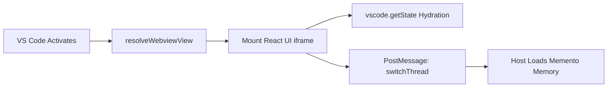
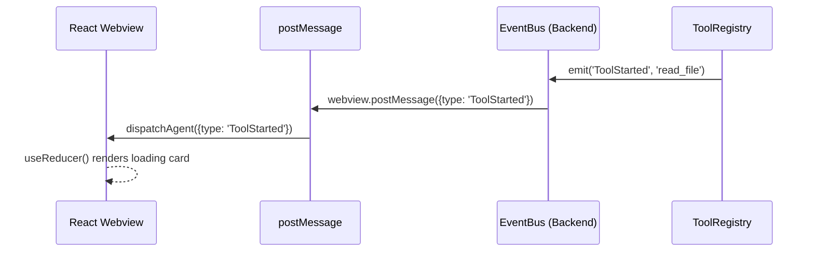
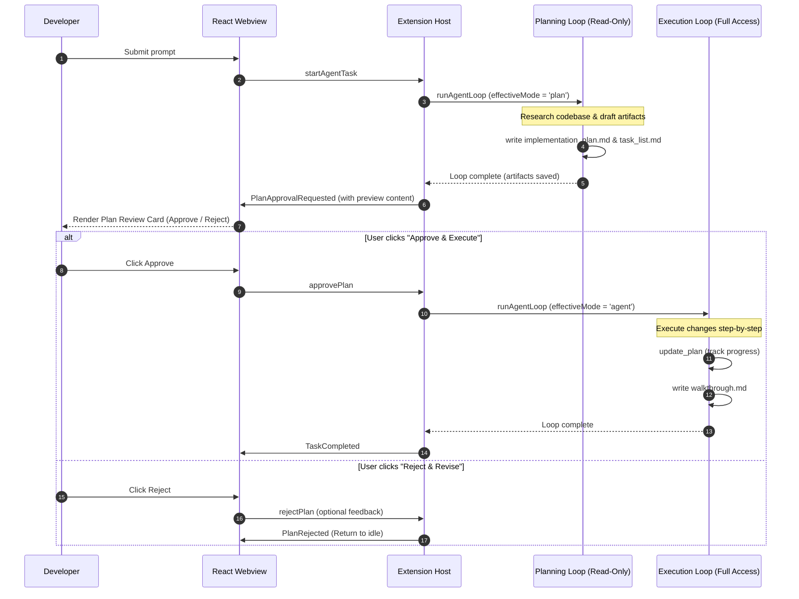
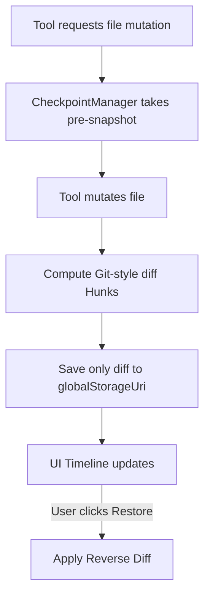
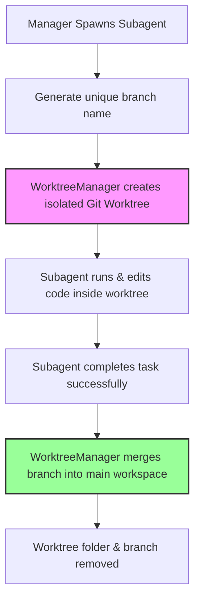
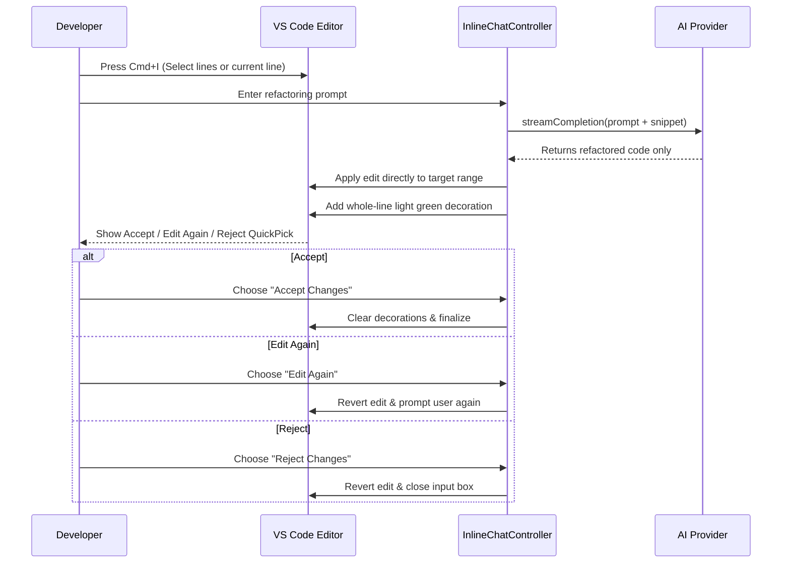

# Black IDE: Comprehensive Knowledge Transfer (KT) Guide

## 1. Executive Summary & Architecture Overview
Black IDE is an autonomous, AI-native coding assistant built directly into a customized fork of VS Code. It acts as a persistent, autonomous agent that can read, write, research, and execute terminal commands in a continuous loop until a developer's request is resolved.

**Core Architecture Separation:**
- **React Webview (Frontend)**: A sandboxed UI layer rendering the Chat, Activity Timeline, and Checkpoint Tracker. It holds no business logic.
- **Extension Host (Backend)**: A Node.js runtime executing the core `agent-loop.ts`, connecting to the file system, managing token budgets, and coordinating with LLM Providers.

## 2. Bootstrapping: The Entry Point

### 📌 Visual: Bootstrapping Flow

**📝 What is this?** This is the initialization sequence of the IDE when you open the AI sidebar.
**⚙️ How it works:** 
1. The extension registers `BlackIdeChatProvider`.
2. When the sidebar opens, it injects a compiled React bundle into an HTML `<iframe>`.
3. To prevent UI amnesia across reloads, the React UI immediately loads its visual state from `vscode.getState()` and tells the Backend to sync up by loading the matching conversation memory from `vscode.Memento` (a crash-proof VS Code database).

## 3. IPC & Event-Driven UI (`EventBus`)

### 📌 Visual: Event-Driven UI Projection

**📝 What is this?** The decoupled communication pipeline between the Node.js backend and the React UI.
**⚙️ How it works:** Heavy Node.js operations can freeze the UI if tightly coupled. Black IDE uses an internal `EventBus`. When the agent runs a tool, it emits a semantic event (`ToolStarted`). The `extension.ts` bridge blindly pipes this event over IPC JSON (`postMessage`), and the React UI's `useReducer` reacts instantly by drawing a loading card on the timeline without waiting for the tool to finish.

## 4. The Agent Loop (The Brain)

### 📌 Visual: The Autonomous Recursive Loop
```mermaid
sequenceDiagram
    autonumber
    participant UI as Webview
    participant Loop as Agent Loop
    participant Ctx as ContextManager
    participant LLM as AI Provider
    participant Tools as Tool Registry
 
    UI->>Loop: {type: 'startAgentTask', prompt: "Fix auth bug"}
    
    loop Max 25 Iterations (While loop)
        Loop->>Ctx: fit(messages) (Truncate to fit Budget)
        Ctx-->>Loop: Budgeted Context
        
        Loop->>LLM: streamGenerate()
        LLM-->>Loop: Tool Call Requests (e.g., read_file)
        
        opt If Final Answer
            LLM-->>Loop: Final Text Answer
            Loop-->>UI: Task Completed
        end
        
        loop For Each Tool Call
            Loop->>Tools: execute(toolName, args)
            Tools-->>Loop: ToolResult
        end
        
        Loop->>Loop: Append ToolResults to Context
    end
```
**📝 What is this?** The beating heart of Black IDE. It is a state machine that drives the AI's autonomy.
**⚙️ How it works:** When you submit a prompt, it doesn't do a single API call. It enters a `while(iterations < 25)` loop. 
1. **Context Budgeting (LRU Truncation)**: Before hitting the LLM, the `ContextManager` computes the token size. If the agent read a massive 5MB file, the API would crash. It targets the oldest `toolResults` and replaces their text with `[Truncated by ContextManager to save budget]`.
2. **Execution Interlock**: If the LLM requests a tool, the loop pauses, executes the local Node.js function, captures the output, and feeds it back into the loop as the user's response, forcing the LLM to analyze the result.

### 4.1 Two-Phase Planning Workflow (The Antigravity Pattern)
Every substantive developer request triggers a mandatory two-phase flow: Planning followed by Execution. This structure separates human validation from heavy multi-step execution.

#### 📌 Visual: Plan-Execute Flow


**⚙️ How it works:**
1. **Planning Gate**: Any non-trivial prompt (more than 5 words or containing planning keywords like *build, implement, fix, refactor*) is forced into `plan` mode. In this mode, the agent has read-only tools and cannot mutate source code files.
2. **Artifact Gating**: The planning agent must call `create_artifact` to produce an `implementation_plan` and `task_list`.
3. **Approval Gating**: The Loop stops and UI presents the Plan Review Card containing collapsible previews.
4. **Execution Phase**: On approval, the task runs in `agent` mode with the plan injected in the system prompt. Progress is tracked via `update_plan`. When done, it writes a `walkthrough` artifact.
5. **State Persistence (Crash-Proofing)**: The pending plan approval state is persisted inside VS Code's `Memento` storage (via `HistoryStore`) key-indexed by the conversation's active thread ID (`pending-plan-${threadId}`). If VS Code is reloaded or crashes during plan review, the UI automatically restores the approval card.
6. **Task Gating & Thread Isolation**: If the user tries to send a new message while a plan is pending, the loop displays a warning blocker. Switching threads or clicking "Reject" immediately discards the pending plan state and transitions the session state back to `'idle'` to avoid cross-thread task pollution.
7. **Trivial/Slash Command Bypassing**: Greets (e.g. "hi"), short questions ($\le 5$ words), or slash commands (like `/explain`) bypass the planning mode, running directly in Ask or Agent mode to keep the UX snappy.

---

### 4.2 Specialized Multi-Agent Roles (Built-in Modes)
Black IDE supports 8 agent modes (the original 3 plus 5 specialized roles). Each role acts as a specialized assistant with targeted system prompts, custom tool permissions, and adjusted iteration budgets.

| Role | Focus Area | Max Iterations | Key Tools / Constraints |
|---|---|---|---|
| **Ask** | Answering questions without modifying code | N/A | No edit/write/command tools |
| **Plan** | Research and architectural planning | 25 | Read-only tools + artifact creation |
| **Agent** | Full agent with absolute tool permissions | 25 | All tools enabled |
| **Frontend** | UI/UX, React, CSS, accessibility, responsive design | 40 | All tools enabled |
| **Backend** | APIs, databases, authentication, server performance | 40 | All tools enabled |
| **DevOps** | CI/CD, Docker, build scripts, Makefiles | 30 | Tailored shell and deployment tool permissions |
| **Manager** | Coordination, breaking down tasks, delegating to sub-agents | 15 | Cannot write code directly; restricted to `spawn_subagent` |
| **Sr Architect** | System design, architectural patterns, tech debt analysis | 20 | Read-only tools, writes ADRs and refactoring plans |

---

### 4.3 Custom Agent Modes Configuration
In addition to built-in modes, Black IDE allows developers to register custom agent modes by placing Markdown files (`*.md`) with YAML frontmatter in any of three locations:
1. **Global Level**: `~/.blackide/modes/`
2. **Workspace Level**: `.blackide/modes/` in the workspace root
3. **Project Level**: `.agents/modes/` in nested project directories

**YAML Configuration Schema:**
- `name` (Required): Unique string identifier for the mode (e.g. `Security Auditor`). Built-in mode names cannot be overridden.
- `description` (Optional): Brief explanation shown in the UI.
- `model` (Optional): Explicit model identifier to use when this mode is selected.
- `tools` (Optional): Allowlist of tool names. If omitted or empty, all tools are permitted.
- `maxIterations` (Optional): Maximum sequential tool loop cycles (1 to 500, default is 25).
- `icon` (Optional): A VS Code Codicon identifier (e.g. `shield`).

The Markdown body below the frontmatter serves as the custom system prompt extension appended when the mode is active.

**Example Mode File (`.blackide/modes/auditor.md`):**
```yaml
---
name: Security Auditor
description: Audits code changes for security vulnerabilities
tools: [read_file, grep_search, complete_task]
maxIterations: 15
icon: shield
---
You are a Senior Security Auditor. Evaluate the code changes in the active selection for common vulnerabilities like injection, memory leaks, and dependency issues. Write a report and do not modify any files.
```

The `ModeLoader` monitors these directories and hot-reloads them dynamically. If configuration errors are found (e.g. missing `name` or invalid types), inline diagnostics are generated using the VS Code diagnostic collection.

---

## 5. File System & Checkpoint Manager

### 📌 Visual: Atomic Rollback Engine

**📝 What is this?** The surgical undo system that prevents the AI from permanently breaking your code.
**⚙️ How it works:** 
- **Reverse Hunks**: Copying entire files on every edit causes massive disk bloat. When the AI mutates a file, we compute the exact structural diff (added/removed lines) and save *only* that diff. If you click "Restore", it mathematically applies the reverse diff to the file on disk.
- **Durable Checkpoints (Crash-Proofing)**: File transaction checkpoints are automatically serialized to JSON and persisted to disk inside the extension's `globalStorage` folder. This ensures that undo history and review state survive VS Code window reloads and crashes.
- **Granular Review Controls**: The `CheckpointManager` tracks each file transaction state (`pending`, `kept`, `restored`). Developers can review individual file edits, accepting them (`keepFile`) or rolling back single files (`restoreFile`) instead of performing an all-or-nothing rollback.
- **Per-Message Undo**: Checkpoints are linked to specific messages via a unique `messageId`, enabling the developer to trigger reverts on a per-response basis directly from the UI timeline.

## 6. Semantic Codebase Indexing
Black IDE features a local RAG (Retrieval-Augmented Generation) pipeline.
- It uses a local SQLite database to store vector embeddings.
- **AST-Aware Chunking**: Instead of chunking code arbitrarily by character count (which breaks functions in half), the indexer parses the Abstract Syntax Tree (AST) to chunk code intelligently by class and function boundaries.
- The agent uses internal semantic search tools to retrieve exact function signatures without guessing file paths.

## 7. Build System & Packaging Architecture

Black IDE is not just an extension; it is distributed as a deeply customized, full standalone fork of VS Code (Electron App).

### 📌 Visual: The Build Pipeline
```mermaid
flowchart TD
    A[Source Code] --> B[TypeScript Compilation / esbuild]
    B --> C[Electron App Packaging (darwin-arm64)]
    C --> D[Bundle Frameworks]
    D --> E[Build CLI Tunnel]
    E --> F[Compute SHA256 Checksums]
    F --> G[gh release upload]
```

**📝 What is this?** The CI/CD release pipeline (e.g., `build_mac.sh`) that turns the source code into a downloadable application.
**⚙️ How it works:**
1. **App Bundling**: The build scripts package the core Electron binaries into `Black IDE.app`. This includes compiling all core webviews and native Node modules.
2. **Framework Packaging**: It packages crucial macOS GUI dependencies like `Squirrel.framework`, `Mantle.framework`, and creates isolated Helper apps for GPU and Renderer processes to ensure Chromium stability.
3. **CLI Packaging**: It extracts and packages the `black-ide-tunnel` CLI binary and compresses it into `black-ide-cli-darwin-arm64.tar.gz`.
4. **DMG Generation**: It bundles the `.app` into a mountable macOS `.dmg` and `.zip` file for distribution.
5. **Security & Release**: A checksum script generates `sha1` and `sha256` hashes for all assets (`.dmg`, `.zip`, `.tar.gz`) to guarantee cryptographic integrity. Finally, it uses the GitHub CLI (`gh release upload`) to automatically publish the assets to the latest tagged release.

---

## 8. Parallel Subagent Isolation (Git Worktrees)

### 📌 Visual: Worktree Isolation Pipeline


**📝 What is this?** 
An architecture that runs multiple subagents in parallel safely without causing file system conflicts or Git repository locking errors.

**⚙️ How it works:**
1. **Worktree Creation**: When a subagent is spawned, `WorktreeManager` checks out a new branch from current HEAD into an isolated folder at `~/.blackide/worktrees/<hash>/<branchName>`.
   - **Worktree path formatting**: The `<hash>` is an MD5 hash of the workspace root path (sliced to 8 characters) to guarantee isolation between multiple open VS Code workspaces.
2. **Execution Sandbox**: The subagent reads, writes, and tests code only within this directory, keeping the developer's main workspace completely untouched.
3. **Serialized Git Mutex**: Git operations are serialized via `gitMutex` to prevent database lock conflicts (like `index.lock`) when multiple parallel subagents execute git operations.
4. **Auto-Merge**: Once the subagent finishes, its changes are merged back into the main repository branch. If a merge conflict occurs, the merge is aborted (`git merge --abort`) and an error is returned. The workspace is then pruned (`git worktree prune`) to clean up dangling worktrees.
5. **Dangling Worktree Pruning**: The `WorktreeManager` regularly executes `git worktree prune` to avoid storage bloat from aborted or orphaned subagent tasks.

---

## 9. Editor Inline Chat (Cmd+I)

### 📌 Visual: Inline Prompt Review Loop


**📝 What is this?**
A fast, editor-native inline code generation and refactoring mechanism.

**⚙️ How it works:**
1. **Selection Capture**: It reads the developer's active selection (or current line) and caches the original text as a snapshot.
2. **Visual Diff Decorator**: As soon as the LLM streams the refactored code back, the controller replaces the selected text and decorates the modified region with a transparent light-green background (`rgba(74, 222, 128, 0.15)`) using `addedLineDecoration`.
   - **Line Offset Tracking**: As the LLM inserts or removes lines, the lines of the document shift. The `InlineChatController` dynamically tracks the cumulative line offset (`runningOffset`) inside the edit handler to position the highlight decoration precisely over the new lines.
   - **Strict Format Request**: The controller instructs the LLM to return ONLY the raw corrected code block without any explanations or Markdown code block backticks (fences). Any fences returned are stripped before applying to the text editor.
3. **Acceptance Controls**: A QuickPick menu allows the user to:
   - **Accept Changes**: Clears the visual decorations and finalizes the edit.
   - **Edit Again**: Reverts the code to its original text snapshot first, then displays the input prompt box again, enabling the developer to refine their instructions on top of the original code.
   - **Reject Changes**: Reverts the edit back to the original code snapshot and closes the inline chat prompt loop.

---

## 10. Model Context Protocol (MCP) Client
Black IDE integrates a built-in Model Context Protocol (MCP) client to dynamically discover and execute tools hosted by external MCP servers.

**⚙️ How it works:**
1. **Config Discovery**: At startup, `MCPClient` scans the workspace for configuration files located at `.blackide/mcp.json` or `.vscode/mcp.json`.
2. **Connection Lifecycle**: For each configured server, the client spawns a child process via `stdio` transport and performs a standard JSON-RPC handshake (`initialize` and `notifications/initialized`).
3. **Tool Registration**: The client requests the available tool schema list using the protocol's `tools/list` method. Discovered tools are dynamically converted into `ToolDefinition` objects and registered with the main Agent's `ToolRegistry`, making them transparently callable by the LLM during the agent loop.
