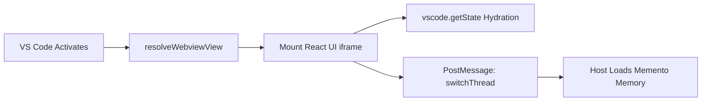
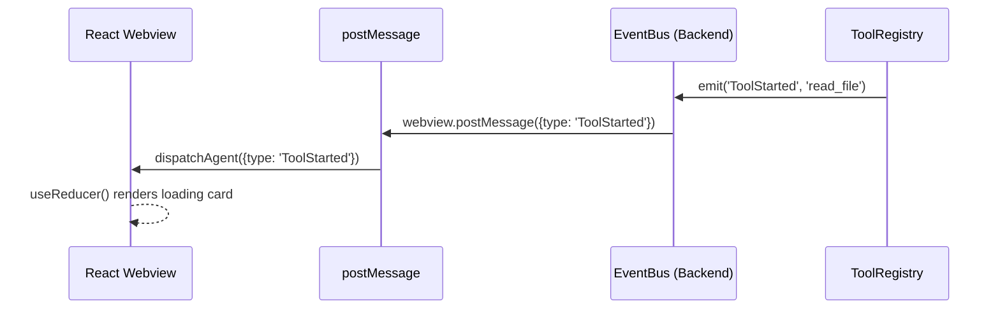
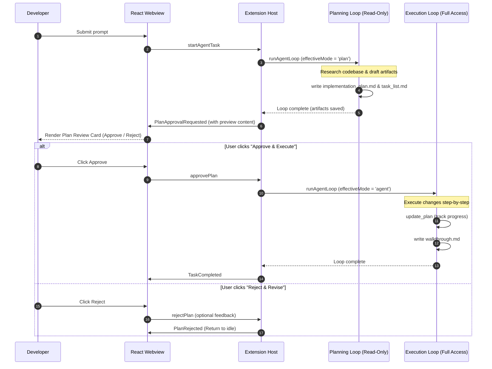
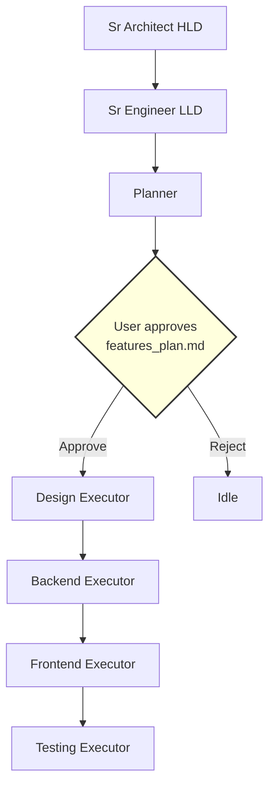
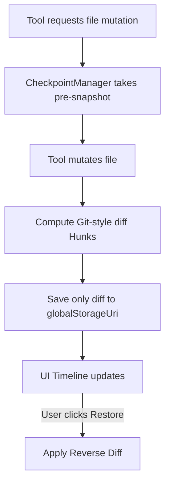
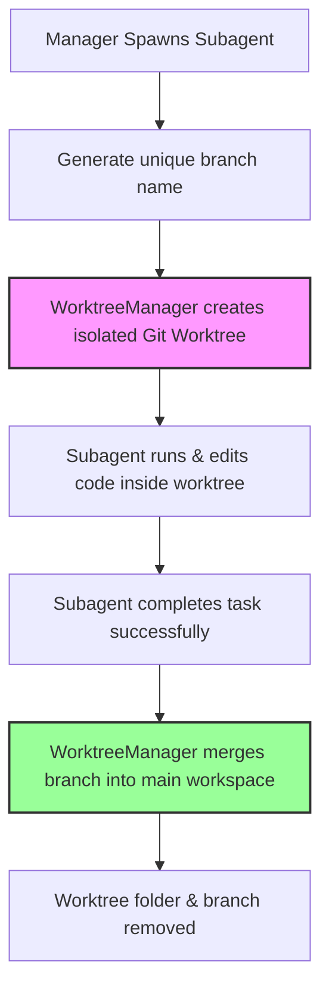
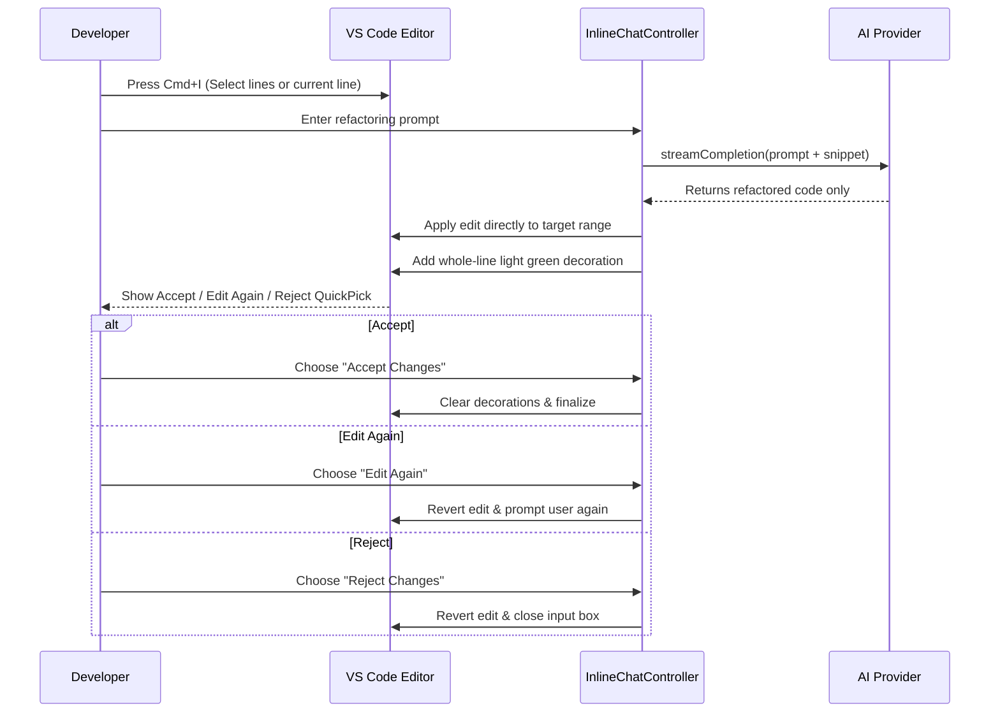

# Black IDE: Comprehensive Knowledge Transfer (KT) Guide

## 1. Executive Summary & Architecture Overview
Black IDE is an autonomous, AI-native coding assistant built directly into a customized fork of VS Code. It acts as a persistent, autonomous agent that can read, write, research, and execute terminal commands in a continuous loop until a developer's request is resolved.

**Core Architecture Separation:**
- **React Webview (Frontend)**: A sandboxed UI layer rendering the Chat, Activity Timeline, and Checkpoint Tracker. It holds no business logic.
- **Extension Host (Backend)**: A Node.js runtime executing the core `agent-loop.ts`, connecting to the file system, managing token budgets, and coordinating with LLM Providers.

## 2. Bootstrapping: The Entry Point

### 📌 Visual: Bootstrapping Flow

**📝 What is this?** This is the initialization sequence of the IDE when you open the AI sidebar.
**⚙️ How it works:** 
1. The extension registers `BlackIdeChatProvider`.
2. When the sidebar opens, it injects a compiled React bundle into an HTML `<iframe>`.
3. To prevent UI amnesia across reloads, the React UI immediately loads its visual state from `vscode.getState()` and tells the Backend to sync up by loading the matching conversation memory from `vscode.Memento` (a crash-proof VS Code database).

## 3. IPC & Event-Driven UI (`EventBus`)

### 📌 Visual: Event-Driven UI Projection

**📝 What is this?** The decoupled communication pipeline between the Node.js backend and the React UI.
**⚙️ How it works:** Heavy Node.js operations can freeze the UI if tightly coupled. Black IDE uses an internal `EventBus`. When the agent runs a tool, it emits a semantic event (`ToolStarted`). The `extension.ts` bridge blindly pipes this event over IPC JSON (`postMessage`), and the React UI's `useReducer` reacts instantly by drawing a loading card on the timeline without waiting for the tool to finish.

## 4. The Agent Loop (The Brain)

### 📌 Visual: The Autonomous Recursive Loop
```mermaid
sequenceDiagram
    autonumber
    participant UI as Webview
    participant Loop as Agent Loop
    participant Ctx as ContextManager
    participant LLM as AI Provider
    participant Tools as Tool Registry
 
    UI->>Loop: {type: 'startAgentTask', prompt: "Fix auth bug"}
    
    loop Max 25 Iterations (While loop)
        Loop->>Ctx: fit(messages) (Truncate to fit Budget)
        Ctx-->>Loop: Budgeted Context
        
        Loop->>LLM: streamGenerate()
        LLM-->>Loop: Tool Call Requests (e.g., read_file)
        
        opt If Final Answer
            LLM-->>Loop: Final Text Answer
            Loop-->>UI: Task Completed
        end
        
        loop For Each Tool Call
            Loop->>Tools: execute(toolName, args)
            Tools-->>Loop: ToolResult
        end
        
        Loop->>Loop: Append ToolResults to Context
    end
```
**📝 What is this?** The beating heart of Black IDE. It is a state machine that drives the AI's autonomy.
**⚙️ How it works:** When you submit a prompt, it doesn't do a single API call. It enters a bounded tool loop whose ceiling comes from the active mode's `maxIterations`.
1. **Context Budgeting (LRU Truncation)**: Before hitting the LLM, the `ContextManager` computes the token size. If the agent read a massive 5MB file, the API would crash. It targets the oldest `toolResults` and replaces their text with `[Truncated by ContextManager to save budget]`.
2. **Execution Interlock**: If the LLM requests a tool, the loop pauses, executes the local Node.js function, captures the output, and feeds it back into the loop as the user's response, forcing the LLM to analyze the result.
3. **Extendable Ceiling (not a hard stop)**: The budget is a checkpoint, not a wall. On hitting it the loop fires `onLoopLimitReached`, which surfaces a prompt to the user; choosing to continue raises `currentMaxLoops` by the granted amount and the loop resumes. Only if nothing is granted does it stop, returning *"Reached the maximum of N tool iterations."*
4. **Termination**: The normal exit is the LLM calling `complete_task`, whose `message` argument becomes the final answer.

### 4.1 Two-Phase Planning Workflow (The Antigravity Pattern)
Every substantive developer request triggers a mandatory two-phase flow: Planning followed by Execution. This structure separates human validation from heavy multi-step execution.

#### 📌 Visual: Plan-Execute Flow


**⚙️ How it works:**
1. **Planning Gate**: Any non-trivial prompt (more than 5 words or containing planning keywords like *build, implement, fix, refactor*) is forced into `plan` mode. In this mode, the agent has read-only tools and cannot mutate source code files.
2. **Artifact Gating**: The planning agent must call `create_artifact` to produce an `implementation_plan` and `task_list`.
3. **Approval Gating**: The Loop stops and UI presents the Plan Review Card containing collapsible previews.
4. **Execution Phase**: On approval, the task runs in `agent` mode with the plan injected in the system prompt. Progress is tracked via `update_plan`. When done, it writes a `walkthrough` artifact.
5. **State Persistence (Crash-Proofing)**: The pending plan approval state is persisted inside VS Code's `Memento` storage (via `HistoryStore`) key-indexed by the conversation's active thread ID (`pending-plan-${threadId}`). If VS Code is reloaded or crashes during plan review, the UI automatically restores the approval card.
6. **Task Gating & Thread Isolation**: If the user tries to send a new message while a plan is pending, the loop displays a warning blocker. Switching threads or clicking "Reject" immediately discards the pending plan state and transitions the session state back to `'idle'` to avoid cross-thread task pollution.
7. **Trivial/Slash Command Bypassing**: Greets (e.g. "hi"), short questions ($\le 5$ words), or slash commands (like `/explain`) bypass the planning mode, running directly in Ask or Agent mode to keep the UX snappy.

---

### 4.2 Specialized Multi-Agent Roles (Built-in Modes)
`ModeLoader` registers **15 built-in modes**. Each acts as a specialized assistant with a
targeted system prompt, a tool allowlist, and its own iteration budget. They split into two
families: modes you select directly in chat, and the pipeline phase roles that the
orchestrator drives (see [§4.3](#43-multi-agent-pipeline-orchestration)).

**Directly selectable:**

| Role | Focus Area | Max Iterations | Key Tools / Constraints |
|---|---|---|---|
| **Ask** | Answering questions without modifying code | default | No edit/write/command tools |
| **Plan** | Research and architectural planning | default | Read-only tools + `create_artifact`, `update_plan` |
| **Agent** | Full agent with all tool permissions | default | All tools enabled |
| **Frontend** | UI/UX, React, CSS, accessibility, responsive design | 40 | All tools enabled |
| **Backend** | APIs, databases, authentication, server performance | 40 | All tools enabled |
| **DevOps** | CI/CD, Docker, build scripts, Makefiles | 30 | Tailored shell and deployment tool permissions |
| **Manager** | Coordination, task breakdown, delegation | 15 | Cannot write code directly; uses `spawn_subagent` |
| **Sr Architect** | System design, patterns, tech debt analysis | 20 | Read-only tools, writes ADRs and refactoring plans |

**Pipeline phase roles** (driven by the orchestrator, in order):

| Role | Phase | Max Iterations | Constraints |
|---|---|---|---|
| **Sr Architect HLD** | High-level design | 20 | Read-only + artifact creation |
| **Sr Engineer LLD** | Low-level design | 25 | Read-only + artifact creation |
| **Planner** | Writes `.blackIDE/features_plan.md` | 15 | Read + write artifacts only |
| **Design Executor** | Design implementation | 40 | Read/write/edit/run + `update_mindmap` |
| **Backend Executor** | Backend implementation | 40 | Read/write/edit/run + `update_mindmap` |
| **Frontend Executor** | Frontend implementation | 40 | Read/write/edit/run + `update_mindmap` |
| **Testing Executor** | Verification | 30 | Execution tools + browser tools for live UI checks |

---

### 4.3 Multi-Agent Pipeline Orchestration

Substantial, multi-domain, from-scratch requests are routed away from the single-agent
loop and through a **7-phase sequential pipeline** instead:



**⚙️ How it works:**

1. **Trigger heuristic** — `PlanningEngine.shouldOrchestrate` fires only when the prompt
   contains both an action verb (build/create/implement/…) **and** a scope noun
   (app/platform/api/dashboard/service/…), and does **not** read as a targeted change to
   existing code (optimize/refactor/fix/faster/…). "Build a CRM with contacts and deals"
   orchestrates; "make this function faster in the user service" does not. The heuristic is
   deliberately conservative — a missed build costs one `/orchestrate`, a false trigger
   spends a full 7-agent run.
2. **Manual overrides** — `/orchestrate` (or selecting the orchestrator mode) forces the
   pipeline on; `/single` forces the single-agent path.
3. **Approval gate** — after the Planner phase the generated `.blackIDE/features_plan.md`
   is shown in chat. Edit the file on disk if needed, then Approve or Reject. Execution
   proceeds only on approval.
4. **Worktree isolation** — the execution phases run inside an isolated git worktree, not
   the live workspace, so a failed phase or a cancelled run never leaves partial changes in
   your files. The worktree starts as a copy of the live workspace including uncommitted
   changes, and is reconciled back only after every phase succeeds. If reconciling conflicts
   with a concurrent edit, the worktree is **preserved, not discarded**, and its path is
   included in the error. Because execution changes land via git, **their undo path is git**
   — not the per-message checkpoint system used for chat edits.
5. **Unattended command policy** — a pipeline run may have no chat surface, so it never
   raises confirmation modals. It still enforces the allow/deny policy: allow-listed
   commands run, deny-listed commands are refused and logged, and anything that *would*
   prompt interactively is **refused and logged, never auto-run**. The auto-approve-terminal
   setting is intentionally not honored in this lane. File writes inside the worktree are
   allowed without prompting; MCP tools are refused.
6. **Self-verification** — the Testing Executor has browser tools and will start the dev
   server and click through the real UI when the plan includes a `[frontend]` phase.
7. **Per-phase models** — each phase can be assigned its own model (Settings → Pipeline
   Phase Models); unset or stale assignments fall back to the run's main model.

**Outputs**, written under `.blackIDE/`:

| File | Purpose |
|---|---|
| `features_plan.md` | The user-editable plan, tagged `[design]` / `[backend]` / `[frontend]` / `[testing]` |
| `mindmap/project_mindmap.md` | Shared architecture knowledge read and updated across phases |
| `overview.md` | Generated on completion: phase timing and a file-change table |

**Settings** (the extension's own settings panel, not native VS Code settings — all stored
in one `general-settings` blob):

* `pipelineAutoOpenAllFiles` (off by default) — preview every file the pipeline touches, not just plan/mindmap/overview.
* `pipelinePhaseModels` — per-phase model assignment.
* `pipelineTokenBudget` (`0` = unlimited) — abort a run once cumulative input+output tokens exceed the ceiling. Pipeline runs report live token usage and cost, same as chat.

---

### 4.4 Custom Agent Modes Configuration
In addition to built-in modes, Black IDE allows developers to register custom agent modes by placing Markdown files (`*.md`) with YAML frontmatter in any of three locations:
1. **Global Level**: `~/.blackide/modes/`
2. **Workspace Level**: `.blackide/modes/` in the workspace root
3. **Project Level**: `.agents/modes/` in nested project directories

**YAML Configuration Schema:**
- `name` (Required): Unique string identifier for the mode (e.g. `Security Auditor`). Built-in mode names cannot be overridden.
- `description` (Optional): Brief explanation shown in the UI.
- `model` (Optional): Explicit model identifier to use when this mode is selected.
- `tools` (Optional): Allowlist of tool names. If omitted or empty, all tools are permitted.
- `maxIterations` (Optional): Maximum sequential tool loop cycles (1 to 500, default is 25).
- `icon` (Optional): A VS Code Codicon identifier (e.g. `shield`).

The Markdown body below the frontmatter serves as the custom system prompt extension appended when the mode is active.

**Example Mode File (`.blackide/modes/auditor.md`):**
```yaml
---
name: Security Auditor
description: Audits code changes for security vulnerabilities
tools: [read_file, grep_search, complete_task]
maxIterations: 15
icon: shield
---
You are a Senior Security Auditor. Evaluate the code changes in the active selection for common vulnerabilities like injection, memory leaks, and dependency issues. Write a report and do not modify any files.
```

The `ModeLoader` monitors these directories and hot-reloads them dynamically. If configuration errors are found (e.g. missing `name` or invalid types), inline diagnostics are generated using the VS Code diagnostic collection.

---

## 5. File System & Checkpoint Manager

### 📌 Visual: Atomic Rollback Engine

**📝 What is this?** The surgical undo system that prevents the AI from permanently breaking your code.
**⚙️ How it works:** 
- **Reverse Hunks**: Copying entire files on every edit causes massive disk bloat. When the AI mutates a file, we compute the exact structural diff (added/removed lines) and save *only* that diff. If you click "Restore", it mathematically applies the reverse diff to the file on disk.
- **Durable Checkpoints (Crash-Proofing)**: File transaction checkpoints are automatically serialized to JSON and persisted to disk inside the extension's `globalStorage` folder. This ensures that undo history and review state survive VS Code window reloads and crashes.
- **Granular Review Controls**: The `CheckpointManager` tracks each file transaction state (`pending`, `kept`, `restored`). Developers can review individual file edits, accepting them (`keepFile`) or rolling back single files (`restoreFile`) instead of performing an all-or-nothing rollback.
- **Per-Message Undo**: Checkpoints are linked to specific messages via a unique `messageId`, enabling the developer to trigger reverts on a per-response basis directly from the UI timeline.

## 6. Hybrid Codebase Indexing (`codebase-index.ts`)

Black IDE runs a local retrieval pipeline behind the `codebase_search` tool. It is
**hybrid, not purely semantic** — two independent rankers are fused so that retrieval still
works when no embeddings provider is configured.

**⚙️ How it works:**

1. **Chunking**: files are split into chunks, each tokenized into a term-frequency map with
   its length recorded for length normalization.
2. **Lexical ranker (BM25)**: classic BM25 scoring over chunk tokens, using document
   frequencies recomputed across the whole index and the running average chunk length.
3. **Semantic ranker (optional)**: if an embeddings provider is configured, each chunk is
   embedded via `EmbeddingsClient` and scored by vector similarity. Providers are OpenAI
   (default model `text-embedding-3-small`) or Ollama (default `nomic-embed-text`).
   **Embedding failures degrade gracefully** — indexing continues without vectors for that
   chunk rather than aborting.
4. **Reciprocal Rank Fusion (RRF)**: the two ranked lists are merged by RRF to produce the
   final top-k, so lexical and semantic evidence both contribute without either dominating.
5. **Incremental refresh**: a file is re-chunked only when its `mtimeMs` or `size` changes;
   unchanged files are reused from cache, so re-indexing a warm workspace is cheap.
6. **Persistence**: the index is written to disk as JSON with vectors in a companion binary
   file. A load failure is non-fatal — it logs and triggers a cold rebuild.

> [!NOTE]
> There is no SQLite database and no AST parser in this path. Chunking is text-based and
> the vector cache is in-memory, backed by the on-disk snapshot described above.

## 7. Build System & Packaging Architecture

Black IDE is not just an extension; it is distributed as a deeply customized, full standalone fork of VS Code (Electron App).

### 📌 Visual: The Build Pipeline
```mermaid
flowchart TD
    A[Source Code] --> B[TypeScript Compilation / esbuild]
    B --> C[Electron App Packaging (darwin-arm64)]
    C --> D[Bundle Frameworks]
    D --> E[Build CLI Tunnel]
    E --> F[Compute SHA256 Checksums]
    F --> G[gh release upload]
```

**📝 What is this?** The CI/CD release pipeline (e.g., `build_mac.sh`) that turns the source code into a downloadable application.
**⚙️ How it works:**
1. **App Bundling**: The build scripts package the core Electron binaries into `Black IDE.app`. This includes compiling all core webviews and native Node modules.
2. **Framework Packaging**: It packages crucial macOS GUI dependencies like `Squirrel.framework`, `Mantle.framework`, and creates isolated Helper apps for GPU and Renderer processes to ensure Chromium stability.
3. **CLI Packaging**: It extracts and packages the `black-ide-tunnel` CLI binary and compresses it into `black-ide-cli-darwin-arm64.tar.gz`.
4. **DMG Generation**: It bundles the `.app` into a mountable macOS `.dmg` and `.zip` file for distribution.
5. **Security & Release**: A checksum script generates `sha1` and `sha256` hashes for all assets (`.dmg`, `.zip`, `.tar.gz`) to guarantee cryptographic integrity. Finally, it uses the GitHub CLI (`gh release upload`) to automatically publish the assets to the latest tagged release.

---

## 8. Parallel Subagent Isolation (Git Worktrees)

### 📌 Visual: Worktree Isolation Pipeline


**📝 What is this?** 
An architecture that runs multiple subagents in parallel safely without causing file system conflicts or Git repository locking errors.

**⚙️ How it works:**
1. **Worktree Creation**: When a subagent is spawned, `WorktreeManager` checks out a new branch from current HEAD into an isolated folder at `~/.blackide/worktrees/<hash>/<branchName>`.
   - **Worktree path formatting**: The `<hash>` is an MD5 hash of the workspace root path (sliced to 8 characters) to guarantee isolation between multiple open VS Code workspaces.
2. **Execution Sandbox**: The subagent reads, writes, and tests code only within this directory, keeping the developer's main workspace completely untouched.
3. **Serialized Git Mutex**: Git operations are serialized via `gitMutex` to prevent database lock conflicts (like `index.lock`) when multiple parallel subagents execute git operations.
4. **Auto-Merge**: Once the subagent finishes, its changes are merged back into the main repository branch. If a merge conflict occurs, the merge is aborted (`git merge --abort`) and an error is returned. The workspace is then pruned (`git worktree prune`) to clean up dangling worktrees.
5. **Dangling Worktree Pruning**: The `WorktreeManager` regularly executes `git worktree prune` to avoid storage bloat from aborted or orphaned subagent tasks.

---

## 9. Editor Inline Chat (Cmd+I)

### 📌 Visual: Inline Prompt Review Loop


**📝 What is this?**
A fast, editor-native inline code generation and refactoring mechanism.

**⚙️ How it works:**
1. **Selection Capture**: It reads the developer's active selection (or current line) and caches the original text as a snapshot.
2. **Visual Diff Decorator**: As soon as the LLM streams the refactored code back, the controller replaces the selected text and decorates the modified region with a transparent light-green background (`rgba(74, 222, 128, 0.15)`) using `addedLineDecoration`.
   - **Line Offset Tracking**: As the LLM inserts or removes lines, the lines of the document shift. The `InlineChatController` dynamically tracks the cumulative line offset (`runningOffset`) inside the edit handler to position the highlight decoration precisely over the new lines.
   - **Strict Format Request**: The controller instructs the LLM to return ONLY the raw corrected code block without any explanations or Markdown code block backticks (fences). Any fences returned are stripped before applying to the text editor.
3. **Acceptance Controls**: A QuickPick menu allows the user to:
   - **Accept Changes**: Clears the visual decorations and finalizes the edit.
   - **Edit Again**: Reverts the code to its original text snapshot first, then displays the input prompt box again, enabling the developer to refine their instructions on top of the original code.
   - **Reject Changes**: Reverts the edit back to the original code snapshot and closes the inline chat prompt loop.

---

## 10. Model Context Protocol (MCP) Client
Black IDE integrates a built-in Model Context Protocol (MCP) client to dynamically discover and execute tools hosted by external MCP servers.

**⚙️ How it works:**
1. **Config Discovery**: At startup, `MCPClient` scans the workspace for configuration files located at `.blackide/mcp.json` or `.vscode/mcp.json`.
2. **Connection Lifecycle**: For each configured server, the client spawns a child process via `stdio` transport and performs a standard JSON-RPC handshake (`initialize` and `notifications/initialized`).
3. **Tool Registration**: The client requests the available tool schema list using the protocol's `tools/list` method. Discovered tools are dynamically converted into `ToolDefinition` objects and registered with the main Agent's `ToolRegistry`, making them transparently callable by the LLM during the agent loop.

---

## 11. Command Safety Policy (`command-policy.ts`)

The agent runs a real shell, which makes `run_command` the highest-value security surface
in the product. Every invocation is gated by `CommandPolicy`, which returns one of three
decisions: `allow`, `deny`, or `ask`.

1. **Hard deny list**: a set of always-blocked destructive patterns that no setting can
   override — `rm -rf /` or `~`, `mkfs`, `dd if=`, the classic fork bomb, `shutdown` /
   `reboot` / `halt`, writes to `/dev/sd*`, and `chmod -R 000` on `/` or `~`.
2. **User allow / deny lists**: configured as regex strings and compiled defensively —
   an invalid pattern is dropped rather than crashing the policy.
3. **Auto-approve**: an opt-in setting that turns `ask` into `allow` for interactive chat.
   It is deliberately **not honored in pipeline runs** (see §4.3) — an unattended run
   refuses anything that would have prompted.

---

## 12. Secret Management (`secret-manager.ts`)

API keys never touch `settings.json`. `SecretManager` wraps the VS Code `SecretStorage`
API, storing each provider's key under `black-ide-<provider>-key`.

Supported provider ids are centralized in `core/constants.ts`: `anthropic`, `openai`,
`google`, `openrouter`, `ollama`.

> **Historical note (MF-36)**: the Anthropic provider was once persisted under the typo
> `antropics`. `SecretManager.canonical()` transparently maps that legacy id to
> `anthropic`, and reading an Anthropic key that is only present under the legacy storage
> key **migrates it** — writing it under the correct key and deleting the old one. Do not
> remove this path while installs predating the fix may still exist.

---

## 13. Long-Term Project Memory (`knowledge-base.ts`)

Distinct from per-thread conversation memory, the knowledge base is a durable,
human-readable set of Markdown files under `.blackIDE/knowledge/` that both the user and
the agents read and update, so project understanding accrues across sessions instead of
being re-derived on every run.

| File | Contents |
|---|---|
| `architecture.md` | High-level structure, modules, and data flow |
| `decision_log.md` | Architecture Decision Records (ADRs), newest last |
| `feature_status.md` | Feature / status / updated / notes table |
| `technical_debt.md` | Known shortcuts and their remediation |
| `glossary.md` | Domain terms |
| `roadmap.md` | Planned and in-flight work |

The mindmap (`.blackIDE/mindmap/`) remains the machine-oriented architecture snapshot;
the knowledge base is the curated decision-and-status record layered on top. Formatting and
merge logic is deliberately separated from file I/O so it can be unit-tested without a
filesystem. A knowledge digest is injected into planning prompts, so agents start from
recorded decisions rather than rediscovering them.

---

## 14. Extensibility: Skills, Hooks, and Scheduling

### 14.1 Skills (`skills-manager.ts`)
Skills are user-authored capability packs auto-discovered from `.blackide/skills/` in the
workspace and `~/.blackide/skills/` globally. Each carries a `name`, `description`,
`instructions`, and `triggerPatterns` — the patterns decide when a skill's instructions get
folded into the agent's prompt.

### 14.2 Hooks (`hooks.ts`)
Lifecycle hooks let users run their own commands around agent activity. Phases are
`beforeToolCall`, `afterToolCall`, `beforeResponse`, and `onError`; the config surface
exposes `afterFileEdit`, `afterWriteFile`, `beforeResponse`, and `onError`. A typical use is
running a formatter or a test command after every file edit.

### 14.3 Scheduler (`scheduler.ts`)
`AgentScheduler` backs the `schedule_task` tool with one-shot (`once`) and recurring
(`recurring`) tasks. Recurring tasks carry an `intervalMs` and an optional `maxRuns` cap;
each task tracks `currentRuns` and a status of `active`, `completed`, or `cancelled`.

### 14.4 Agent Rules
Project-level standing instructions are read from `.blackide/AGENTS.md` and injected into
the system prompt.

---

## 15. Tool Inventory

`core/tools.ts` defines **23 built-in tools**, plus any discovered dynamically over MCP.

| Category | Tools |
|---|---|
| **Filesystem** | `read_file`, `write_file`, `edit_file`, `list_directory` |
| **Search** | `grep_search`, `codebase_search`, `web_search` |
| **Execution** | `run_command` |
| **Planning & artifacts** | `create_artifact`, `update_plan`, `update_mindmap`, `complete_task`, `cancel_task` |
| **Memory** | `remember` |
| **Delegation** | `spawn_subagent`, `schedule_task` |
| **Browser** | `browser_open`, `browser_click`, `browser_type`, `browser_read`, `browser_screenshot`, `browser_close` |
| **Interop** | `mcp_call` |

Modes restrict this set via their `tools` allowlist; a mode with no `tools` field gets
everything.

---

## 16. Commands and Keybindings

Contributed by the extension's `package.json`:

| Command | Title | Default Keybinding |
|---|---|---|
| `black-ide.openSettings` | ✦ Black IDE Settings | — |
| `black-ide.generateCommitMessage` | Generate Commit Message | — |
| `black-ide.inlineEdit` | Black IDE: Inline Edit | `Cmd+I` / `Ctrl+I` (when editor has focus) |
| `black-ide.openPipelineManager` | ✦ Black IDE: Pipeline Manager | — |
| `black-ide.exportDiagnostics` | ✦ Black IDE: Export Agent Diagnostics | — |

---

## 17. Repository Map

| Path | Contents |
|---|---|
| `src/stable/` | Sources overlaid onto upstream VS Code for stable builds |
| `src/insider/` | Insider-quality overlay (stable's extensions are layered on top) |
| `src/stable/extensions/black-ide-agent/` | The AI agent extension |
| ├ `src/agent/` | `agent-loop`, `pipeline-orchestrator`, `planning-engine`, `tool-executor`, `worktree-manager`, `skills-manager`, `hooks`, `scheduler`, `artifact-manager`, `git-mutex`, `model-fetcher` |
| ├ `src/core/` | `llm-client`, `context-manager`, `prompt-builder`, `checkpoint-manager`, `codebase-index`, `command-policy`, `secret-manager`, `knowledge-base`, `mode-loader`, `event-bus`, `inline-chat-controller`, `inline-completion`, `diff`, `git-pr`, `pipeline-runs` |
| ├ `src/memory/` | `history-store`, `knowledge-store` |
| ├ `src/tools/` | `tool-runner`, `mcp-client`, `browser-tool`, `web-search`, `diff-provider` |
| ├ `webview/src/` | React UI: `App`, `AgentPanels`, `ManagerPanel`, `ParallelSubagents`, `agent-store`, `webview-bridge` |
| └ `test/`, `__tests__/` | Core harness, unit tests, extension-host integration suite |
| `config/patches/` | The VS Code patch set ([[Patches]]) |
| `config/product.json` | Base product config, rewritten at build time |
| `config/upstream/` | Pinned upstream VS Code tag and commit |
| `scripts/` | `build/`, `dev/`, `prepare/`, `release/`, `ci/`, `lib/`, `telemetry/`, `tools/` |
| `docs/wiki_docs/` | This wiki |
| `docs/notes/`, `docs/mindmap/` | Internal design records and architecture notes |
