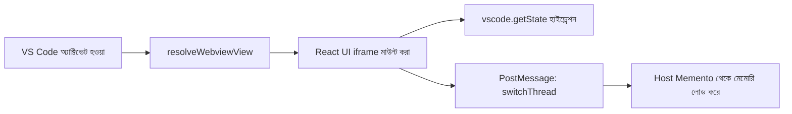
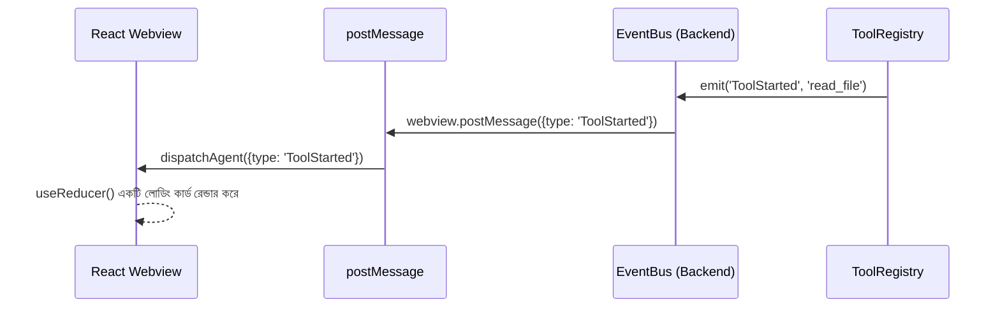
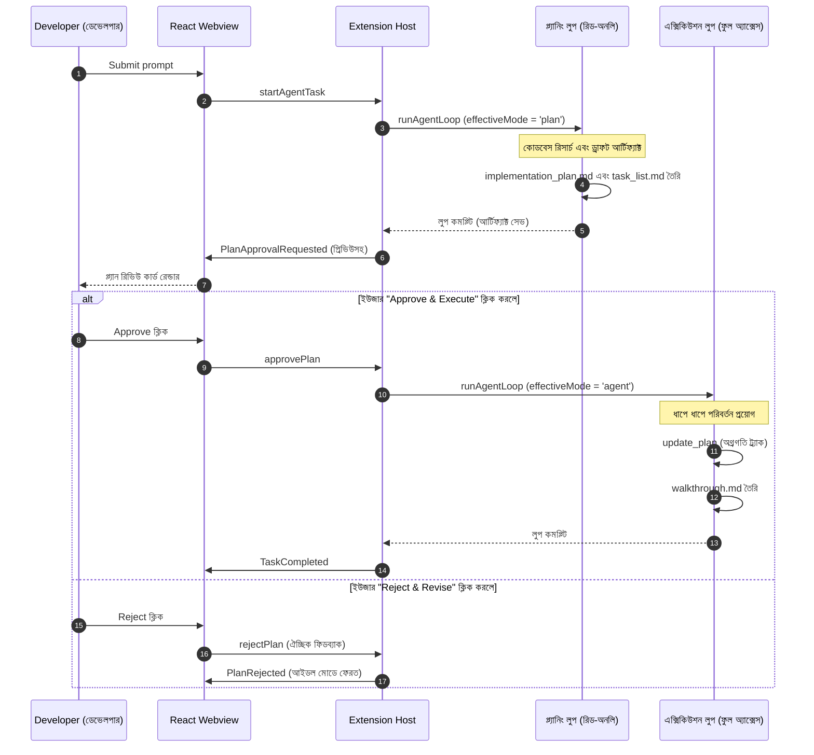
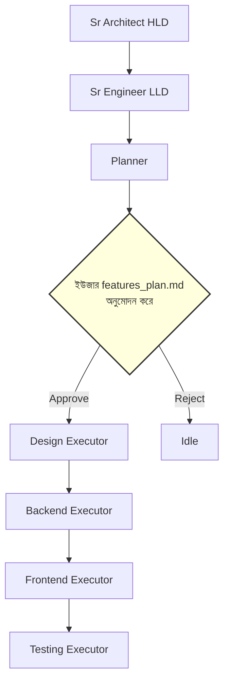
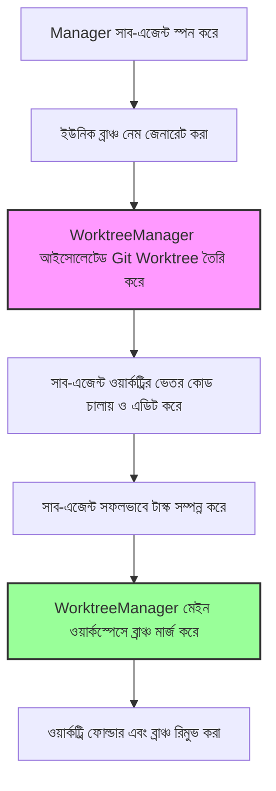
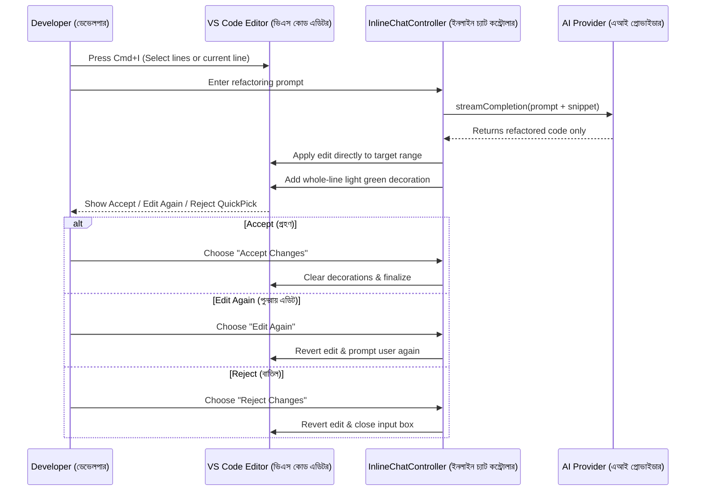

# Black IDE: সম্পূর্ণ নলেজ ট্রান্সফার (KT) গাইড

> [!NOTE]
> এটি [[Architecture & KT Guide|Architecture-and-KT-Guide]]-এর বাংলা অনুবাদ, যা ১–১০ নং সেকশন পর্যন্ত কভার করে।
> ইংরেজি গাইডের ১১–১৭ নং সেকশন (কমান্ড সেফটি পলিসি, সিক্রেট ম্যানেজমেন্ট, লং-টার্ম প্রজেক্ট মেমরি,
> স্কিলস/হুকস/শিডিউলার, টুল ইনভেন্টরি, কমান্ড তালিকা, রিপোজিটরি ম্যাপ) এখনো অনূদিত হয়নি।

## ১. এক্সিকিউটিভ সামারি এবং আর্কিটেকচার ওভারভিউ
Black IDE হলো VS Code-এর একটি কাস্টমাইজড ফোর্ক (fork)-এর ভেতর তৈরি একটি স্বয়ংক্রিয় (autonomous), এআই-ভিত্তিক কোডিং অ্যাসিস্ট্যান্ট। এটি শুধু কোড অটো-কমপ্লিট করে না; এটি একটি পারসিস্টেন্ট এজেন্ট হিসেবে কাজ করে যা নিজে থেকে ফাইল পড়তে পারে, কোড লিখতে পারে, রিসার্চ করতে পারে এবং টার্মিনাল কমান্ড রান করতে পারে। ইউজারের একটি জটিল কাজ শেষ না হওয়া পর্যন্ত এটি একটি লুপের মাধ্যমে কাজ চালিয়ে যায়।

**আর্কিটেকচার বিভাজন (Core Architecture Separation):**
- **React Webview (ফ্রন্টএন্ড)**: এটি একটি স্যান্ডবক্সড UI লেয়ার যা চ্যাট, অ্যাক্টিভিটি টাইমলাইন এবং চেকপয়েন্ট ট্র্যাকার প্রদর্শন করে। এর ভেতরে কোনো বিজনেস লজিক থাকে না।
- **Extension Host (ব্যাকএন্ড)**: এটি একটি Node.js রানটাইম যা মূল `agent-loop.ts` চালায়, ফাইল সিস্টেমের সাথে কানেক্ট করে, টোকেন বাজেট ম্যানেজ করে এবং LLM প্রোভাইডারগুলোর (যেমন OpenAI, Gemini) সাথে যোগাযোগ করে।

## ২. বুটস্ট্র্যাপিং: এন্ট্রি পয়েন্ট (শুরুর স্থান)

### 📌 ভিজ্যুয়াল: বুটস্ট্র্যাপিং ফ্লো (Bootstrapping Flow)

**📝 এটি কী?** আপনি যখন AI সাইডবার খোলেন, তখন IDE-এর ইনিশিয়ালাইজেশন সিকোয়েন্স বা শুরু হওয়ার ধাপ এটি।
**⚙️ এটি কীভাবে কাজ করে:** 
১. এক্সটেনশনটি শুরুতে `BlackIdeChatProvider` রেজিস্টার করে।
২. সাইডবার খুললে, এটি একটি HTML `<iframe>`-এর ভেতর কম্পাইল করা React বান্ডেল ইনজেক্ট করে।
৩. VS Code রিলোড করলে UI যেন আগের অবস্থা ভুলে না যায়, সেজন্য React UI সাথে সাথে `vscode.getState()` থেকে তার ভিজ্যুয়াল স্টেট লোড করে এবং ব্যাকএন্ডকে মেমোরি সিঙ্ক করার জন্য বলে। ব্যাকএন্ড তখন `vscode.Memento` (একটি ক্র্যাশ-প্রুফ ডেটাবেস) থেকে চ্যাট হিস্ট্রি নিয়ে আসে।

## ৩. IPC এবং ইভেন্ট-ড্রিভেন UI (`EventBus`)

### 📌 ভিজ্যুয়াল: ইভেন্ট-ড্রিভেন UI প্রজেকশন

**📝 এটি কী?** Node.js ব্যাকএন্ড এবং React UI-এর মধ্যে ডিকাপলড (decoupled) যোগাযোগের পাইপলাইন।
**⚙️ এটি কীভাবে কাজ করে:** Node.js-এ ভারী কাজ চলার সময় টাইট-কাপলিং থাকলে UI ফ্রিজ (freeze) হয়ে যেতে পারে। Black IDE একটি ইন্টারনাল `EventBus` ব্যবহার করে। এজেন্ট যখন কোনো টুল রান করে, তখন এটি একটি সিমান্টিক ইভেন্ট তৈরি করে (`ToolStarted`)। `extension.ts` ব্রিজ এই ইভেন্টটিকে সরাসরি IPC JSON (`postMessage`)-এর মাধ্যমে UI-তে পাঠায়। React UI-এর `useReducer` সাথে সাথেই টাইমলাইনে একটি লোডিং কার্ড রেন্ডার করে, টুলের কাজ শেষ হওয়ার জন্য অপেক্ষা না করেই।

## ৪. এআই লুপ (The Agent Loop) - সিস্টেমের মস্তিষ্ক

### 📌 ভিজ্যুয়াল: স্বয়ংক্রিয় রিকার্সিভ লুপ (Autonomous Loop)
```mermaid
sequenceDiagram
    autonumber
    participant UI as Webview
    participant Loop as Agent Loop
    participant Ctx as ContextManager
    participant LLM as AI Provider
    participant Tools as Tool Registry

    UI->>Loop: {type: 'startAgentTask', prompt: "Fix auth bug"}
    
    loop সর্বোচ্চ ২৫ বার (While loop)
        Loop->>Ctx: fit(messages) (বাজেট ঠিক করতে ট্রাঙ্কেট করা)
        Ctx-->>Loop: বাজেট অনুযায়ী কনটেক্সট
        
        Loop->>LLM: streamGenerate()
        LLM-->>Loop: টুলের রিকোয়েস্ট (যেমন, read_file)
        
        opt যদি চূড়ান্ত উত্তর হয়
            LLM-->>Loop: চূড়ান্ত টেক্সট উত্তর
            Loop-->>UI: টাস্ক কমপ্লিট
        end
        
        loop প্রতিটি টুল কলের জন্য
            Loop->>Tools: execute(toolName, args)
            Tools-->>Loop: ToolResult
        end
        
        Loop->>Loop: কনটেক্সটে ToolResults যোগ করা
    end
```
**📝 এটি কী?** Black IDE-এর মূল ইঞ্জিন। এটি একটি স্টেট মেশিন যা AI-এর স্বয়ংক্রিয় কাজগুলো পরিচালনা করে।
**⚙️ এটি কীভাবে কাজ করে:** প্রম্পট সাবমিট করলে এটি শুধু একটি API কল করে না। এটি একটি সীমাবদ্ধ টুল লুপে প্রবেশ করে, যার সিলিং আসে সক্রিয় মোডের `maxIterations` থেকে।
১. **কনটেক্সট বাজেটিং (LRU Truncation)**: LLM-কে কল করার আগে `ContextManager` টোকেন সাইজ মাপে। এজেন্ট যদি ৫ মেগাবাইটের বড় ফাইল পড়ে, তবে API ক্র্যাশ করবে। তাই এটি পুরোনো `toolResults` টার্গেট করে এবং তার কন্টেন্ট মুছে সেখানে `[Truncated by ContextManager to save budget]` বসিয়ে দেয়।
২. **এক্সিকিউশন ইন্টারলক (Execution Interlock)**: LLM যদি কোনো টুল কল করে, লুপটি থামে, লোকাল Node.js ফাংশন রান করে, ফলাফল সংগ্রহ করে এবং লুপে ইউজারের রেসপন্স হিসেবে তা ফেরত পাঠায়, যাতে LLM ফলাফলটি বিশ্লেষণ করতে পারে।
৩. **বর্ধনযোগ্য সিলিং (হার্ড স্টপ নয়)**: এই বাজেট একটি চেকপয়েন্ট, দেয়াল নয়। সীমায় পৌঁছালে লুপ `onLoopLimitReached` ট্রিগার করে, যা ইউজারকে জিজ্ঞাসা করে; চালিয়ে যেতে বললে `currentMaxLoops` বেড়ে যায় এবং লুপ পুনরায় শুরু হয়। কিছু না দিলে তবেই এটি থামে এবং *"Reached the maximum of N tool iterations."* ফেরত দেয়।
৪. **সমাপ্তি (Termination)**: স্বাভাবিক প্রস্থান হলো LLM-এর `complete_task` কল করা, যার `message` আর্গুমেন্টটিই চূড়ান্ত উত্তর হিসেবে দেখানো হয়।

### ৪.১ টু-ফেজ প্ল্যানিং ওয়ার্কফ্লো (Antigravity প্যাটার্ন)
ডেভেলপারের যেকোনো গুরুত্বপূর্ণ রিকোয়েস্ট একটি বাধ্যতামূলক দুই-ধাপের প্রক্রিয়া ট্রিগার করে: প্রথমে প্ল্যানিং (Planning) এবং তারপর এক্সিকিউশন (Execution)। এই স্ট্রাকচারটি হিউম্যান ভ্যালিডেশনকে বা ইউজারের অনুমোদনকে ভারী ও জটিল এক্সিকিউশন থেকে আলাদা করে।

#### 📌 ভিজ্যুয়াল: প্ল্যান-এক্সিকিউট ফ্লো (Plan-Execute Flow)


**⚙️ এটি কীভাবে কাজ করে:**
১. **প্ল্যানিং গেট (Planning Gate)**: যেকোনো গুরুত্বপূর্ণ প্রম্পট (৫ শব্দের বেশি বা *build, implement, fix, refactor* ইত্যাদি কীওয়ার্ডযুক্ত) স্বয়ংক্রিয়ভাবে `plan` মোডে চালিত হয়। এই মোডে এজেন্টের কাছে শুধুমাত্র রিড-অনলি টুলস থাকে এবং কোনো ফাইল পরিবর্তন করতে পারে না।
২. **আর্টিফ্যাক্ট গেটিং (Artifact Gating)**: প্ল্যানিং লুপের সময় এজেন্টকে অবশ্যই `create_artifact` কল করে একটি `implementation_plan` এবং `task_list` তৈরি করতে হবে।
৩. **অনুমোদন গেট (Approval Gating)**: লুপটি থেমে যায় এবং UI-তে কোলাপসিবল প্রিভিউসহ প্ল্যান রিভিউ কার্ড প্রদর্শিত হয়।
৪. **এক্সিকিউশন ফেজ (Execution Phase)**: অনুমোদন পাওয়ার পর টাস্কটি `agent` মোডে চলে এবং সিস্টেম প্রম্পটে অনুমোদিত প্ল্যানটি ইনজেক্ট করা হয়। অগ্রগতি `update_plan` দিয়ে ট্র্যাক করা হয়। কাজ শেষে এটি একটি `walkthrough` আর্টিফ্যাক্ট তৈরি করে।
৫. **স্টেট পার্সিস্টেন্স (State Persistence - ক্র্যাশ-প্রুফিং)**: পেন্ডিং প্ল্যান অ্যাপ্রুভাল স্টেটটি ভিএস কোডের `Memento` স্টোরেজে (`HistoryStore`-এর মাধ্যমে) কনভারসেশনের অ্যাক্টিভ থ্রেড আইডি (`pending-plan-${threadId}`) অনুযায়ী কী-ইনডেক্স করে সেভ করা থাকে। প্ল্যান রিভিউ চলাকালীন ভিএস কোড রিলোড বা ক্র্যাশ হলে UI স্বয়ংক্রিয়ভাবে অ্যাপ্রুভাল কার্ডটি রিস্টোর করে।
৬. **টাস্ক গেটিং এবং থ্রেড আইসোলেশন (Task Gating & Thread Isolation)**: প্ল্যান পেন্ডিং থাকা অবস্থায় ইউজার নতুন কোনো মেসেজ পাঠানোর চেষ্টা করলে লুপটি একটি ওয়ার্নিং মেসেজ দেখিয়ে তা ব্লক করে। থ্রেড সুইচ করলে অথবা "Reject" ক্লিক করলে পেন্ডিং প্ল্যান স্টেটটি সাথে সাথে মুছে যায় এবং সেশন স্টেট আবার `'idle'` ফেজে ফিরে আসে যাতে এক থ্রেডের টাস্ক অন্য থ্রেডে চলে না যায়।
৭. **ট্রিভিয়াল/স্ল্যাশ কমান্ড বাইপাসিং (Trivial/Slash Command Bypassing)**: সাধারণ শুভেচ্ছা বার্তা (যেমন: "hi"), ছোট প্রশ্ন ($\le 5$ শব্দ) বা স্ল্যাশ কমান্ড (যেমন: `/explain`) সরাসরি প্ল্যানিং মোড বাইপাস করে Ask বা Agent মোডে চলে যায়, যা ইন্টারফেসের গতি ঠিক রাখে।

---

### ৪.২ বিশেষায়িত মাল্টি-এজেন্ট রোলসমূহ (Built-in Modes)
`ModeLoader` মোট **১৫টি বিল্ট-ইন মোড** রেজিস্টার করে। প্রতিটি রোল নির্দিষ্ট সিস্টেম প্রম্পট, টুল অ্যালোলিস্ট এবং নিজস্ব ইটারেশন বাজেটসহ বিশেষায়িত অ্যাসিস্ট্যান্ট হিসেবে কাজ করে। এগুলো দুই ভাগে বিভক্ত — যেগুলো চ্যাটে সরাসরি সিলেক্ট করা যায়, এবং যেগুলো পাইপলাইন অর্কেস্ট্রেটর চালায় (দেখুন §৪.৩)।

**সরাসরি সিলেক্টযোগ্য:**

| রোল (Role) | ফোকাস এরিয়া (Focus Area) | সর্বোচ্চ ইটারেশন | মূল টুলস / সীমাবদ্ধতা |
|---|---|---|---|
| **Ask** | কোড পরিবর্তন না করে প্রশ্নের উত্তর দেওয়া | ডিফল্ট | কোনো এডিট/রাইট/কমান্ড টুল নেই |
| **Plan** | রিসার্চ এবং আর্কিটেকচারাল প্ল্যানিং | ডিফল্ট | রিড-অনলি টুলস + `create_artifact`, `update_plan` |
| **Agent** | সম্পূর্ণ এজেন্ট (সব টুলের অ্যাক্সেস) | ডিফল্ট | সব টুল সক্রিয় |
| **Frontend** | UI/UX, React, CSS, অ্যাক্সেসিবিলিটি, রেসপন্সিভ ডিজাইন | ৪০ | সব টুল সক্রিয় |
| **Backend** | API, ডেটাবেস, অথেন্টিকেশন, সার্ভার পারফরম্যান্স | ৪০ | সব টুল সক্রিয় |
| **DevOps** | CI/CD, Docker, বিল্ড স্ক্রিপ্ট, Makefiles | ৩০ | নির্দিষ্ট শেল এবং ডেপ্লয়মেন্ট টুল অ্যাক্সেস |
| **Manager** | কাজের সমন্বয়, কাজ ভাগ করা, সাব-এজেন্টদের ডেলেগেট করা | ১৫ | সরাসরি কোড লিখতে পারে না; `spawn_subagent` ব্যবহার করে |
| **Sr Architect** | সিস্টেম ডিজাইন, আর্কিটেকচারাল প্যাটার্ন, টেক ডেট বিশ্লেষণ | ২০ | রিড-অনলি টুলস, ADR এবং রিফ্যাক্টরিং প্ল্যান তৈরি |

**পাইপলাইন ফেজ রোল** (অর্কেস্ট্রেটর ধারাবাহিকভাবে চালায়):

| রোল | ফেজ | সর্বোচ্চ ইটারেশন | সীমাবদ্ধতা |
|---|---|---|---|
| **Sr Architect HLD** | হাই-লেভেল ডিজাইন | ২০ | রিড-অনলি + আর্টিফ্যাক্ট |
| **Sr Engineer LLD** | লো-লেভেল ডিজাইন | ২৫ | রিড-অনলি + আর্টিফ্যাক্ট |
| **Planner** | `.blackIDE/features_plan.md` লেখে | ১৫ | শুধু রিড ও আর্টিফ্যাক্ট রাইট |
| **Design Executor** | ডিজাইন বাস্তবায়ন | ৪০ | রিড/রাইট/এডিট/রান + `update_mindmap` |
| **Backend Executor** | ব্যাকএন্ড বাস্তবায়ন | ৪০ | রিড/রাইট/এডিট/রান + `update_mindmap` |
| **Frontend Executor** | ফ্রন্টএন্ড বাস্তবায়ন | ৪০ | রিড/রাইট/এডিট/রান + `update_mindmap` |
| **Testing Executor** | যাচাইকরণ | ৩০ | এক্সিকিউশন টুলস + লাইভ UI যাচাইয়ের ব্রাউজার টুলস |

---

### ৪.৩ মাল্টি-এজেন্ট পাইপলাইন অর্কেস্ট্রেশন

বড়, মাল্টি-ডোমেইন, শূন্য থেকে শুরু করা রিকোয়েস্টগুলো সিঙ্গেল-এজেন্ট লুপের বদলে **৭-ফেজ ধারাবাহিক পাইপলাইনে** যায়:



**⚙️ এটি যেভাবে কাজ করে:**

১. **ট্রিগার হিউরিস্টিক**: `PlanningEngine.shouldOrchestrate` তখনই সক্রিয় হয় যখন প্রম্পটে একটি অ্যাকশন ভার্ব (build/create/implement/…) **এবং** একটি স্কোপ নাউন (app/platform/api/dashboard/service/…) দুটোই থাকে, এবং সেটি বিদ্যমান কোডে নির্দিষ্ট পরিবর্তনের অনুরোধ (optimize/refactor/fix/faster/…) না হয়। এটি ইচ্ছাকৃতভাবে রক্ষণশীল — একটি বিল্ড মিস হলে খরচ শুধু একটি `/orchestrate`, কিন্তু ভুল ট্রিগারে পুরো ৭-এজেন্ট রান খরচ হয়।
২. **ম্যানুয়াল ওভাররাইড**: `/orchestrate` পাইপলাইন জোর করে চালু করে; `/single` সিঙ্গেল-এজেন্ট পথে বাধ্য করে।
৩. **অনুমোদন গেট**: Planner ফেজের পর তৈরি হওয়া `.blackIDE/features_plan.md` চ্যাটে দেখানো হয়। প্রয়োজনে ডিস্কে ফাইলটি এডিট করুন, তারপর Approve বা Reject করুন। অনুমোদন ছাড়া এক্সিকিউশন শুরু হয় না।
৪. **ওয়ার্কট্রি আইসোলেশন**: এক্সিকিউশন ফেজগুলো লাইভ ওয়ার্কস্পেসে নয়, একটি আলাদা git worktree-তে চলে — তাই ব্যর্থ বা বাতিল হওয়া রান আপনার ফাইলে আংশিক পরিবর্তন রেখে যায় না। প্রতিটি ফেজ সফল হলেই পরিবর্তনগুলো ফিরিয়ে আনা হয়। কনফ্লিক্ট হলে worktree **মুছে ফেলা হয় না, সংরক্ষণ করা হয়** এবং এরর মেসেজে তার পাথ থাকে। যেহেতু পরিবর্তন git-এর মাধ্যমে আসে, **এর আনডু পথও git** — চ্যাট এডিটের চেকপয়েন্ট সিস্টেম নয়।
৫. **আনঅ্যাটেন্ডেড কমান্ড পলিসি**: পাইপলাইন রান কোনো কনফার্মেশন মোডাল দেখায় না। তবু allow/deny পলিসি বলবৎ থাকে: allow-list করা কমান্ড চলে, deny-list করা কমান্ড বাতিল ও লগ হয়, এবং ইন্টারঅ্যাকটিভ চ্যাটে যা প্রম্পট দেখাত তা **বাতিল ও লগ হয়, কখনো স্বয়ংক্রিয়ভাবে চলে না**। auto-approve-terminal সেটিং এখানে ইচ্ছাকৃতভাবে উপেক্ষা করা হয়।
৬. **সেলফ-ভেরিফিকেশন**: প্ল্যানে `[frontend]` ফেজ থাকলে Testing Executor ডেভ সার্ভার চালু করে ব্রাউজার টুল দিয়ে আসল UI-তে ক্লিক করে যাচাই করে।
৭. **ফেজ-ভিত্তিক মডেল**: প্রতিটি ফেজে আলাদা মডেল সেট করা যায় (Settings → Pipeline Phase Models); সেট না থাকলে রানের মূল মডেল ব্যবহৃত হয়।

**আউটপুট** (`.blackIDE/` ফোল্ডারে):

| ফাইল | উদ্দেশ্য |
|---|---|
| `features_plan.md` | ইউজার-এডিটযোগ্য প্ল্যান, ফেজ ট্যাগসহ (`[design]`, `[backend]`, `[frontend]`, `[testing]`) |
| `mindmap/project_mindmap.md` | ফেজগুলোর মধ্যে শেয়ার করা আর্কিটেকচার নলেজ |
| `overview.md` | সম্পন্ন হলে তৈরি হয়: ফেজের সময় ও ফাইল-পরিবর্তনের টেবিল |

---

### ৪.৪ কাস্টম এজেন্ট মোড কনফিগারেশন (Custom Agent Modes)
বিল্ট-ইন মোডগুলোর পাশাপাশি, Black IDE ডেভেলপারদের নিজস্ব কাস্টম এজেন্ট মোড তৈরি করার অনুমতি দেয়। এজন্য নিচের তিনটি লোকেশনের যেকোনো একটিতে YAML ফ্রন্টম্যাটার (frontmatter) সহ একটি মার্কডাউন (`*.md`) ফাইল রাখতে হবে:
১. **গ্লোবাল লেভেল (Global Level)**: `~/.blackide/modes/`
২. **ওয়ার্কস্পেস লেভেল (Workspace Level)**: মূল ওয়ার্কস্পেস ডিরেক্টরির `.blackide/modes/` ফোল্ডারে
৩. **প্রজেক্ট লেভেল (Project Level)**: সাব-ডিরেক্টরির ভেতরের `.agents/modes/` ফোল্ডারে

**YAML কনফিগারেশন স্কিমা (Configuration Schema):**
- `name` (বাধ্যতামূলক): মোডটির একটি ইউনিক নাম (যেমন: `Custom Auditor`)। বিল্ট-ইন মোডগুলোর নাম এখানে ওভাররাইড করা যাবে না।
- `description` (ঐচ্ছিক): UI-তে দেখানোর জন্য মোডটির সংক্ষিপ্ত বর্ণনা।
- `model` (ঐচ্ছিক): এই মোডটি সিলেক্ট করা হলে এআই কোন মডেল ব্যবহার করবে তা নির্দিষ্ট করে দেওয়া।
- `tools` (ঐচ্ছিক): অনুমোদিত টুলের নামের তালিকা। এটি খালি রাখলে বা বাদ দিলে সব টুলের অ্যাক্সেস থাকবে।
- `maxIterations` (ঐচ্ছিক): সর্বোচ্চ কতবার টুল রান করার লুপ চলবে (১ থেকে ৫০০, ডিফল্ট হলো ২৫)।
- `icon` (ঐচ্ছিক): ভিএস কোডের একটি Codicon আইকন আইডি (যেমন: `shield`)।

ফ্রন্টম্যাটারের চিহ্নের (`---`) ঠিক নিচে মার্কডাউন ফাইলের মূল অংশটি (body) এজেন্টের জন্য কাস্টম সিস্টেম প্রম্পট (system prompt) হিসেবে কাজ করবে।

**কাস্টম মোড ফাইলের উদাহরণ (`.blackide/modes/auditor.md`):**
```yaml
---
name: Security Auditor
description: Audits code changes for security vulnerabilities
tools: [read_file, grep_search, complete_task]
maxIterations: 15
icon: shield
---
You are a Senior Security Auditor. Evaluate the code changes in the active selection for common vulnerabilities like injection, memory leaks, and dependency issues. Write a report and do not modify any files.
```

`ModeLoader` প্রতিটি ডিরেক্টরি পর্যবেক্ষণ করে এবং কোনো ফাইল তৈরি, পরিবর্তন বা মুছে ফেলা হলে সাথে সাথে তা হট-লোড করে। কোনো কনফিগারেশন ত্রুটি থাকলে (যেমন নাম না থাকা বা ভুল টাইপ), এটি VS Code-এর মাধ্যমে এডিটর স্ক্রিনেই ডায়াগনস্টিক ত্রুটি প্রদর্শন করে।

---

## ৫. ফাইল সিস্টেম এবং চেকপয়েন্ট ম্যানেজার

### 📌 ভিজ্যুয়াল: অ্যাটোমিক রোলব্যাক ইঞ্জিন
```mermaid
flowchart TD
    A[টুল ফাইল পরিবর্তনের রিকোয়েস্ট করে] --> B[CheckpointManager স্ন্যাপশট নেয়]
    B --> C[টুল ফাইল পরিবর্তন করে]
    C --> D[Git-এর মতো Diff Hunks হিসাব করে]
    D --> E[globalStorageUri-তে শুধুমাত্র Diff সেভ করে]
    E --> F[UI টাইমলাইন আপডেট হয়]
    F -- ইউজার Restore ক্লিক করলে --> G[রিভার্স ডিভ (Reverse Diff) প্রয়োগ করে]
```
**📝 এটি কী?** সার্জিক্যাল আন্ডো (undo) সিস্টেম, যা নিশ্চিত করে AI যেন আপনার কোড পুরোপুরি ভেঙে না ফেলে।
**⚙️ এটি কীভাবে কাজ করে:** 
- **রিভার্স হাঙ্কস (Reverse Hunks)**: প্রতিবার এডিট করার সময় পুরো ফাইল কপি করলে হার্ডডিস্ক ভরে যায়। AI যখন ফাইল পরিবর্তন করে, আমরা তার স্ট্রাকচারাল ডিফারেন্স (কোন লাইন যোগ/বাদ হলো) হিসাব করি এবং *শুধুমাত্র* সেই ডিফারেন্সটি সেভ করি। আপনি "Restore"-এ ক্লিক করলে এটি গাণিতিকভাবে রিভার্স ডিভ প্রয়োগ করে ফাইলটি আগের অবস্থায় ফিরিয়ে আনে।
- **স্থায়ী চেকপয়েন্ট (Durable Checkpoints)**: ফাইল পরিবর্তনের ট্রানজেকশন চেকপয়েন্টগুলো স্বয়ংক্রিয়ভাবে JSON ফরম্যাটে এক্সটেনশনের `globalStorage` ফোল্ডারে সেভ বা পার্সিস্ট করা হয়। এর ফলে ভিএস কোড রিলোড দিলে বা ক্র্যাশ করলেও রিভিউ স্টেট এবং আন্ডো হিস্ট্রি অক্ষুণ্ণ থাকে।
- **গ্র্যানুলার রিভিউ কন্ট্রোল (Granular Review)**: `CheckpointManager` প্রতিটি ফাইলের ট্রানজেকশন স্টেট (`pending`, `kept`, `restored`) ট্র্যাক করে। ডেভেলপাররা প্রতিটি ফাইলের পরিবর্তন আলাদা করে দেখে তা গ্রহণ করতে (`keepFile`) অথবা নির্দিষ্ট ফাইলটি রোলব্যাক করতে (`restoreFile`) পারেন, যার জন্য সম্পূর্ণ প্রজেক্ট রোলব্যাক করার প্রয়োজন হয় না।
- **মেসেজ-ভিত্তিক আন্ডো (Per-Message Undo)**: প্রতিটি চেকপয়েন্ট একটি ইউনিক `messageId` দিয়ে নির্দিষ্ট মেসেজের সাথে লিঙ্ক করা থাকে। এর ফলে ডেভেলপাররা চ্যাট টাইমলাইন থেকে সরাসরি প্রতি মেসেজের ভিত্তিতে আন্ডো বা রিভার্ট ট্রিগার করতে পারেন।

## ৬. হাইব্রিড কোডবেস ইনডেক্সিং (`codebase-index.ts`)

`codebase_search` টুলের পেছনে Black IDE একটি লোকাল রিট্রিভাল পাইপলাইন চালায়। এটি **সম্পূর্ণ সিমান্টিক নয়, হাইব্রিড** — দুটি আলাদা র‍্যাঙ্কার একসাথে মিশিয়ে ব্যবহার করা হয়, যাতে কোনো এম্বেডিং প্রোভাইডার কনফিগার করা না থাকলেও সার্চ কাজ করে।

**⚙️ এটি যেভাবে কাজ করে:**

১. **চাঙ্কিং**: ফাইলগুলো চাঙ্কে ভাগ করা হয়; প্রতিটি চাঙ্কের টার্ম-ফ্রিকোয়েন্সি ম্যাপ ও দৈর্ঘ্য সংরক্ষণ করা হয় (লেংথ নরমালাইজেশনের জন্য)।
২. **লেক্সিক্যাল র‍্যাঙ্কার (BM25)**: চাঙ্ক টোকেনের উপর ক্লাসিক BM25 স্কোরিং, পুরো ইনডেক্স জুড়ে ডকুমেন্ট ফ্রিকোয়েন্সি ও গড় চাঙ্ক দৈর্ঘ্য ব্যবহার করে।
৩. **সিমান্টিক র‍্যাঙ্কার (ঐচ্ছিক)**: এম্বেডিং প্রোভাইডার কনফিগার করা থাকলে `EmbeddingsClient` দিয়ে প্রতিটি চাঙ্ক এম্বেড করে ভেক্টর সিমিলারিটি স্কোর করা হয়। প্রোভাইডার: OpenAI (ডিফল্ট মডেল `text-embedding-3-small`) অথবা Ollama (ডিফল্ট `nomic-embed-text`)। **এম্বেডিং ব্যর্থ হলে পুরো প্রক্রিয়া থামে না** — ওই চাঙ্কটি ভেক্টর ছাড়াই ইনডেক্স হয়।
৪. **Reciprocal Rank Fusion (RRF)**: দুটি র‍্যাঙ্কড লিস্ট RRF দিয়ে মিশিয়ে চূড়ান্ত top-k তৈরি হয়, যাতে কোনো একটি র‍্যাঙ্কার একচেটিয়া প্রভাব না ফেলে।
৫. **ইনক্রিমেন্টাল রিফ্রেশ**: কোনো ফাইলের `mtimeMs` বা `size` বদলালে তবেই সেটি পুনরায় চাঙ্ক করা হয়; বাকিগুলো ক্যাশ থেকে আসে।
৬. **পার্সিস্টেন্স**: ইনডেক্স JSON হিসেবে ডিস্কে লেখা হয়, ভেক্টরগুলো একটি আলাদা বাইনারি ফাইলে। লোড ব্যর্থ হলে তা মারাত্মক নয় — লগ করে কোল্ড রিবিল্ড শুরু হয়।

> [!NOTE]
> এখানে কোনো SQLite ডেটাবেস বা AST পার্সার ব্যবহৃত হয় না। চাঙ্কিং টেক্সট-ভিত্তিক এবং ভেক্টর ক্যাশ ইন-মেমরি, যার ব্যাকআপ উপরে বর্ণিত অন-ডিস্ক স্ন্যাপশট।

## ৭. বিল্ড সিস্টেম এবং প্যাকেজিং আর্কিটেকচার (Build System)

Black IDE শুধুমাত্র একটি এক্সটেনশন নয়; এটি VS Code-এর একটি কাস্টমাইজড, স্বয়ংসম্পূর্ণ ফোর্ক (Electron App) হিসেবে ডিস্ট্রিবিউট করা হয়।

### 📌 ভিজ্যুয়াল: বিল্ড পাইপলাইন (Build Pipeline)
```mermaid
flowchart TD
    A[সোর্স কোড] --> B[TypeScript Compilation / esbuild]
    B --> C[Electron অ্যাপ প্যাকেজিং (darwin-arm64)]
    C --> D[Frameworks বান্ডেল করা]
    D --> E[CLI Tunnel তৈরি করা]
    E --> F[SHA256 Checksums হিসাব করা]
    F --> G[gh release upload]
```

**📝 এটি কী?** CI/CD রিলিজ পাইপলাইন (যেমন, `build_mac.sh`), যা সোর্স কোডকে ডাউনলোডেবল অ্যাপ্লিকেশনে রূপান্তর করে।
**⚙️ এটি কীভাবে কাজ করে:**
১. **অ্যাপ বান্ডলিং (App Bundling)**: বিল্ড স্ক্রিপ্ট (যেমন, `./scripts/build/build_mac.sh`) কোর Electron বাইনারিগুলোকে `Black IDE.app`-এর ভেতর প্যাকেজ করে। এর মধ্যে কোর ওয়েবভিউ এবং নেティブ Node মডিউলগুলো কম্পাইল করাও অন্তর্ভুক্ত।
২. **ফ্রেমওয়ার্ক প্যাকেজিং**: এটি macOS-এর গুরুত্বপূর্ণ GUI ডিপেন্ডেন্সি যেমন `Squirrel.framework`, `Mantle.framework` প্যাকেজ করে এবং Chromium-এর স্ট্যাবিলিটি নিশ্চিত করতে GPU ও Renderer প্রসেসের জন্য আইসোলেটেড Helper অ্যাপ তৈরি করে।
৩. **CLI প্যাকেজিং**: এটি `black-ide-tunnel` CLI বাইনারি এক্সট্র্যাক্ট ও প্যাকেজ করে এবং এটিকে `black-ide-cli-darwin-arm64.tar.gz`-এ কম্প্রেস করে।
৪. **DMG তৈরি করা**: এটি `.app`-টিকে একটি মাউন্টেবল macOS `.dmg` এবং ডিস্ট্রিবিউশনের জন্য `.zip` ফাইলে রূপান্তর করে।
৫. **সিকিউরিটি ও রিলিজ**: একটি চেকসাম স্ক্রিপ্ট সমস্ত অ্যাসেটের (`.dmg`, `.zip`, `.tar.gz`) ক্রিপ্টোগ্রাফিক ইন্টিগ্রিটি নিশ্চিত করতে `sha1` এবং `sha256` হ্যাশ জেনারেট করে। সবশেষে, এটি গিটহাব CLI (`gh release upload`) ব্যবহার করে অ্যাসেটগুলোকে লেটেস্ট ট্যাগড রিলিজে স্বয়ংক্রিয়ভাবে পাবলিশ করে।

---

## ৮. প্যারালাল সাব-এজেন্ট আইসোলেশন (Git Worktrees)

### 📌 ভিজ্যুয়াল: ওয়ার্কট্রি আইসোলেশন পাইপলাইন (Worktree Isolation Pipeline)


**📝 এটি কী?**
ফাইল সিস্টেম কনফ্লিক্ট বা গিট রিপোজিটরি লকিং এরর ছাড়াই নিরাপদে সমান্তরালভাবে (parallel) একাধিক সাব-এজেন্ট চালানোর একটি আর্কিটেকচার।

**⚙️ এটি কীভাবে কাজ করে:**
১. **ওয়ার্কট্রি তৈরি (Worktree Creation)**: যখন একটি সাব-এজেন্ট স্পন করা হয়, `WorktreeManager` বর্তমান HEAD থেকে একটি নতুন ব্রাঞ্চ চেক-আউট করে `~/.blackide/worktrees/<hash>/<branchName>` নামের একটি আইসোলেটেড ফোল্ডারে।
   - **ওয়ার্কট্রি পাথ ফরম্যাটিং (Worktree path formatting)**: একাধিক আলাদা উইন্ডোতে খোলা ওয়ার্কস্পেসের মধ্যে সংঘর্ষ এড়াতে `~/.blackide/worktrees/<hash>/<branchName>` ফরম্যাটে পাথ তৈরি করা হয়, যেখানে `<hash>` হলো মূল ওয়ার্কস্পেস পাথের MD5 হ্যাশ (প্রথম ৮ অক্ষর)।
২. **এক্সিকিউশন স্যান্ডবক্স (Execution Sandbox)**: সাব-এজেন্ট শুধুমাত্র এই ডিরেক্টরির ভেতরেই কোড রিড, রাইট এবং টেস্ট করে, যার ফলে ডেভেলপারের মূল ওয়ার্কস্পেস সম্পূর্ণ সুরক্ষিত থাকে।
৩. **সিরিয়ালাইজড গিট মিউটেক্স (Serialized Git Mutex)**: ডেটাবেস লক কনফ্লিক্ট (যেমন `index.lock`) এড়াতে গিট অপারেশনগুলো `gitMutex`-এর মাধ্যমে সিরিয়ালাইজ বা ক্রমানুসারে চালানো হয় যখন একাধিক প্যারালাল সাব-এজেন্ট একই সাথে কাজ করে।
৪. **অটো-মার্জ (Auto-Merge)**: সাব-এজেন্টের কাজ শেষ হলে, তার পরিবর্তনগুলো মূল রিপোজিটরি ব্রাঞ্চে মার্জ করা হয়। যদি কোনো মার্জ কনফ্লিক্ট দেখা দেয়, মার্জটি বাতিল করা হয় (`git merge --abort`) এবং একটি এরর রিটার্ন করা হয়। এরপর ঝুলে থাকা ওয়ার্কট্রিগুলো পরিষ্কার করতে ওয়ার্কস্পেসটি প্রুন (`git worktree prune`) করা হয়।
৫. **ঝুলে থাকা ওয়ার্কট্রি পরিষ্কার করা (Dangling Worktree Pruning)**: বাতিল বা অনাথ (orphaned) সাব-এজেন্ট টাস্কগুলোর কারণে যেন স্টোরেজ নষ্ট না হয়, সেজন্য `WorktreeManager` নিয়মিতভাবে `git worktree prune` কমান্ডটি চালায়।

---

## ৯. এডিটর ইনলাইন চ্যাট (Cmd+I)

### 📌 ভিজ্যুয়াল: ইনলাইন প্রম্পট রিভিউ লুপ


**📝 এটি কী?**
ভিএস কোডের এডিটর স্ক্রিনের ভেতরে সরাসরি কোড জেনারেশন এবং রিফ্যাক্টর করার একটি দ্রুত মেকানিজম।

**⚙️ এটি কীভাবে কাজ করে:**
১. **সিলেকশন ক্যাপচার (Selection Capture)**: এটি ডেভেলপারের সিলেক্ট করা কোড (অথবা কারেন্ট লাইন) রিড করে এবং মূল কোডটির একটি স্ন্যাপশট ক্যাশ করে রাখে।
২. **ভিজ্যুয়াল ডিভ ডেকোরেটর (Visual Diff Decorator)**: LLM যখনই রিফ্যাক্টরড কোড স্ট্রিম করে পাঠায়, কন্ট্রোলার সিলেক্ট করা কোডটি পরিবর্তন করে এবং পরিবর্তিত অংশটিকে `addedLineDecoration`-এর মাধ্যমে একটি হালকা সবুজ ব্যাকগ্রাউন্ড (`rgba(74, 222, 128, 0.15)`) দিয়ে হাইলাইট করে।
   - **লাইন অফসেট ট্র্যাকিং (Line Offset Tracking)**: LLM যখন নতুন লাইন যোগ বা বিয়োগ করে, ডকুমেন্টের লাইন সংখ্যা পরিবর্তিত হয়। পরিবর্তিত টেক্সটের ওপর নিখুঁতভাবে হাইলাইট ডেকোরেশন (`addedLineDecoration`) বসানোর জন্য `InlineChatController` এডিট হ্যান্ডলারের ভেতর ডাইনামিকালি জমা হওয়া লাইন অফসেট (`runningOffset`) ট্র্যাক করে।
   - **স্ট্রিক্ট ফরম্যাট রিকোয়েস্ট (Strict Format Request)**: LLM-কে স্পষ্ট নির্দেশ দেওয়া থাকে যেন সে কোনো ব্যাখ্যা বা মার্কডাউন কোড ব্লক ব্যাকটিক্স (fences) ছাড়াই শুধুমাত্র মূল সংশোধিত কোড ফেরত দেয়। যদি কোনো কারণে ব্যাকটিক্স ফেরত আসে, তবে এডিটরে বসানোর আগে সেগুলো ফিল্টার করে মুছে ফেলা হয়।
৩. **অনুমোদন নিয়ন্ত্রণ (Acceptance Controls)**: একটি কুইকপিক (QuickPick) মেনু ইউজারকে নিম্নলিখিত সুযোগ দেয়:
   - **কোড গ্রহণ (Accept Changes)**: হাইলাইট ডেকোরেশন মুছে ফেলে এবং পরিবর্তনটি স্থায়ী করে।
   - **পুনরায় এডিট (Edit Again)**: কোডটিকে প্রথমে মূল স্ন্যাপশটে ফিরিয়ে নেয় এবং পুনরায় প্রম্পট ইনপুট বক্স দেখায়, যাতে ডেভেলপার মূল কোডের ওপর নতুন নির্দেশনা দিতে পারেন।
   - **পরিবর্তন বাতিল (Reject Changes)**: পরিবর্তনটি পুরোপুরি বাতিল করে আগের কোড ফিরিয়ে আনে এবং ইনলাইন চ্যাট লুপ বন্ধ করে।

---

## ১০. মডেল কনটেক্সট প্রোটোকল (MCP) ক্লায়েন্ট
এক্সটার্নাল MCP সার্ভার দ্বারা চালিত টুলগুলো ডাইনামিকালি সনাক্ত এবং রান করার জন্য Black IDE-এ একটি বিল্ট-ইন মডেল কনটেক্সট প্রোটোকল (Model Context Protocol - MCP) ক্লায়েন্ট রয়েছে।

**⚙️ এটি কীভাবে কাজ করে:**
১. **কনফিগারেশন স্ক্যান (Config Discovery)**: এক্সটেনশনটি চালু হওয়ার সময় `MCPClient` মূল ওয়ার্কস্পেস ডিরেক্টরির `.blackide/mcp.json` অথবা `.vscode/mcp.json` ফাইলে কোনো কনফিগারেশন আছে কিনা তা স্ক্যান করে।
২. **কানেকশন লাইফসাইকেল**: কনফিগার করা প্রতিটি সার্ভারের জন্য ক্লায়েন্টটি `stdio` ট্রান্সপোর্টের মাধ্যমে একটি চাইল্ড প্রসেস (child process) স্পন করে এবং সাধারণ JSON-RPC হ্যান্ডশেক (`initialize` ও `notifications/initialized`) সম্পন্ন করে।
৩. **টুল রেজিস্ট্রেশন (Tool Registration)**: ক্লায়েন্টটি প্রোটোকলের `tools/list` মেথড ব্যবহার করে সার্ভারে উপলব্ধ টুলের তালিকা রিট্রিভ করে। সনাক্ত করা এই টুলগুলোকে ডাইনামিকালি `ToolDefinition` অবজেক্টে রূপান্তর করে এজেন্টের মূল `ToolRegistry`-তে রেজিস্টার করা হয়, যাতে এআই লুপ চলার সময় LLM সরাসরি এই টুলগুলো কল করতে পারে।
